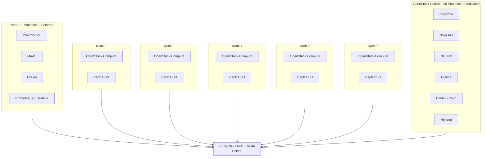

# OpenStack + Ceph Pilot – Architecture and Implementation Plan

This plan refines and extends your existing design with your chosen stack (**kolla-ansible**, **cephadm**, **GitLab**, **Prometheus + Grafana**), addresses the DL360 G8 VLAN/MAAS question, and fills DevOps design-level gaps.

---

## 1. High-Level Architecture

**Role assignment (pilot):**

| Role | Where | Components |
|------|--------|------------|
| **Bootstrap / Jump** | 1 server (Proxmox host) | Proxmox, MAAS (region+rack), GitLab, Prometheus + Grafana + Alertmanager, optional small VMs for OpenStack control |
| **OpenStack control** | 1 VM on Proxmox or 1 bare-metal | kolla-ansible: Keystone, Nova API, Neutron, Glance, Cinder, Horizon, Placement; Ceilometer/Gnocchi/Aodh if metering needed |
| **OpenStack compute + Ceph** | 5 bare-metal nodes | Nova compute (kolla-ansible), Ceph OSD (cephadm) on local SSDs/HDDs |
| **Ceph MON/MGR** | 3 nodes (odd) | Collocate on control node + 2 compute nodes, or 3 VMs on Proxmox for pilot |

---

## 2. Network Design (VLAN 110 / 111, LACP, MAAS PXE)

**VLAN usage:**

- **VLAN 110 (172.31.10.0/24):** Management, API, MAAS, PXE, Horizon, SSH, GitLab, Prometheus/Grafana.
- **VLAN 111 (172.31.11.0/24):** Ceph cluster/public network and/or Neutron tenant/data plane.

**Per-server (align with [proxmox-interfaces.conf](proxmox-interfaces.conf)):**

- **Bond0:** `eno1 + eno2 + eno3` in 802.3ad (LACP); on the switch: port-channel with VLANs 110 and 111 **tagged**.
- **VLAN 110:** `bond0.110` → bridge `br0-v110` with management IP.
- **VLAN 111:** `bond0.111` → bridge `br0-v111` for Ceph and/or Neutron.

**DL360 G8 and VLAN / MAAS PXE:**

- **In the OS (post-install):** VLAN awareness is in the driver/stack (Linux 802.1Q). HP DL360 G8 typically use Intel or Broadcom NICs; Linux supports VLAN sub-interfaces (e.g. `bond0.110`) without special firmware. Your current [proxmox-interfaces.conf](proxmox-interfaces.conf) already uses `bond0.110`; the same pattern in MAAS autoinstall (bond + VLAN 110/111) will work once the OS is installed.
- **During PXE (pre-OS):** The installer receives an IP from MAAS via DHCP. If the switch sends only **tagged** traffic for 110/111, the PXE client may not see DHCP unless the NIC or BIOS supports VLAN tagging in pre-OS environment (many G8 BIOS/NIC setups do **not**). **Recommended:** On the switch, set **VLAN 110 as native/untagged** on the port-channel (or each port) used by the servers, and keep 111 tagged. Then PXE and MAAS live on 110 without requiring VLAN awareness during boot. After install, autoinstall configures bond + `bond0.110` and `bond0.111` as above.
- **If you cannot set a native VLAN:** Use a separate physical port or a dedicated “provisioning” VLAN (untagged) for PXE, and move MAAS/DHCP there for deploy only; then production traffic stays on 110/111 tagged.

**Concrete actions:**

- Document switch config: LACP (port-channel), VLAN 110 native (or provisioning VLAN), VLAN 111 tagged.
- In MAAS: Ensure subnet for 172.31.10.0/24 (VLAN 110) and that DHCP is served on the VLAN that PXE uses (native 110 or dedicated provisioning).
- In [maas-autoinstall-template.yaml](maas-autoinstall-template.yaml): Change VLAN from **310** to **110** (and add **111** if you use it for Ceph/Neutron); use bond + `bond0.110` / `bond0.111` and static IPs from 172.31.10.0/24 (and 172.31.11.0/24 if needed). One template per role (control vs compute) with correct IPs and hostnames.

**ILO (172.26.1.101–106):** Keep reachable from 110/111 as you do today; for production hardening, consider a separate management VLAN and firewall rules to limit access.

**DNS/NTP:** Internal DNS (e.g. Unbound) for `maas`, `openstack`, `*.internal`; NTP on all nodes and switch (required for Ceph and OpenStack).

---

## 3. Storage Design (Ceph via cephadm)

**Inventory (as specified):**

- **SSD:** 10 × 500 GB total across nodes (e.g. 1–2 per node).
- **HDD:** Mix of 900 GB, 1.2 TB, 600 GB SATA across nodes.

**Approach:**

- **One OSD per disk** (no hardware RAID); Ceph handles replication/erasure.
- **cephadm** deploys Ceph (MON, MGR, OSD); use device classes and CRUSH rules for tiering.
- **Device classes:** `ssd` for 500 GB SSDs; `hdd` for SATA HDDs.
- **Pools:**
  - **SSD pool:** Replicated size 3, for Cinder (OpenStack volumes) and VM primary storage; CRUSH rule with `step chooseleaf type host` so no two replicas on the same host.
  - **HDD pool:** Replicated size 3 (or erasure coding if you prefer space over simplicity), for object (RGW) or bulk/CephFS if needed.
- **Reservations:** One SSD or small partition per node for OS; do not share OS root with OSD on the same disk without a clear partition layout. Document disk serial/model per node for failure-domain and runbook use.

**Sizing (pilot):** ~5 TB SSD usable (after replication) for Cinder; HDD for object or secondary pool. Keep MON/MGR on SSD or fast disks where possible.

---

## 4. OpenStack (kolla-ansible) and Software Stack

- **Deployment:** **kolla-ansible** (declarative, version-controlled in Git). Use a dedicated repo or a directory (e.g. `openstack/kolla`) with `globals.yml` and `passwords.yml` (see secrets below).
- **Neutron:** LinuxBridge or OVS with provider networks on VLAN 110/111; align with your two-VLAN design (e.g. management on 110, tenant/data on 111).
- **Cinder:** Backend Ceph (rbd); use the SSD pool for volume types that need performance.
- **Metering:** Ceilometer + Gnocchi + Aodh (kolla-ansible can deploy these); integrate with your portal via API.
- **Portal:** Integrate with OpenStack APIs (identity, compute, network, image, block, metering); keep portal config and endpoint list in Git.

**Pilot scope:** Nova, Neutron, Glance, Keystone, Cinder (Ceph), Horizon, Placement; optional Manila (CephFS), Ceph RGW (S3) if you need object storage.

---

## 5. DevOps Practices (Design-Level)

These close common design gaps and make the pilot production-grade and repeatable.

| Area | Practice | Implementation |
|------|----------|----------------|
| **IaC** | All topology and config in Git | Repo layout: `network/`, `ceph/`, `openstack/` (kolla-ansible), `maas/`, `monitoring/`, `ansible/` (base OS, users, firewall, NTP, DNS). |
| **Secrets** | No secrets in Git | **Ansible Vault** or **SOPS** for `passwords.yml` and API keys; or **HashiCorp Vault** if you adopt it. Store only references in playbooks; decrypt in CI or at deploy time. |
| **Bare-metal** | Repeatable OS install | MAAS + autoinstall ([maas-autoinstall-guide.md](maas-autoinstall-guide.md)) with bond + VLAN 110/111 and disk layout; one template per role (control vs compute), versioned in `maas/`. |
| **Version control** | Single source of truth | One repo (or a few) for network, Ceph, OpenStack, MAAS, monitoring, runbooks; tag releases (e.g. `pilot-v1`). |
| **CI/CD (GitLab)** | Validate before apply | GitLab CI: `ansible-lint`, `yamllint`, `kolla-ansible` check (or dry-run), idempotent Ansible runs; deploy from main after MR. |
| **Monitoring** | Health and usage | **Prometheus + Grafana + Alertmanager**; node_exporter, Ceph metrics (ceph-mgr prometheus plugin), OpenStack exporters; optional Loki for logs. |
| **Backup & DR** | Recover from failure | Ceph: 3-way replica is primary protection; backup OpenStack DB (MariaDB) and config (Git); document restore: MAAS re-deploy + Git + DB restore. |
| **Documentation** | Runbooks and decisions | ADRs in `docs/`; runbooks: “add node”, “replace disk”, “restore OpenStack DB”, “failover”. |
| **Security baseline** | Harden and audit | SSH key-based; host firewall (e.g. ufw/iptables) and OpenStack security groups; automated updates via Ansible; optional CIS benchmarks. |

---

## 6. Implementation Phases

**Phase 1 – Foundation (weeks 1–2)**  
- Switch: LACP port-channel, VLAN 110 native (or provisioning), VLAN 111 tagged.  
- All 6 nodes: bond + VLAN 110/111 (match [proxmox-interfaces.conf](proxmox-interfaces.conf) and MAAS autoinstall).  
- NTP and DNS (e.g. extend Unbound) for management subnet.  
- Document disk map (serial, size, node, OS vs OSD).  
- Install MAAS on Proxmox (or dedicated VM); add all 6 machines; prepare autoinstall YAMLs for **control** and **compute** (bond, VLAN 110/111, disk layout); put in Git under `maas/`.  
- Version network configs and MAAS templates in Git.

**Phase 2 – Ceph (cephadm) (weeks 2–3)**  
- Deploy Ceph with **cephadm**: MON on 3 nodes (or 1 for minimal pilot), OSD on all designated disks.  
- Define device classes (ssd/hdd), pools, CRUSH rules.  
- Integrate Ceph dashboard and Prometheus (ceph-mgr prometheus plugin).

**Phase 3 – OpenStack (kolla-ansible) (weeks 3–5)**  
- Deploy OpenStack with **kolla-ansible**: Neutron with VLAN 110/111; Cinder backend Ceph.  
- Deploy Ceilometer/Gnocchi/Aodh if metering is required.  
- Integrate portal with Keystone and metering API.

**Phase 4 – Automation and production-grade (ongoing)**  
- All changes via IaC (Ansible + kolla-ansible config in Git).  
- GitLab CI: lint + idempotent/dry-run; secrets via Vault or Ansible Vault.  
- Complete Prometheus/Grafana/Alertmanager and runbooks; one DR test (e.g. restore DB, re-deploy one node via MAAS).

---

## 7. Repo Structure (Version-Controlled)

- `network/` – interface configs, VLANs, LACP (templates or per-node).  
- `maas/` – autoinstall YAMLs for control and compute (VLAN 110/111, disk layout).  
- `ceph/` – cephadm spec, OSD layout, CRUSH rules, pool definitions.  
- `openstack/` – kolla-ansible config (`globals.yml`, overrides), inventory.  
- `ansible/` – playbooks for base OS, users, firewall, NTP, DNS.  
- `monitoring/` – Prometheus, Grafana, Alertmanager configs.  
- `docs/` – ADRs, runbooks, disk map.

---

## 8. Risks and Mitigations

- **Single switch:** Single point of failure; document and test failover if you add a second switch later (MCLAG or STP).  
- **DL360 G8 PXE + VLAN:** Use native VLAN 110 (or dedicated untagged provisioning) for PXE so BIOS/NIC limitations do not block MAAS.  
- **Disk imbalance:** CRUSH and pool placement will be asymmetric; document and test node/disk failure scenarios.  
- **kolla-ansible/cephadm complexity:** Start with 1 control node and 5 compute+storage nodes; scale to 3 controllers when moving to the larger cloud.  
- **Hardware lifecycle:** G8 is older; plan for spare parts and monitor SMART and RAM; use pilot to validate before scaling.

---

## 9. What You Asked For vs Covered Here

- **Architecture:** Roles, network (VLAN 110/111, LACP), Ceph (cephadm, device classes, pools), OpenStack (kolla-ansible, Cinder on Ceph), MAAS, GitLab, Prometheus+Grafana.  
- **Implementation:** Phased steps from network and MAAS through Ceph, OpenStack, and automation; repo layout and DevOps practices (IaC, secrets, CI/CD, monitoring, backup, runbooks).  
- **DL360 G8 VLAN:** Addressed via native VLAN 110 for PXE and OS-level bond+VLAN for runtime.  
- **DevOps gaps:** IaC, secrets, version control, GitLab CI, monitoring, backup/DR, documentation/runbooks, security baseline.

If you want, next step can be a concrete **switch config snippet**, **MAAS autoinstall diff** (310→110/111), or **kolla-ansible/cephadm inventory examples** keyed to your 6 nodes and IP plan.