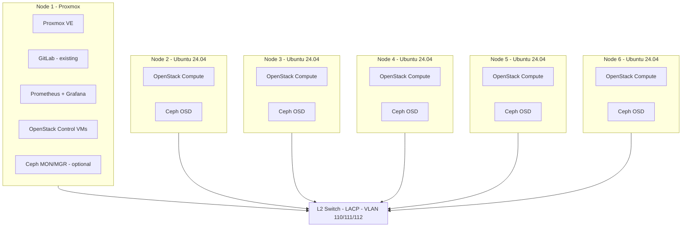

# OpenStack + Ceph Pilot – Architecture and Implementation (No MAAS)

This plan aligns with your current state: **no MAAS** in this phase (5 nodes are already Ubuntu 24.04), **three VLANs** (110, 111, 112), and your chosen stack (kolla-ansible, cephadm, GitLab, Prometheus + Grafana). It also fills design-level DevOps gaps.

---

## 1. High-Level Architecture

**Role assignment (pilot, no MAAS):**

- **Proxmox (1 node):** Proxmox VE; existing GitLab; Prometheus + Grafana + Alertmanager; **OpenStack control plane as VMs** (Keystone, Nova API, Neutron, Glance, Cinder API, Horizon, Placement; optional Ceilometer/Gnocchi/Aodh for metering). Optionally 1–3 small VMs for Ceph MON/MGR if you prefer not to run MON on bare-metal.
- **Bare-metal Ubuntu 24.04 (5 nodes):** Nova compute (kolla-ansible) + Ceph OSD (cephadm) on local SSDs/HDDs. Ceph MON/MGR can run on 3 of these (e.g. nodes 2, 3, 4) for quorum, or on Proxmox VMs for minimal footprint.

---

## 2. Network Design – Three VLANs and LACP

**VLAN usage (align with your subnets):**

- **VLAN 110 (172.31.10.0/24):** Management, API, SSH, GitLab, Prometheus/Grafana, Horizon, OpenStack APIs.
- **VLAN 111 (172.31.11.0/24):** Ceph cluster (public + cluster network, or split if you add a second NIC later). Storage traffic.
- **VLAN 112 (172.31.12.0/24):** Neutron tenant/data plane (instance traffic, provider networks, or overlay). Keeps tenant VM traffic separate from management and storage.

**Per-server (all 6):**

- **Bond:** All 3 interfaces in 802.3ad (LACP); switch side: port-channel with VLANs 110, 111, 112 **tagged**.
- **Linux:** `bond0.110`, `bond0.111`, `bond0.112` (or bridges) with IPs from the respective subnets. Same pattern on Proxmox (e.g. `vmbr` tied to VLAN 110/111/112 as needed) and on each Ubuntu node.

**PXE / future MAAS:** When you add MAAS later, use **VLAN 110 as native (untagged)** on the port-channel for PXE, or a dedicated provisioning VLAN; for now, no change required.

**ILO (172.26.1.101–106):** Kept reachable from 110/111/112 as today; for hardening, consider a dedicated management VLAN and firewall rules.

**DNS/NTP:** Internal DNS for OpenStack, Ceph, Grafana, etc.; NTP on all nodes and switch (required for Ceph and OpenStack).

---

## 3. Storage Design – Ceph (cephadm)

**Inventory (as specified):**

- **SSD:** 10 × 500 GB total across the 5 Ubuntu nodes (e.g. 2 per node).
- **HDD:** Mix of 900 GB, 1.2 TB, 600 GB SATA across the same nodes.

**Approach:**

- One OSD per disk (no hardware RAID); Ceph handles replication.
- **cephadm** deploys MON, MGR, OSD; use **device classes** and CRUSH rules.
- **Device classes:** `ssd` for 500 GB SSDs; `hdd` for SATA HDDs.
- **Pools:**
  - **SSD pool (replicated, size 3):** Cinder (OpenStack volumes) and performance-sensitive workloads; CRUSH rule with `chooseleaf type host` so replicas are on different hosts.
  - **HDD pool (replicated size 3 or erasure-coded):** Object (RGW) or bulk/CephFS if needed later.
- Reserve one disk or partition per node for OS; do not use the same disk for root and OSD without a clear partition layout. Document disk serial/model per node.

**Sizing (pilot):** ~5 TB SSD usable (after replication) for Cinder; HDD for object or secondary pool. MON/MGR on SSD or fast storage where possible.

---

## 4. OpenStack (kolla-ansible) and Software Stack

- **Deployment:** kolla-ansible in a Git repo (e.g. `openstack/kolla`) with `globals.yml` and encrypted `passwords.yml` (see DevOps section).
- **Neutron:** LinuxBridge or OVS with **provider networks** on VLAN 110 (management), 111 (storage), 112 (tenant); or overlay on 112. Align with your three-VLAN design.
- **Cinder:** Backend Ceph (rbd) using the SSD pool for performance volume types.
- **Metering:** Ceilometer + Gnocchi + Aodh if required for portal; integrate via API.
- **Portal:** Integrate with OpenStack APIs (identity, compute, network, image, block, metering); keep portal config and endpoints in Git.

**Pilot scope:** Nova, Neutron, Glance, Keystone, Cinder (Ceph), Horizon, Placement; optional Manila (CephFS), Ceph RGW (S3).

---

## 5. DevOps Practices (Design-Level)

| Area                  | Practice                       | Implementation                                                                                                                                            |
| --------------------- | ------------------------------ | --------------------------------------------------------------------------------------------------------------------------------------------------------- |
| **IaC**               | All topology and config in Git | Repo: `network/`, `ceph/`, `openstack/` (kolla-ansible), `monitoring/`, `ansible/` (base OS, users, firewall, NTP, DNS). No MAAS repo until you add MAAS. |
| **Secrets**           | No secrets in Git              | Ansible Vault or SOPS for `passwords.yml` and API keys; decrypt in CI or at deploy time.                                                                  |
| **Version control**   | Single source of truth         | One repo (or a few) for network, Ceph, OpenStack, monitoring, runbooks; tag releases (e.g. `pilot-v1`).                                                   |
| **CI/CD (GitLab)**    | Validate before apply          | GitLab CI: `ansible-lint`, `yamllint`, kolla-ansible check/dry-run; deploy from main after MR.                                                            |
| **Monitoring**        | Health and usage               | Prometheus + Grafana + Alertmanager; node_exporter, Ceph (ceph-mgr prometheus), OpenStack exporters; optional Loki for logs.                              |
| **Backup & DR**       | Recover from failure           | Ceph 3-way replica; backup OpenStack DB (MariaDB) and config (Git); runbook: restore DB + re-apply config.                                                |
| **Documentation**     | Runbooks and decisions         | ADRs in `docs/`; runbooks: add node, replace disk, restore OpenStack DB, failover.                                                                        |
| **Security baseline** | Harden and audit               | SSH key-based; host firewall; OpenStack security groups; automated updates via Ansible.                                                                   |

---

## 6. Implementation Phases (Walk-Through)

**Phase 1 – Foundation (weeks 1–2)**  

- **Switch:** LACP port-channel per server; VLANs 110, 111, 112 tagged on trunk. Document config in `network/`.  
- **All 6 nodes:** Bond (3 × NICs) + VLAN sub-interfaces (110, 111, 112) with static IPs; same pattern on Proxmox and Ubuntu.  
- **NTP and DNS:** Internal DNS and NTP for management and service discovery.  
- **Disk map:** Document disk serial, size, node, OS vs OSD per server; store in `docs/` or `ceph/`.  
- **Base OS (Ansible):** Users, SSH keys, firewall, NTP, DNS client; version in `ansible/`.  
- **GitLab:** Use existing GitLab; create repo(s) for `network/`, `ceph/`, `openstack/`, `ansible/`, `monitoring/`, `docs/`.

**Phase 2 – Ceph (cephadm) (weeks 2–3)**  

- Bootstrap Ceph with **cephadm** on the 5 Ubuntu nodes (and optionally MON/MGR on Proxmox VMs).  
- Add OSDs from designated SSDs and HDDs; device classes `ssd` / `hdd`; create SSD pool (replicated, size 3) and HDD pool.  
- Enable ceph-mgr Prometheus plugin; connect Prometheus (already planned on Proxmox).  
- Store cephadm spec and pool/CRUSH definitions in `ceph/`.

**Phase 3 – OpenStack (kolla-ansible) (weeks 3–5)**  

- Deploy **OpenStack control** on Proxmox (VMs): Keystone, Nova API, Neutron, Glance, Cinder, Horizon, Placement; Ceilometer/Gnocchi/Aodh if metering needed.  
- Deploy **Nova compute** on the 5 Ubuntu nodes; Neutron with provider networks on VLAN 110/111/112.  
- Configure **Cinder** with Ceph backend (rbd, SSD pool).  
- Integrate Horizon and API endpoints with VLAN 110 (management).  
- All kolla-ansible config and inventory in `openstack/` under version control.

**Phase 4 – Automation and production-grade (ongoing)**  

- All changes via IaC (Ansible + kolla-ansible in Git).  
- GitLab CI: lint + idempotent/dry-run; secrets via Vault or Ansible Vault.  
- Complete Prometheus/Grafana/Alertmanager dashboards and alerts; write runbooks (add node, replace disk, restore DB); one DR test (e.g. restore OpenStack DB from backup).

---

## 7. Repo Structure (Version-Controlled)

- `network/` – interface configs, VLANs, LACP (templates or per-node).  
- `ceph/` – cephadm spec, OSD layout, CRUSH rules, pool definitions.  
- `openstack/` – kolla-ansible config (`globals.yml`, overrides), inventory.  
- `ansible/` – playbooks for base OS, users, firewall, NTP, DNS.  
- `monitoring/` – Prometheus, Grafana, Alertmanager configs.  
- `docs/` – ADRs, runbooks, disk map.

*(Add `maas/` when you introduce MAAS later.)*

---

## 8. Differences From Your Previous Plan

- **MAAS:** Not used in this scenario; the 5 Ubuntu nodes are assumed already installed. Phases do not include MAAS install or autoinstall; when you add MAAS later, Phase 1 can be extended with a provisioning VLAN and autoinstall templates.  
- **VLANs:** All **three** VLANs (110, 111, 112) are used: management (110), Ceph (111), tenant/data (112).  
- **Control plane:** OpenStack control runs as **VMs on Proxmox**; 5 nodes are dedicated to compute + Ceph OSD for a clear split and easier recovery.

---

## 9. Risks and Mitigations

- **Single switch:** Single point of failure; document and plan for a second switch (e.g. MCLAG) when you scale.  
- **Disk imbalance:** CRUSH and pool placement will be asymmetric; document and test node/disk failure.  
- **Proxmox as single host for control:** Consider HA for control VMs (e.g. multiple control VMs + load balancer) when moving to the larger cloud.  
- **Hardware lifecycle:** G8 is older; monitor SMART and plan for spare parts; use pilot to validate before scaling.

---

## 10. Summary

- **Architecture:** 1 Proxmox (control VMs, GitLab, monitoring) + 5 Ubuntu 24.04 (compute + Ceph OSD); three VLANs (110 management, 111 Ceph, 112 tenant); LACP on all 6 servers.  
- **Implementation:** Phased from foundation (network, DNS/NTP, disk map, Ansible base OS) through Ceph (cephadm), then OpenStack (kolla-ansible), then automation and runbooks.  
- **DevOps:** IaC in Git, secrets management, GitLab CI, Prometheus+Grafana, backup/DR and runbooks, security baseline—no MAAS until you request it.

If you want, next step can be **concrete examples**: switch config snippet for 110/111/112, sample `netplan`/bond config for Ubuntu 24.04, or kolla-ansible/cephadm inventory and `globals.yml` snippets for your 6 nodes and IP plan.