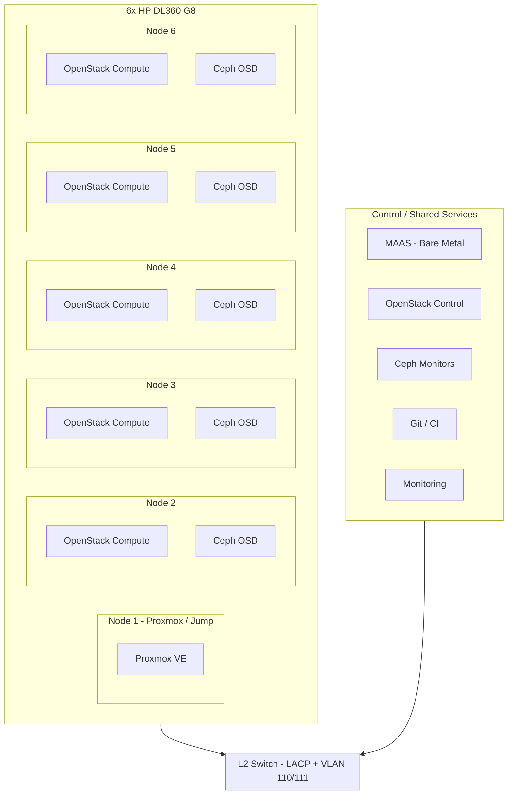

# OpenStack + Ceph Pilot – Architecture and Implementation Plan

**Assumption:** You have two VLANs; the second is treated as **VLAN 111** with subnet **172.31.11.0/24** (you wrote "vlan 110" twice; 111 is used below for the second subnet).

---

## 1. High-Level Architecture

**Roles (recommended):**

| Role | Nodes | Purpose |
|------|--------|--------|
| **Bootstrap / Jump / Optional Proxmox** | 1 | MAAS region+rack, Git runner, monitoring stack, optional small Proxmox for legacy VMs |
| **OpenStack control (3-node HA or 1 for pilot)** | 1 or 3 | API, scheduler, placement, Neutron server, Glance, Cinder (Ceph backend) |
| **OpenStack compute + Ceph OSD** | 3–5 | Nova compute + Ceph OSD on same nodes to use local disks |
| **Ceph MON** | 3 (collocated) | Ceph monitors (odd number; can run on control nodes or dedicated VMs) |

For a **pilot**, a simpler split is: **1 control node** (or 2 for minimal redundancy), **5 compute+storage nodes**, with Ceph MON on the control node(s) and 2–3 compute nodes.

---

## 2. Network Design

- **VLAN 110 (172.31.10.0/24):** Management / API / tenant networks (OpenStack API, Horizon, SSH, MAAS, monitoring).
- **VLAN 111 (172.31.11.0/24):** Storage (Ceph cluster network) and/or tenant data plane (Neutron provider network for VMs).

**Per-server layout (align with your existing [proxmox-interfaces.conf](proxmox-interfaces.conf)):**

- **Bond0:** `eno1 + eno2 + eno3` in 802.3ad (LACP); switch side: port-channel with VLANs 110 and 111 tagged.
- **VLAN 110:** `bond0.110` → bridge (e.g. `br0-v110`) with management IP.
- **VLAN 111:** `bond0.111` → bridge (e.g. `br0-v111`) for Ceph public/cluster and/or Neutron.

**Gaps to address:**

- **Out-of-band (IPMI/iLO):** Ensure iLOs are on a separate management VLAN or restricted segment for security and recovery.
- **DNS:** You already use Unbound ([unbound-forward-tcp.conf](unbound-forward-tcp.conf)). Plan internal DNS (e.g. `maas.internal`, `openstack.internal`, `*.svc.cluster`) and optional dynamic updates from MAAS/OpenStack.
- **NTP:** All nodes and switch in the same NTP pool (critical for Ceph and OpenStack).

---

## 3. Storage Design (Ceph)

**Inventory (as you described):**

- **SSD:** 10 × 500 GB (distributed across nodes).
- **HDD:** Mix of 900 GB, 1.2 TB, 600 GB SATA.

**Recommendations:**

- **Ceph OSD:** One OSD per disk (no RAID under Ceph); Ceph handles replication/erasure.
- **Crush rules:**  
  - **SSD device class:** Use for Ceph Block (Cinder), CephFS metadata (if used), and optionally RGW index.  
  - **HDD device class:** Use for object (RGW) and bulk block/CephFS data.
- **Replication:** With 6 nodes and mixed disk count, start with **replicated size 3**; ensure no more than one replica per node (Crush rule `step chooseleaf type host`).
- **Pilot sizing:**  
  - ~5 TB SSD → use for Cinder volumes and VMs (primary).  
  - HDD total → use for object storage or secondary pool; avoid running Ceph MON on HDD.

**Reservations:**

- Leave one SSD (or partition) per node for OS; do not use the same disk for both OS and OSD without clear partitioning.
- Document which disk (by serial/model) is on which node so Crush and failure domains are predictable.

---

## 4. OpenStack Deployment and Software Stack

- **Deployment method:** Use **OpenStack Charms (Charmed OpenStack)** or **Kolla/Kolla-Ansible** so that the whole stack is **declarative and version-controlled** (YAML/git).
- **Metering:** **Ceilometer + Gnocchi + Aodh** (or Telemetry with Prometheus exporters); integrate with your portal via API.
- **Portal:** Integrate with OpenStack APIs (identity, compute, network, image, block storage) and metering; keep portal config and API endpoints in Git.

**Pilot scope:**

- Core: Nova, Neutron (OVS or LinuxBridge with VLAN 110/111), Glance, Keystone, Cinder (Ceph backend), Horizon.
- Optional: Manila (CephFS), Swift or Ceph RGW (S3) if you need object storage.

---

## 5. DevOps Gaps and Practices

These are the areas often missed at design time; they make the pilot production-grade and repeatable.

| Area | Practice | Implementation |
|------|----------|----------------|
| **Infrastructure as Code (IaC)** | All topology and config in Git | Repo layout: `network/`, `ceph/`, `openstack/`, `maas/`, `monitoring/`. Use Ansible (or Salt) for node config; Charms/Kolla for OpenStack. |
| **Secrets** | No secrets in Git | HashiCorp Vault, or at minimum encrypted files (e.g. Ansible Vault, SOPS) and a small secrets store. Store only references in playbooks. |
| **Bare-metal provisioning** | Repeatable OS install | You already use MAAS + autoinstall ([maas-autoinstall-guide.md](maas-autoinstall-guide.md)). Extend templates for bond+VLAN 110/111 and disk layout (OS vs Ceph); one template per role (control vs compute). |
| **Version control** | Single source of truth | One repo (or a few) for: network configs, Ceph config, OpenStack deploy config, monitoring/alerting, runbooks. Tag releases (e.g. `pilot-v1`). |
| **CI/CD** | Validate before apply | GitLab CI (or GitHub Actions) to run `ansible-lint`, `yamllint`, and idempotent dry-runs; deploy only from main after review. |
| **Monitoring & observability** | Know health and usage | Prometheus + Grafana (or VictoriaMetrics); alertmanager; node exporter, Ceph metrics, OpenStack exporters. Optional: centralized logs (e.g. Loki). |
| **Backup & DR** | Recover from failure | Ceph: no extra backup for pilot if 3-way replica; backup OpenStack DB (MariaDB) and config (Git). Document restore from MAAS re-deploy + Git. |
| **Documentation** | Runbooks and decisions | ADR (Architecture Decision Records) in Git; runbooks for “add node”, “replace disk”, “restore OpenStack DB”. |
| **Security baseline** | Harden and audit | SSH key-only where possible; firewall (e.g. OpenStack security groups + host firewall); regular updates via automation; optional CIS benchmarks. |

---

## 6. Implementation Phases

**Phase 1 – Foundation (weeks 1–2)**  
- Harden network: LACP + VLAN 110/111 on switch and all 6 nodes; NTP and DNS (extend Unbound if needed).  
- Document disk map (serial, size, node).  
- Install MAAS on one node; add all 6 machines; prepare autoinstall YAMLs for control and compute roles (bond, VLANs, disk layout).  
- Put network configs and MAAS autoinstall templates in Git.

**Phase 2 – Ceph (weeks 2–3)**  
- Deploy Ceph (Manifest or cephadm/ansible) with MON on 3 nodes (or 1 for minimal pilot), OSD on all disks.  
- Define device classes (ssd/hdd), pools, and Crush rules.  
- Integrate monitoring (Ceph dashboard + Prometheus).

**Phase 3 – OpenStack (weeks 3–5)**  
- Deploy OpenStack (Charms or Kolla) with Neutron using VLAN 110/111; Cinder backend Ceph.  
- Deploy Ceilometer/Gnocchi (and Aodh if needed) for metering.  
- Integrate portal with Keystone and metering API.

**Phase 4 – Automation and production-grade (ongoing)**  
- Move all changes to IaC (Ansible + OpenStack deploy config in Git).  
- Add CI (lint + dry-run); introduce secrets management.  
- Complete monitoring, alerting, and runbooks; one disaster recovery test.

---

## 7. Risks and Mitigations

- **Single switch:** Single point of failure; document and test failover if you later add a second switch (MCLAG or STP).  
- **Charms/Kolla complexity:** Start with minimal HA (e.g. 1 control node) and scale to 3 controllers when moving to “bigger” cloud.  
- **Disk imbalance:** Crush rules and pool placement will be asymmetric; document and test node failure scenarios.  
- **DL360 G8 lifecycle:** Hardware is older; plan refresh or spare parts; monitor disk SMART and RAM errors.

---

## 8. Deliverables You Can Version-Control

- **Repo structure (example):**  
  - `network/` – interfaces, VLANs, LACP (per node or template).  
  - `maas/` – autoinstall YAMLs for control and compute.  
  - `ceph/` – spec, osd layout, crush rules, pool definitions.  
  - `openstack/` – Charms/Kolla config and overrides.  
  - `ansible/` – playbooks for base OS, users, firewall, NTP, DNS.  
  - `monitoring/` – Prometheus/Grafana/Alertmanager config.  
  - `docs/` – ADRs, runbooks, disk map.

This gives you an architecture and a stepwise implementation that reduces manual changes, enables version control, and prepares you for a larger production cloud.
