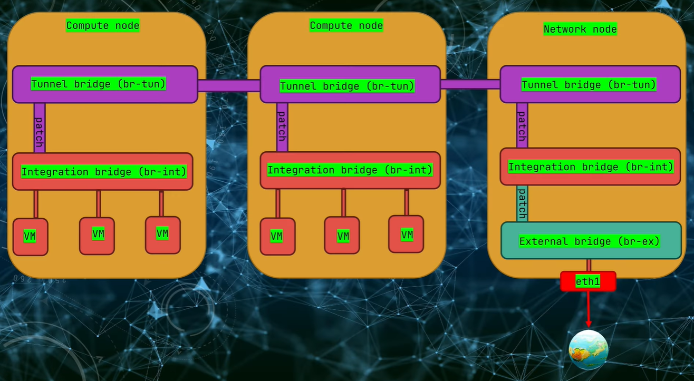

# Openstack Network (Neutron)

This Document is Assisted by Following [This Tutorial](https://www.youtube.com/watch?v=JyYZ1gOig64)

## Neutron Architecture
Neutron is an OpenStack project to provide "networking as a service" between interface devices (e.g., vNICs) managed by other Openstack services (e.g., nova).
Neutron gives cloud tenants an API to build rich networking topologies, and configure advanced network policies in the cloud. for example create multi-tier web application topology.


### neutron-server
neutron-server provides a webserver that exposes the Neutron API, and passes all web service calls to the Neutron plugin for processing. in our kolla ansible project we are running Neutron service in a docker container. you can verify it via:
- `docker ps | grep neutron-server` => it will list all service that has been run via `neutron-server`
- `docker ps | grep neutron_server`


### Modular Layer 2 (ML2) Architecture Neutron ([ML2 Plug-in](https://docs.openstack.org/neutron/latest/admin/config-ml2.html))
The Modular Layer 2 (ML2) neutron plug-in is a framework allowing OpenStack Networking to simultaneously use the variety of layer 2 networking technologies found in complex real-world data centers. The ML2 framework distinguishes between the two kinds of drivers that can be configured. </br>

to check drivers and configs of ml2 in neutron service we can check it in docker via:
- `docker exec -it neutron_server cat /etc/neutron/plugins/ml2/ml2_conf.ini`


### network services

to check all related process such as openvswitch, l3, l3-agent by hosts via:
- `openstack network agent list -c Host -c Binary`

we can list docker containers via:
- `docker ps | grep neutron`


### openvswitch ([Open vSwitch: Provider Network](https://docs.openstack.org/ocata/networking-guide/deploy-ovs-provider.html#:~:text=The%20OVS%20provider%20bridge%20swaps,network%20infrastructure%20switch%20(10).))
we might want to run network services such as DHCP or L3 Routing on other machines but how can each compute node find out how to route its network traffic? thats where we use openvswtich and ovs-agent. they are responsible for managing the local virtual swtich and connect them in to other nodes because ovs agent is interacting in layer 2 so each compute node can send broadcast message to receive service or connection. we can confirm its running contaner via: </br>

- `docker ps | grep openvswitch`


### ovs-agent ([Open vSwitch L2 Agent](https://docs.openstack.org/neutron/latest/contributor/internals/openvswitch_agent.html))
ovs-neutron-agent can be configured to use different networking technologies to create project isolation. These technologies are implemented as ML2 type drivers which are used in conjunction with the Open vSwitch mechanism driver.


#### ovs agent firewall capability ([Open vSwitch Firewall Driver](https://docs.openstack.org/neutron/latest/contributor/internals/openvswitch_firewall.html))
ovs is not only used for layer 2 capability but it is also responsible for access rules and security enforcing. the ovs-agent uses `iptables` as its own `firewall_driver` check out the drivers by: </br>
- `docker exec -it neutron_openvswitch_agent cat /etc/neutron/plugins/ml2/openvswitch_agent.ini` 

`iptables` as a driver adds complexity and performance overhead. another option for that is `openvswitch`.


### openvswitch firewall
the `openvswitch` driver is the native and more cleaner and more efficient approach for applying firewall security. for better performance we can reconfigure our `kolla-ansible` configuration to use native ovs firewall. we do this by adding custome configuration file that kolla ansbile will override the default setting.

1. create a directory for new neutron configuration file.
- `mkdir -p /etc/kolla/config/neutron`

2. add the new `openvswitch_agent.ini` to the configuration file and change to `firewall_driver` to `openvswitch`
- `vim /etc/kolla/config/neutron/openvswitch_agent.ini`

``` ini
[securitygroup]
firewall_driver = openvswitch
```

3. run the kolla-ansible deployment playbook to apply new configuration
- `kolla-ansible deploy -i all-in-one`


### Tenant Network and Provider Network

#### 1. Tenant Network
think of it as your own private project scope network space. Tenant networks are created by users and Neutron is configured to automatically select a network segmentation type like VXLAN or VLAN. The user cannot select the segmentation type. these are called overlay network which it means that they run over the existing physical networks. openstack achieve this through encapsulation. you can create these virtual network without need for network teams to be envolved

#### 2. Provider networks 
provider network is a direct bridge to a physical network that already exists outside of openstack cloud. these are created by administrators, that can set one or more of the following attributes: </br>
Segmentation type (flat, VLAN, Geneve, VXLAN, GRE) </br>
Segmentation ID (VLAN ID, tunnel ID) </br>
Physical network tag </br>
Any attributes not specified will be filled in by Neutron. </br>


### Network and Subnet Configuration
for 2 different vms to communication, they first need a common network. the openstack network will act as a distributed layer between 2 VMs. to do that lets create a network

1. create a network
- `openstack network create <network-name>`

2. create a subnet which belongs to the created network and define IP address pool and dns server.
- `openstack subnet create --network <network-name> --subnet-range 192.168.1.0/24 --gateway 192.168.1.254 --dns-nameserver 8.8.8.8 <subnet-name>`

in openstack, VMs don't connect directly to the network, they connect through ports which are like virtual network plug. a port holds the MAC address, IP address, and security.

we can list our ports in openstack via:
- `openstack port list`

inpsect the ports device owner via:
- `openstack port show <ID> -c device_owner`

inspect dhcp provider nodes
- `openstack network agent list --agent-type dhcp`


#### how does dhcp agent connect to networks?
dhcp uses the [namespaces](https://en.wikipedia.org/wiki/Linux_namespaces) which is a linux feature. it is an isolated copy of the networking stack with its own interfaces, routing tables and firewall rules. </br>
to list networking namepsaces we use:
- `ip netns`

for interacting inside dhcp node we use `exec -it` switch:
- `ip netns exec <qdhcp-ip> bash`

inside the dhcp node, use `ip add` to see interfaces. to check the interface.

and then to check `dnsmasq` to see which interface it is using
- `ps -ef | grep dnsmasq`


### creating dedicated port for virtual machines
after establishing, network, a subnet and dhcp service, we can create a dedicated port for creating VMs. 
- `openstack port create --network <network-name> --fixed-ip subnet=<subnet-name>,ip-address=192.168.1.1 <port-name>` 
note: 
> if you don't specific the `ip-address` the ip will be applied automatically from subnet.
> also if the port is not defined for any VM its status will be DOWN.


#### Create a new machine with create network
after establishing the network and ports we can create machine and assign the network port to that.
- `openstack server create --flavor m1.tiny --image cirros --port <port-name> <vm-name>`  

check the ports again to see if the created port is `UP`:
- `openstack port list --long`

 

### OVS Bridge
its a software based virtual switch. it connects different network interfaces like network tunnels, physical NICs and VM interfaces. ovs uses **three distinct bridges** on each network node to separate and manage different types of traffic. </br>
to identify and list it:
- `docker exec -it openvswitch_db ovs-vsctl show` this command will list data related:
1. **intergration bridge (`Bridge br-int`)**: this is the central hub. all virtual network interfaces for your VM connect to dhcp server and virtual routers and etc.
2. **Ports**: list of interfaces of VMs and servers, they are tagged via `tag` so their networks corelations are defined
3. **tunnel bridge (`Brdige br-tun`)**: it handles are the overlay network trafic between nodes. when a vm from a node wants to talk to another vm in another compute node, the tunnel bridge encapsulates traffic into a VXLAN tunnel and sends it across the physical network (the key to expand the private network across the cloud)
4. **external bridge (`bridge br-ex`)**: this is the gateway to the external world. it connects to the physical network interface (`eth1`) and manages traffic to provider networks and floating IPs. in short, it allows our VMs to reach the internet and be reachable.
5. **patch ports (`Port patch-tun`)**: the separated bridged work together by being connected by patch ports. it acts as a virtual network that directly link ovs bridges




### Neutron Ports
in neutron, a port is a logical connection point, like a virtual NIC, that attaches a device (like a VM) to a virtual network, carrying crucial info like MAC/IP addresses and security rules, acting as the fundamental element for network connectivity services within the cloud. </br>
it is possible to detach a port from one VM and attach it to another and keep the same IP and settings. **it is useful in failover scenarios where you can move the IP from a broken instance to a new one or during upgrades or migrations where you can swap infrastructure without changing the DNS.** think of it as plugin a cable from one server to another expect you are moving the whole network interface not just the connection. </br>
when a VM is created the port is automatically created by it and we need to provide the network. for instance: </br>

lets create a VM but this time only provide the network
- `openstack server create --flavor m1.tiny --image cirros --network <network-name> <vm-name>` => this command will cause `Nova` to ask `Neutron` to create a port.

verify the port creation via:
- `openstack port list --device-owner compute:nova`=> it will list ports owned by nova which will show the NIC of VM
- `openstack server list` => to see the machines are connected networks

**Keep in Mind**: keep in mind that the automatically made ports will be deleted when vm is also deleted (because of the ownership) but the manually dedicated ports will not be deleted.


### How to VMs communicated in Different Physical Nodes (belong to the same Subnet) - these steps are done on MultiNode Scenario
we are going to created two separated VMs in different compute nodes and establish their connection.

1. create the first vm on one of our nodes
- `openstack server create --flavor m1.tiny --image cirros --network <network-name> --availability-zone nove:<stack-number-1> <vm-name-1> `

2. create the second vm on another compute stack
- `openstack server create --flavor m1.tiny --image cirros --network <network-name> --availability-zone nove:<stack-number-2> <vm-name-2>`

3. confirm their placement on stacks and check its value
- `openstack server show <vm-name-1> -c OS-EXT-SRV-ATTR:host` 
- `openstack server show <vm-name-2> -c OS-EXT-SRV-ATTR:host`
- `openstack server list` verify the IP address

4. test the connectivity.
    1. first we need to find the operating system
    - `sudo virsh list --all` (it comes with `libvirt-clients` packages).
    2. connect to the machine console after finding its instance name
    - `sudo virsh console <instance-name>`
    3. ping the other IP address inside the VM
    - `ping 192.168.1.3


### Checking the Configuration on First Compute Node (Stack-1)
1. examine the configurations of openvswitch database and examine its `Port, Bridge, and remote_IP
- `docker exec -it openvswitch_db ovs-vsctl show` 

- **Port vxlan**: this port which is visible on the tunnel bridge is the key on how the cross communication is possible  
- **remote_IP**: it is the overlay network IP which belongs to Port vxlan that connects VMS from different stacks (compute nodes)


#### VXLAN Functionality
VXLAN (Virtual Extensible LAN) creates large-scale, logical Layer 2 networks over an existing Layer 3 IP infrastructure, enabling network virtualization, scalability, and multi-tenancy by encapsulating Ethernet frames within UDP/IP packets, allowing Layer 2 segments (like virtual machines) to stretch across physical data centers, and supporting 16 million virtual networks using a 24-bit VNI (VXLAN Network Identifier) instead of limited VLANs, solving data center scaling issues


### Two Subnets within the same Network
1. create another subnet under the created network and name it to something else:
- `openstack subnet create --network <network-name> --subnet-range 192.168.2.0/24 --gateway 192.168.2.254 --dns-nameserver 8.8.8.8 <subnet-name-2>` 

confirm subnet creation via 
- `openstack subnet list`

3. create manual and specific port inside the subnet
- `openstack port create --network <network-name> --fixed-ip subnet=<subnet-name-2> <port-name-vm3>` 

4. create a machine with the newly created port
- `openstack server create --flavor m1.tiny --image cirros --port <port-name-vm2> <vm-name>`

    1. confirm the server and IP
    - `openstack server list`

    2. list its name
    - `sudo virsh list --all`

    3. connect to it via 
    - `sudo virsh console <instance-name>`

    4. attempt to ping another machine in different subnet (will fail cause there is no route for that)
    - `ping <other-machine-subnet-ip>`
    - `ip route get <other-machine-subnet-ip>` check why the device cannot be pinged 

the process above shows the segmentation of network in openstack neutron


### Neutron Router ([Router](https://docs.openstack.org/python-openstackclient/pike/cli/command-objects/router.html) [Routing](https://docs.openstack.org/neutron/latest/admin/ovn/routing.html))
openstack router is a logical component that forwards data packets between networks. It also provides Layer 3 and NAT forwarding to provide external network access for servers on project networks. the router can intelligently route the traffics.

#### Create new Router in Openstack

1. create a new router for handling traffic between subnets
- `openstack router create <router-name>`

2. add subnets to the newly created router
- `openstack router add subnet <router-name> <subnet-name>`
- `openstack router add subnet <router-name> <subnet-name-2>`

by adding both subnets to the router we can have the connectivity of instances. so connect to one of instances and ping the other
- `sudo virsh console <instance-name-1>`
    - `ping <other-machine-subnet-ip>`
    - `ip route get <other-machine-subnet-ip>` => to should return the IP of new router

3. verify the existance of new namespace for the router
- `ip netns ls` => we should have a new `qrouter` namespace

4. check the router configuration by using its id
- `sudo ip netns exec qrouter-<id> bash`
    - `ip add` it will list `qr` interfaces which they will act as a default gateways for each subnets
    - `ip route` it will list the routing tables (which is a proof of linux network namespace equipped with multiple interfaces)


#### inspect the integration of router to openvswitch
to inpsect the router and openvswitch, check the `openvswitch_db` integration
- `docker exec -it openvswitch_db ovs_vsctl` => it should list the `qr` interfaces of the router which are plugged into the ovs integration bridge (note that each are presented under the integration bridge (`br-int`))

**CAUTION:** each IP assigned to the router interface is the same that is defined in the gateway of each VM.


### VM on a Different Network
1. create another network and establish new connection between different networks.
- `openstack network create <network-name-2>`</br>
verify that new network is created: 
- `openstack network list`

2. create new subnet inside the network
- `openstack subnet create --network <network-name-2> --subnet-range 192.168.3.0/24 --gateway 192.168.3.254 --dns-nameserver 8.8.8.8 <subnet-name-3>` </br>
verify the subnet:
- `openstack subnet list`

3. create new machine inside the new network
- `openstack server create --flavor m1.tiny --image cirros --network <network-name-2> <vm-name-4>` </br>
verify it via:
- `openstack server list`

4. add the newly created subnet to the created router
- `openstack router add subnet <router-name> <subnet-name-3>`

you can also use horizon dashboard to check the routing toplogy in "Network Topology" Section


### External Network 
we need our vms to be able to connect to the external network (internet)

1. create an external network
- `openstack network create --external --provider-physical-network <physnet1> --provider-network-type flat <name-of-network(public)>` </br>
`--external`: defining that the network is external
`--provider-phusical-network`: specifying the physical network mapping
`--provider-network-type`: there will be NO VLAN taging

#### why `physnet1`?
in ML2 we have declared `physnet1` as a valid flat network:
- `docker exec -it neutron_server cat /etc/neutron/plugins/ml2/ml2_conf.ini`
``` ini
[ml2_type_flat]
flat_networks = physnet1
```

we have defined the `physnet1` in our external bridge (`br-ex`) by the `--external` switch: 
- `docker exec -it neutron_openvswitch_agent cat /etc/neutron/plugins/ml2/openvswitch_agent.ini`

```ini
...
[ovs]
bridge_mappings = physnet1:br-ex
datapath_type = system
ovsdb_connection = tcp:127.0.0.1:6640
ovsdb_timeout = 10
local_ip = 172.31.11.151
...
```


lastly we can see that real physical interface is connected to the external bridge:
- `docker exec -it openvswitch_db ovs-vsctl show`
``` ini
Bridge br-ex
        Controller "tcp:127.0.0.1:6633"
            is_connected: true
        fail_mode: secure
        datapath_type: system
        Port enp6s19
            Interface enp6s19 #the OS interface
        Port br-ex
            Interface br-ex
                type: internal
        Port phy-br-ex
            Interface phy-br-ex
                type: patch
                options: {peer=int-br-ex}
```


#### Create Subnet on Created External Network
1. create a subnet and attach it to your external network
- `openstack subnet create --no-dhcp --subnet-range 192.168.4.0/24 --network <network-name(public)> --allocation-pool 'start=192.168.4.11, end=192.168.4.250' --gateway 192.168.4.254 <subnet-name(public-subnet)>`

**--gateway**: Note that the default gateway should be the IP of our external router

2. attach the router to external network and set it as gateway
- `openstack router set --external-gateway <network-name(public)> <router-name>` =>
- `openstack router show <router-name>` => by checking the `external_gateway_info` you should see that the router is assigned by a public network and the SNAT is enabled (`enabled_snat`) 

it should be possible to verify the topology schema on Horizon dashboard


3. connect to first VM and test the connection
    - `sudo virsh list --all`
    - `sudo virsh console <instance-name>` 
    - `ping dns.google`


### exposing the VM as a service to publics ([Floating IP](https://cloud.switch.ch/-/documentation/compute/private-networks/floating-ips/introduction-to-floating-ips/))
in this scenario we are going to give an external IP to vms without compromising the security of network by using floating IP. it will act as a static public facing address for our instance while the instance keep its private IP for internal communication


#### [Floating IP](https://docs.openstack.org/newton/user-guide/cli-manage-ip-addresses.html#:~:text=Manage%20IP%20addresses%C2%B6,automatically%20deletes%20that%20IP's%20associations.)
An OpenStack Floating IP is a dynamic, public, routable IP address that users can attach to their virtual machine (VM) instances, allowing them to be accessible from external networks like the internet, unlike fixed private IPs. They provide flexibility for failover, maintenance, and load balancing because they can be quickly reassociated with a different instance without changing the instance's internal network settings, acting as a stable public entry point for potentially ephemeral cloud servers. 


#### Configuring the floating IP
1. first we need to allocate a floating IP from our external network pool
- `openstack floating ip create <network-name(public)>` => it will print out the  floating Ip that it has taken from the network dhcp server

2. to attach it to a server manually, use:
- `openstack server add floating ip <vm-name> <floating-ip>` </br>
verify it via:
- `openstack floating ip list` => it shows that openstack virtual router will establish a one-to-one knot and shows the translation from `Floating IP address` and `Fixed IP address` </br>
- `openstack server list` => it will shows the network and IP of VM instance

we can detach and attach the floating Ip from one VM to another VM instance.


Future Questions:
how to attach to multiple physical network or VLANs?
what are the best practices for designing a complex network topology?
how do security groups function as a stateful distributed firewall for your VMs?
how can different project talk to each other securely?
what is the best way to ad a virtual firewall appliance?
what are the pros and cons of OVS versus OVN?
how do you setup HA and distributed virtual routing