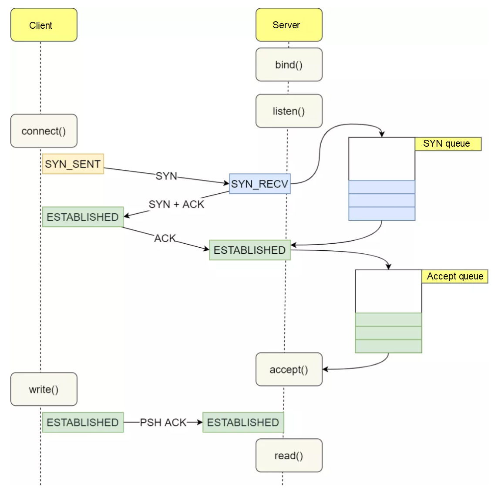

# LPIC-3 Security and Hardening 

## Session 1

### what is information Security?
the 3 objectives are commonly known as **CIA**: </br>
Confidentiality (Mahramanegi): Its about encryption of data, responsibility for abstracting Data and keeping them in Secret format. </br>
Integrity (Sehaat): its about the validity of data or source in process of transfering or expantion </br>
 - Data Integrity: the data which is sent is correct and valid
 - Source Integrity: the sender is the valid one and can be trusted </br>
Availability (Dastres paziri): the data or service should be always available doesn't matter what. like GPS, Search Engines.

the CIA triangle side are not always Equal and it is based on the content or usecase.


### CVE (Common Vulnerabilities and Exposures)
the CVE consist of all the vulnerabilities that have been detected and got signatureure. it is created in order to first, to announce the problem so everybody will be aware of it. </br>
there are many websites and communities that hold these CVEs like: [**mitre.orh**](https://cve.mitre.org/) </br>
we need daily survery over CVE if we are working on security.

[OPENCTI (Open Source Threat Integilence Platform )](https://filigran.io/solutions/open-cti/)
we can use this to assign our devices so we only can get the CVEs that are related to our devices

to check if the previous code is executed without any error we can use: `echo $?` in command line to check the result which should be zero as the `C` Programming is based on `return 0` functionality </br>
it will show even the background errors and always should be checked.


### how to detect Buffer flow
canary: we can use carry buffer which can be called as `null canary` or 0x00 or Xor which will be place at the end of the program buffer which will act as a detector and if the program flows over it, it will detect that something insecure is happening </br>
for instance we can use it in compiling a C program: </br>
`gcc code.c -fno-stack-protector -z execstack -o file.c`: the -fno-stack-protector will serve as the canary.

we also use tools suchas GNU Debugger to detect the BUffer Overflows</br>
`gdb -q ./user_directory`
#### what is DEP?
**Data execution prevention (DEP):** it prevents the CPU instructures to be executed directly via a program or data. for example system calls. ( it is a windows based concept) </br>
it linux, it is called **NX/XD (NO execute / Execute Disable)**, which it should be enabled on CPU. </br>
to check if Nx/xd ( NX XD ) is enabled on OS:
`dmesg | grep -i nx` </br>
`cat /pro/cpuinfo | grep -i nx`


check out `/proc` and process ID directory and their map to see where the data is written.

#### fuzzer (fuzzing)
giving a lots of different inputs to a program to check the program vulnerability.

what is `Segmentation fault (core dump)` error: </br>
it means that the progam that we run got more input than its buffer capacity and the (core dump) means that the error is dumped so we can analyse the error. this buffer flow is the cuase of invalid memory access.

kernel does NOT give access to a program to write on memory directly, it will write on a virtual ram and give address to it. and this addressing is randomized on memory so it cannot be intrusioned. </br>
`segmentation fault` means that the program is trying to overflow to other memory location which are not belong to it. </br>
`core dump`: when segmentation fault happnes the kernel will get a core dump and of those segment and will write the logs somewhere. we can analys those data with GDB (Genu Debugger).

**RCE (Remote Code Execution)**


### Developing and updating strategy.

#### stage updating
when we detect an vulnerability or if the service needs an update its not feasible to update it right away so we need to take a **staging** scenario which we will update a sample of project, let it run for a while and then implement the real update on service to prevent any problem in service and also bracade the vulnerability.

for instance we can use (Centos and Not on Debians): </br>
`dnf updateinfo`: it will give all vulnerabilities on our packages </br>
`dnf updateinfo list updates security`: it will list with details of where the vulnerability is. they have **RSLA** in their begining which it means "Rocky Linux Security Advisory". DSA (debian Security Adivor), RHSA(Redhat Security advisor). </br>
we can search the "RSLA" problems on the [Product Errata](https://errata.rockylinux.org/). each OS has its own CVE

after checking the security problems we run:
`dnf update --security` it only updates the security patches.

#### ASLR (Address Space Layout Randomization)
as we know the heap, stack and data on memory are addresses with RIP (the instruction pointer) which are the register that points to the next instruction to be executed. and base pointer (RBP), by using ASLR we will be able to randomize and make gap between these addresses so it will be difficult to detect the next address. </br>
**ASLR should always be active on OS.** </br>
ASLR is built into the Linux kernel and is controlled by the parameter `/proc/sys/kernel/randomize_va_space`. 
the values inside the `randomize_va_space` is:
**0**: Disable ASLR. This setting is applied if the kernel is booted with the norandmaps boot parameter.
**1**: Randomize the positions of the stack, virtual dynamic shared object (VDSO) page, and shared memory regions. 
The base address of the data segment is located immediately after the end of the executable code segment.
**2**: Randomize the positions of the stack, VDSO page, shared memory regions, and the data segment. This is the 
default setting
*attackers will try to set the value to 0 in the beginning of attack*

if problem is detected we need to call CSIRT (Computer Security Incident Response Team) to handle the problem.


#### calculating the CVSS (Common Vulnerability Scoring System)
each vulnerability has weight and score for itself and it based on:
Attack Vector (AV), Scope(S), Confidentiality(C), Attack Complexity (AC), Integrity (I), Availability (A), Privileges Required (PR), User Interaction (UI) </br>
check them on [first](https://www.first.org/cvss/) website


### Cryptography
nowadays the asymmetric and symmetric key cryptography is applied, it is the base concept of Pre-shared keys and Public/Private asymmetric keys.
some algoriths for symmetric cryptography are: ~~DES~~ , ~~AES~~ , 3DES, CAST5 6, which most are deprecated.


#### Public Key and Private Key Pairs
its an asymmetric way to encrypt, note that in mathematical perspective, the Public key is created based on Private Key. but public Key cannot create the Private key. </br>
this private and public key also include the signture and signing the Data so the source will be valid (Integrity). the verification and signing is also important to adjust Source Integrity.

Alogrithms being used for Asymmetric are: RSA 
for instance: </br>
Ali wants to send Data to Mona. </br>
Ali will take data and encrypt it with Mona Public Key --> then it will sign it with his Private Key --> then Mona will receive the Message and Verify Ali by its Signture --> then it will Decrypt the message by her Prviate key.


#### Signing should happen after encryption
signing a data always should be done after encryption cause it will reduce process overflow. cause for instance by not verifying the signature, the encryption process will not be needed.

#### Hashing
Hashing means encrypting a data in order that it only can be decrypted in one way and cannot be decrypted from calculating the encrypted data. </br>
*md5sum are deprecated and mostly the SHA512 and above are being used.*

*be careful to not fill the bucket of Hashing with nulls*

#### passphrase vs password
passphrase is more difficult to be cracked and it can consist of space in it.
remember that length of a password is more important than its complexity and it always should be more than 8 characters.


### GPG (GNU Privacy Guard)
GPG is a free open source implementation of Pretty Good Privacy(PGP), which can be ued to encrypt or sign a data. </br>
GPG uses strong, hard to crack encryption algorithms. and it uses the private/public key scheme, which eliminates the need to transfer a password to a message or file recipient in a secure manner.

we can generate GPG for our OS via
`GPG --full-generate-key ` => it will prompt a wizard to create a GPG 
after wizard is completed, the GPG will prompt a request for user to create entropy by moving mouse, increasing I/O or other activities so it can create a better Key.

the common entropy score is between 1500 to 3000, and we can check it in `cat /proc/sys/kernel/random/entropy_avail` </br>
**note** on some linux distros the number is 256, its because linus torvalds has implement in such order but 256 is good enough and will pass requirements. </br>

this randomness of entropy will protect us from **side channel attacks**

#### keyrings
keyrings also has another task which is caching the password for a period, thats why when we enter a password for sudo privilege it might not ask for another entrying password again for another sudo task. all these keyrings are holds for each user in separated place inside memory. 
**be caution**, when for instance we switch user from root to another user, the keyring has cached the root keyring, so for instance if we switch to "john" user after "root", it won't allow us to generate GPG key, unless we login with "John" first or empty the cache. </br>

use `man 7 gpg` </br>
**note**: the passphrase in "GPG" prompt is used to secure private key, so if we lost our private key, it still have a passphrase to be broken.

we can list all generated keys for a user by:
`gpg --list-keys`

#### symmetrical Encryption with GPG
`gpg -c --cipher-algo AES256 <file>` => it will cipher a file by giving passphrase and based on AES256 algorithm and then we can send to soemone </br>
`gpg -d <file>` => to decrypt a file </br>
`file <file>.gpg` to shows data about how a gpg file is encrypted.

*side note*
> we can read the gpg file by `less` command, thats because less has preprocessors and one of them is keyrings
#### SHRED
shred is used to overwrite a file to hide its content and optionally delete it. it is used instead of rm in order to prevent forensic attacks. </br>
check out its man page for its options </br>
`shred -u -n3 -s -z <filename>` => it will shred the file 3 times and change its allocation (-u) and overwrite it with 0 (-z) and change its size with (-s)

**note**: be caution about selling or buying a used devices and shred before passing it to others.


- *what is Stack canary (research)* </br>
- *what is vdso & vsyscall for instance why `ldd` consist of vdso without address?* </br>
- *ASLR vs KASLR and its properties* </br>
- *what is kernel self-protection (read the documents and take note)* </br>
- *dev/random , dev/urandom and their differnces and which is better* </br>
- *what is side channel Attack nad accoustic side channel attack* </br>
- *why randomize instead of uradomize?*

**zim (for making documentation)**

</br>

## Session 2
*another user is present, user:hacker pass: qazwsx* </br>

### creating GPG for user:
after creating GPG key with `gpg --full-generate-key`, the output will consist of two key which one is pub and other is sub. and output include: </br>
gpg stored directory.  which is `/root/.gnugp/trustdb.gpg`
gpg: key ID 
gpg revocation directory which will be used for creating future certifications
pub: algorithm,  date, [SC] Sign and Create Certificate
uid: owner information
sub algorithm date [E] Encryption


#### Exporting and Sharing GPG
for exporting gpg file we can use:
`gpg --export -a -o /export_pgp-file.txt` => the --export will export the public key only, but without -a it will export it in binary. So, we use -a to export it in ASCII format in PEM format structure. -o is for output file which will be saved in a text file. </br>
**PEM FORMAT** </br>
every key that is similar to below is known as PEM format </br>
-----BEGIN PGP PUBLIC KEY BLOCK-----</br>
        (DATA INSIDE OF IT)</br>
-----END of PGP PUBLIC KEY BLOCK-----</br>

PEM FORMAT and Binary format are formats that are used for storing Data in Commercials and are the most convenient ones.


#### Importing Public Key
to save the public key of someone to be used later with gpg we can use:</br>
`gpg --import <publickey.file>`

to check the list of imported public keys we use </br>
`gpg --list-keys`


#### encrypting and signing a data asymmetrically with GPG
the encryption and sending data to someone assymetrically using GPG consist of 3 parameters: </br>
`gpg -e -s messsage.txt` => first `-e` is used instead of `-c` because the encryption is asymmetrical, second, we use `-s` to sign our message with out private key (which we will be prompted to enter our private-key password).third, we can use `-r` to define the recepient but if we don't we will be prompt to select. *note:* receiver is selected base on 


#### decrypting the public encrypted file
after receiving a file which is encrypted by our public key and signed with sender's private key we can decrypt and verify it with our private key: </br>
`gpg -d receivedfile.gpg` => it will prompt use to enter passphrase related to private key. </br>

**note**: it might throw us warning related to untrusted certification which it means that the sender is not verified by trusted Data bases.
the trusted databases are located in: </br>
`~/.gnupg/trustdb.gpg`


#### adding a user in trusted database.
to add a sender ceritifcation and sign to our trusted db we use `--edit-key` option which will prompt use to gpg prompt command: </br>
`gpg --edit-key (sender-name)` => it will prompt use to gpg cmd and we can use `help` option to see all commands. </br>
we use `trust` to add the user to the trusted db. adding user also can be based on trust weight of sender. </br> 
> in gpg cmd, use `save` or `quite` to save and exit the prompt.

**KMS** KMS (Key Management System) in organization can add weight on managing tursted db in GPG and for each scenario they have their own implemenation like using vault or not.

**note**: </br>
we also can use signing for symmetrical encryption with switches `-c -s`. however it will prompt us in sender for both symmetric passphrase and signing passphrase and in the recepient to enter the symmetrical passphrase.
`gpg -c -s <filename>`

#### encrpytion and then signing or signing and then encrypting?
**it depends on two factors:** 
- if privacy and encryption has more priority then it is iimportant to first sign and then encrypt so the hacker won't get even the signer. if she intrudes.
- if the process and resource is important then signing should be in the end so verifying will be done first.


#### uploading key to server
for uploading our public key to internet server we need to take few steps: </br>
1. we first need to extract the Public Key id by: </br>
`gpg --keyid-format LONG --list-key` => it will print all keys in our list with their ID in front of their algorithm (we use logn format for convenient of finding 16bits quickly) for instance: </br>
`pub   rsa4096/6957E6A1C663189C 2025-04-28 [SC]`

2. we define the server and send our key to that server via gpg </br>
`gpg --send-keys -keyserver <server-url> <public-key-ID>` for example </br>
`gpg --send-keys --keyserver keyserver.ubuntu.com 6957E6A1C663189C`


#### searching for public key in serverkey
after uploading we can verify or most importantly we can search for other peoples public key in keyserver via gpg: </br>
`gpg --keyserver <server-url> --search-key <name, email, comment, information related to user>` </br>
for instance: </br>
`gpg --keyserver keyserver.ubuntu.com --search-key mohammadreza`


#### deleting a pair-key fron key list
we can delete public or private key or both of them for specific user on our OS with: </br>
`gpg --delete-secret-and-public-keys <user identifier>`


### LUKS (Linux Unified Key Setup)
LUKS is used for hard disk encryption. luks uses `dmcrypt` module inside the `dm` (device mapper) from kernel to encrypt data of block device. 
one of Its benefits is that it is AF (Anti-Forensic). Luks uses symmetric key to encrypt data on disk.
LUKS encrypt block by block and partition by partition. </br>

***but how does this encryption work? cant we just use `dd` to dump its data?***
LUKS is hashed secured with salt and hash type inside of it so it is also difficult to dump it. </br>
**luks v1 compared to luks v2**: Luks version 1 has 8 key slots to store key passphrases for spare but in version 2, 32 key slots are assigned for it. </br> 

in using LUKS, data is encrypted until it is not mounted. so after mounting and passing the password the whole data is decrypted and can be accessed.</br>
commucation happens with **cryptsetup** from user space through **LUKS interface** and then with physical block storage


### creating a LUKS disk

#### creating LUKS parition
1. first we need to partion a desired disk with `fdisk`, for instance: </br>
` fdisk /dev/sda ` => then make partition which will be for our example, `sda1`.

note: </br>
> luks will be implemented by `cryptsetup` over the data structure of the physical disk.

2. then we will apply LUKS structure over it by:
`cryptsetup luksFormat /dev/sda1` => the operation is irrevocable and data will be erased on disk (because it is encrypting blocks). it is important that memory of OS be more than 1G or 2G and passphrase should be complex. otherwise, operation will be failed.

#### verify the LUKS encryption
we can verify LUKS creation in 2 ways:
- use `echo $?` to check return 0 result.
- use `crysetup isLuks /dev/sda1 && echo YES`

#### Opening a LUKS partition
`cryptsetup luksOpen /dev/sda1 secret` => it will decrypts all the blocks and opens the LUKS (on some distros only "Open/Close" is present) and then it will map it with name "secret". you can check it out with `ls /dev/mapper/`. **note that it will open all blocks of our physical storage** </br>
*dm is used to partion the physical disk and make other partions (check it out on lvm section in lpic-2)*

passphrase that is selected for LUKS via cryptsetup is stored in **keyrings**. to check that we can use:
`cryptsetup status /dev/mapper/secret` => it will print description about the opened luks. (from then we only work with mapped disk which is "secret" in our case)


#### checking detailed information via luksDump
to check more information such as keyslots, hashing slots, uuid, pbkdf and etc, we use `luksDump`. remember that dump is done over the disk not the mapped partions. </br>
`cryptsetup luksDump /dev/sda1`


#### adding spare key for keyslots in Luks
for making spare key slots on our luks disk we use `luksAddKey`, it will prompt use for our previous passphrase on our disk and after that we can add another passphrase into our 32 key slots. </br>
`cryptsetup luksAddKey /dev/sda1` </br>
check it via: `cryptsetup luksAddKey /dev/sda1`


#### removing the passphrase 
we also can remove spare passphrase via `luksRemoveKey` but it has a catch. to remove the pass phrase we should enter the passphrase and it will be deleted. it happens for security. </br>
`cryptsetup luksRemoveKey /dev/sda1`


### LUKS format and mkfs
mkfs (make file system) has another CS name which is "data structure". its difference between the LUKS structure is that the mkfs will make changes on the body of block device but the LUKS will impact on header of the block device.

(followed up by the "mapper/secret" pratice) </br>
for instance after we `luksOpen` the /dev/sda1 as `secret` in `/dev/mapper/` we can make filesystem on it. for instance:</br>
1. make ext4 file system format on it:</br>
`mkfs -t ext4 /dev/mapper/secret`
2. create a directory and mount the secret on it: </br>
`mkdir /vault` </br>
` mount /dev/mapper/secret /vault` => mounting the secret filesystem on vault directory. </br>
` cd /vault & echo something > created.txt` => write something in it. </br>


#### encrypting the luks disk again
when the luks disk is `luksOpen` and mounted it means that the whole disk is open and everyone can use it, nonetheless it is mounted as well. the only way to encrypt it again is to first, umount it and then use `luksClose` to encrypt it. thus the mounted disk cannot be encrypted.</br>
1. first unmount the disk from filesystem: </br>
`umount /vault`
2. then close the luks disk from md: </br>
`cryptsetup luskClose /dev/mapper/secret` => **note**: it will also flush our passphrase from the keyrings


#### to make the luks disk permanent on our OS via crypttab
we use fstab to mount disk in booting process, however it is different when we are going to add luks to our mounting points. thus we use `crypttab` file to add our luks disk which is located in `/etc/crypttab`. use `man crypttab` to see manual page related to it. after that we can use `fstab` to mount it on our filesystem hierarchy.</br>
the cryptab has 4 main fields: </br>
1. first field contains the name of the encrypted block device. the device is set up within `/dev/mapper`
2. the second is the block devices or file, for instance the `sda1`.
3. the third is the passphrase, we should put "-" or none which will result on entering password during system boot.
4. the forth is the following options

**A**. we use `vim /etc/crypttab` and write new line: </br>
`secret     /dev/sda1       none        defaults`

**B**. then add the known filesystem to `/etc/fstab`: </br>
`secret     /vault      ext4        defaults     0 0` </br>

note:
> mount -a won't work after fstab configuration cause of secret file system


#### problem of not being able to open the luks disk from remote
working with luks is possible when we have close access to our machine, but what if we are remote and we still need to turn OS up. </br>
as we learned we also can give files such as movie, image or a randomly generated file as passphrase to keyslots of luks disk. </br>
thus, we can use /dev/urandom to create a random binary file to use it as passphrase. to do so: </br>
1. first we are going to create that file with /dev/urandom: </br>
`dd if=/dev/urandom of=/root/mykey bs=8192 count=1` => it will create a single 8k binary file. 
`chmod 600 /root/mykey` => change its permission to make it inaccessible from others
2. add the file to luks key slots via `luksAddkey`: </br>
`cryptsetup luksAddKey /dev/sda1 /root/mykey` </br>
3. and then add the file to `/etc/ecrypttab`:
`secret     /dev/sda1   /root/mykey     defaults` => it will allow boot to find the file and use it for luks key.


### Openssl
OpenSSL is a general purpose cryptography library that provides an open source implementation of the Secure Sockets Layer (SSL) and Transport Layer Security (TLS) protocols. The library includes tools for generating RSA private keys and Certificate Signing Requests (CSRs), checksums, managing certificates and performing encryption/decryption. OpenSSL is written in C, but wrappers are available for a wide variety of computer 
languages.


### Self-Sgined Certificate
A self signed certificate is a digital certificate that’s not signed by a publicly trusted certificate authority (CA). 
This can include SSL/TLS certificates, code signing certificates, and S/MIME certificates.
**Advantages of a Self-Signed SSL Certificate**
- Self-signed SSL certificates are free.
- They’re suitable for internal (intranet) sites or testing environments.
- They encrypt the incoming and outgoing data with the same ciphers as any other paid SSL certificate.

**Disadvantages of a Self-Signed SSL Certificate**
- No browsers and operating systems trust self-signed certificates.
- It’s easy for attackers to make self-signing certificates to perform man-in-the-middle (MitM) attacks


**SSL Certification Types:** </br>
- DV (Domain Validation): for validating a domain and its sub-domains via a Ceritication Authority(CA). we send a CSR (Ceritifcate Signing Request) and send our public key and might do some task in order to verify that domain name for ourself.
- OV (Organization validation): it is for organizations validation and for enterprise companies
- EV (extended validation): it supports both DV and OV, it is expensive and take a lot of time to be validated.
- wild card ceriticate: using wild card such as (*) to validate all subdomains of a domain name (it is not secure) because if private key is leaked then all the services and subdomains will be leaked.


### PKI, CSR, PKCS, X.509, CRL
**PKI**: A public key infrastructure (PKI) is a set of roles, policies, hardware, software and procedures needed to create, manage, distribute, use, store and revoke digital certificates and manage public-key encryption. </br>
**CA**: In public key infrastructure (PKI) systems, a certificate signing request (CSR or certification request) is a message sent from an applicant to a certificate authority of the public key infrastructure (PKI) in order to apply for a digital identity certificate. The CSR usually contains the public key for which the certificate should be issued, identifying information (such as a domain name) and a proof of authenticity including integrity protection </br>
**PKCS**: Public Key Cryptography Standards (PKCS) are a group of public-key cryptography standards devised and published by RSA Security LLC, starting in the early 1990s </br>
**X.509**: In cryptography, X.509 is an International Telecommunication Union (ITU) standard defining the format of public key certificates.
the structure of X.509 can be seen when we are trying to get information about the TLS connection in a website from search bar.</br>
**CRL**: Certifcate Revocation list also known as "revocation list", is "a list of digital certificates that have been revoked by the issuing certificate authority (CA) before their scheduled expiration date and should no longer be trusted"

#### CRL use with openssl
we can check this CRL list and its data content via ssl. to do so, we first need to download its ".crl" file. </br>
1. go to web browser and in browser bar select your "Certiciate View" then find the "CRL Distribution point which will have a url with .crl in the end.
2. download the file using wget: </br>
`wget http://crl3.digicert.com/DigiCertGlobalRootCA.crl`
3. then open the binary file with openssl:
`openssl crl -text -noout -in DigiCertTLSHybridECCSHA3842020CA1-1.crl` => it tells openssl that format a crl to a text wihtout encoded version and get the "crtlfile.crl" as an input.


#### using Openssl to create CSR
lets create a directory inside httpd service and work on it from now on: </br>
`cd /etc/httpd/ && mkdir ssl; cd ssl` => create a ssl directory in httpd dir and cd to it.

1. lets create a private key with openssl (which can be used to create public key with it): </br>
`openssl genrsa 2048 > private.key` => it generates a private key with 2048 length

2. we use private key to creates the public key and send a CSR message with `-new` option:
`openssl req -new -key private.key > request.csr` => it will request to generate a new public key based on private key and save it in request.csr. the request.csr is saved in PEM format. </br>
note: 
> challenge password in csr wizard is for securing the revocation requests.

3. creating only a public key with rsa algorithm from private.key file: 
`openssl rsa -in private.key -pubout > public.key`

4. verify the request.csr PEM file by openssl:
`openssl req -text -in request.csr`

5. after verification we can send our request.csr file to the CA (Certificate Authority)


#### Certification Authority Side for Approving the CSR Request. 
first of all the CA will check the format to be X.509v3 which is the standard format for public key certificates. aslo it needs to be sign by CA as well: </br>
`openssl x509 -in request.csr -out cert.pem -req -signkey ca-private.key -days 365` => it will check the input by x509 standard and then make an certifciate output as cert.pem. then for another request we use `-req` to sign the cert.pem file with the CA private.key and then add expiration day to it. thus, the cert.pem will have issuer data and the public key of requestor.

- verify it by: </br>
`openssl x509 -text -in cert.pem`

- acquiring public key from the cert.pem file
`openssl x509 -pubkey -noout -in cert.pem`


#### assign the SSL ceritifcation on webserver
we can verify and use the SSL certification in our web server. for our case we use apache httpd service.
1. change the file path of private and public key in `/etc/httpd/conf.d/ssl.conf`:
- `SSLCertificateFile /etc/httpd/ssl/cert.pem` => adding the cert.pem file as certificateFile
- `SSLCertificateKeyFile /etc/httpd/ssl/private.key` => adding the private.key file path  for Key.

2. open the firewall (if needed):
- `firewall-cmd --add-service=https`

3. check the url of yourserver with `https`
`https://192.168.112.135`


- *xxd, strings, hexdump for checking content inside of an executable file*
- *homework: https://github.com/testssl/testssl.sh*
- *ja3 ja3s and its relationship to ssl and fingerprint. checking malwares*
- *pbkdf2 and what is it?*
- *what is luksHeaderbackup and luksHeaderRestore*
- *drown attack on ssl*
- *poodle attack on ssl*
- *CBC CFB ECB, SIV, GCM, CTR encryption types*
- *crime, ticket bleed, breach lucky13, beast, freak attacks*
- *OCSP and its comparison with CRL*
- **attack simulation and security simulation**
- **RSA Security conference**


</br>

## Session 3
### Testing SSL verification

#### Test SSL tool
[test ssl](https://github.com/testssl/testssl.sh*) is one of the tools to verify whether SSL and TLS functionality properly on my service. and what kind of protocols or versions are being used on

#### openssl test tool
openssl also have built in tools to test SSL connection on services that are offering it: </br>
`openssl s_client -connect <ip/domain>:<port>` </br>
for instance </br>
`openssl s_client -connect soft98.ir:443`


#### encrypting and decrypting file with openssl
openssl also can be used to encrypt a file symmetrically with different types of algorithms it also supports adding salt and using pbkdf (password-based key derivative function) as well. for instance lets encrypt a file and indicate an output for it: </br>
`openssl enc -aes-256-cbc -pbkdf2 -in mohammadreza-secret.txt -out mohammadsecret.enc` => note that using pbkdf2 option will strength the password and is used for passowrd hardening, we also defined the "-aes-256-cbc" to describe the encryption algorithm. it will also prompt use for choosing a password for our encrypted file.

to decrypt the file similar to encryption, we will use "-d" options. as a pratice:
`openssl enc -d -aes-256-cbc -pbkdf2 -in msecret.enc -out revealed.txt` => by using "-d" and identifying the algorithm we will decrypt the file and output the result into another file.


#### hashing a file using openssl
we can use `sha256sum ` or `sha512sum` command to make hash of a file but this functionality is also present in openssl tool:
`openssl dgst -sha256 file.txt` => it will print the sha256 hash of our file. the "dgst" stands for digest which also means the hashing process. </br>
note:
> we mostly desire to use sha256 command instead of openssl but it is extra feature that coms with openssl that can help up for developing


### firewall
firewall is counted as a organization asset, so it should not be exposed to the internet via any Public IP, and if the firewall does have a public IP, all the exposable services such as "http" or etc, should be disabled on them. otherwise, the data related to asset, or even configuration might be thefted. </br>

firewalls also can be used in middle of our internal services such as database, production servers and etc. the firewalls are mostly reliable which have IPS (Intrusion Prevention System). also multiple firewalls can be used for risk mitigations as well

#### multi branding in using firewall
mutli branding means to use different brands and types of firewalls in our network due to security hardening. it is used because it will reduce the risk of similar attack on both devices. so if a vulnerability is used for first one it is really difficult to use the same approach for the others.


#### DPI (Deep Packet Inspection)
deep packet inspection (DPI) is used to inspect packet and used on most of firewall to secure the data transaction. because DPI consume so much process, in some strict conditions, if DPI cannot read the packet it will drop it, similar to condition where the VPNs aren't working in internet outage. 


### Linux Firewall and Netfilter
Netfilter is a framewrok provide by the linux kernel that allows various netwroking-related operations to be implemented in the form of customized handlers, Netfilter offers various functions and operations for packet filtering, netwrok addressing translation (NAT), and port transaltion. </br>
many might know **firewalld**, **iptable** or **ufw** (which is interface of iptable). but all of these firewalls are actuall interfaces allowing us to communicate with Netfilter core which is written in C.

#### iptable 
iptables is a command-line firwall utility that uses policy chains to allow or block traffic. during a connection, iptables looks for a rule in its list to match it to the connection, if it doesn't find one it will resort to the defualt actions. </br>
the attributes of iptable is: </br>
- **Stateful packet inspection**: the firewall keeps track of each connection passing through it.
- **Filtering packets based the values of the flags in the TCP Header**: helpful in preventing attacks using malformed packets and in restricting access.
- **system logging of netwrok activities**: provides the optinos of adjusting the level of details of the reporting
- **Packet manipulation (mangling) like altering the TOS/DSCP/ECN bits of the IP header**: mark and classify packets dependent on rules, first step is QoS (quality of Service).

#### IPtable Builtin Tables </br>
1. **Mangle**: Manipulates QoS bits in TPC header
2. **Filter**: packets filtering has three builtin chanis
    - **Forward chain**: filters packets to severs protected by firewall
    - **Input chain**: filters packets destinated for the firewall
    - **output chain**: filters packets originatin from the firewall
3. **NAT**: Network address translation, has two built in chains
    - **pre-routing**: NAT packets when destination address need changes
    - **post-routing**:  NAT packets when source address need changes

#### Target and Jumps
1. Accept
    - Iptable stops further processing
    - the packet is handed over for operating.
2. DROP
    - iptables stop further processing
    - the packet will be blocked
3. LOG
    - the packet information is sent to the system daemon for logging. Iptables continues processing with the next rule in the table.
4. Reject
    - works like the DROP target, but will also return an error message to the host.

5. return

**reject vs drop** </br>
drop wont respond back and is used to keep the end host as ananymous also reject will use processor. however, reject is used for troubleshooting and service usecases because it will send back the cause of stopping connection.


#### Masking a filewall daemon.
When masking a service, the symlinks are moved and then point to /dev/null. When you simply disable a service, it can still be started manually. When you mask a service, it cannot be started manually. In other words, masking a service renders the service permanently unusable until it’s unmasked. Say, for instance, that you install a piece of software with a systemd service and you find out there’s a vulnerability in the service. You might not want to remove the application, but you certainly don’t want it running until the vulnerability is fixed. You could mask the service, wait for the vulnerability to be patched, patch the software and unmask the service. </br>
`systemctl stop firewalld.service`</br>
`systemctl mask firewalld.service`


#### Review the concept
**gathering knowledge before working on something related to security is much more important than only acting on it (59min knowledge gathering and 1min action)**
Port scans are available in numerous types, including TCP Connection sacn, SYN (half connection scan), Null, FIN, Xman and **Dumb scan**.


#### common iptables switches
- `-t <table> `=> if you don;t specify a table then filter table assumed.
- `-i <target>` => ACCEPT, DROP, REJECT, LOGs
- `-A` => append a rule to the end of chain 
- `-I` => Insert the rule at the head of the chain (or give a number)
- `-F` => Delete all the rules in the selected table
- `-p <protocol-type>` => match protocols (tcp, udp, icmp, and etc)
- `-s <source-ip>` => match the source IP 
- `-d <destination-ip>` => match the destination IP
- `-i <interface-name>` => match the input interface 
- `-o <interface-name>` =>  Match the output interface

#### iptables commands example explanations:
- `iptables -I INPUT -i eth0 -j DROP` => insert for the INPUT chain rules and define the input of inteface eth0 and for "-j" jumps, just drop the packet
- `iptables -I OUTPUT -o eth0 -j REJECT` => insert for the OUTPUT chain, for outbound of eth0 interface every jump should be Rejected
- `iptables -A INPUT 3 -p tcp --dport 80 -j DROP` => append to the INPUT chain rule no.3 and for protocol tcp for destination port 80, DROP the jump packets
- `iptables -A INPUT 3 -p icmp -s 192.168.3.0/24 -j DROP` => append to INPUT chain, for protocol icmp for source in range of 192.168.3.0/24, DROP the jumps </br>
**Note**:
> multiple firewalls cannot be activated on a single OS, only one should be enabled.
> the iptable rules are applied ascending 


#### iptable modules
iptables include modules for bulk rulings and for using them `-m` switch is used. some examples of this modules are: </br>
- Multiport: for assining rules on multiple ports
- iprange: use to include range of ips which might not be in a same subnet.
- connlimit: also stands for concurrent connection limits and used to apply shape on rate limit
 and, state, 

**multiport** </br>
for instance instead of assining rule to each port one by one via `-A` we'll do: </br>
`iptables -A INPUT -p tcp -m multiport --dport 21,23,80,443 -j DROP` </br>

verify it by: </br>
`iptables -nvL`


**iprange** </br>
we use iprange for ips that are not in a complete subnet or we are going to specify only porition of a range. for example: </br>
`iptables -A INPUT -p tcp -m iprange --src-range 192.168.1.7-192.168.1.130 -j DROP` => it will only drop packets from  192.168.1.7 to 192.168.1.130.


**connlimit** </br>
the connlimit is applied over parallel connections, which it means for instance it can be set on all ports that are using tcp connection to implement it we do:</br>
`iptables -I INPUT -p tcp -m connlimit --connlimit-above 110 -j DROP` => it only accept 110 connection to the server up to 110 and above that it will be dropped


**state**
the state module have four what are called as "states" which are: </br>
1. new: packets related to initializing a connection
2. stablished: packets that indicate that connection is established
3. related: the connections that are related to previous connection or is based on stablished connection like FTP (21, 20) or DNS request packets.
4. invalid: invalid are packets or connection that are stateless, for example a FIN packet that is sent to interface or a RST packet similar to "cve-2017-7285". 

example scenario: </br>
think about the condition which we are going to implement zero trust over our OS network connection, but we are going to accept ssh connection via INPUT chain and only respond the *related* connection from the OUTPUT chain. to do so: </br>
1. we will DROP all connections in our INPUT and OUTPUT chain:
`iptables -P INPUT DROP` => -P stands for policy and we just change the INPUT Policy to DROP all. </br>
`iptables -P OUTPUT DROP` => dropping all output traffic.
`iptables -I INPUT -p tcp --dport ssh -j ACCEPT` => will accept the ssh (22) connection from the INPUT chain.
`iptable -I OUTPUT -p tcp -m state --state ESTABLISHED,RELATED -j ACCEPT` => it will accept the OUTPUT traffic that are related and are stablished packets (which in our case is the packets related to ssh).

to retrieve the default configuration: </br>
- `iptables -P INPUT ACCEPT` 
- `iptables -P OUTPUT ACCEPT`
- `iptables -F` 


**conntrack**
there are many tools that help us to prevent attacks that involves dictionary attacking, brute force or password spraying for example the failed2ban which is used for IDS (Intrusion Detection System). another tool which will work on is *conntrack*. </br>
conntrack as its name indicates, holds a track of connection to our OS by using a table of connection. however, this module comes with another module called `recent` which a sub module, for instance </br>
`iptables -I INPUT -p tcp --dport 22 -m conntrack --ctstate NEW -m recent --set` => in this case we are using `conntrack` to track the connection for port 22 with tcp protocl, also we declared `--cstate` which explain what kind of packets should be <u>*tracked.*</u> that in our case is the `NEW`. also we are using `-m recent` module which explain how to track the data (in our case it only sets), and where this data is withheld. it is called module over module approach in iptables. </br>


to check where the connections and data are being hold we can use `modinfo` to see information of our recent process in sudofile called `/proc` (the process folder) </br>
`cd /proc/net/xt_recent` </br>
`modeinfo xt_recent`

**till when the data is hold in buffer and when it is flushed?** </br>
by examining the `xt_recent` with `modinfo xt_recent | less` we can see that in the end of we have a state which indicate *number of packet per IP adress to remember () max*, it is our treshhold which our recent module will hold data related to our connections. it should be more than 65,000 IPs. 
 
*why not ESTABLISHED state in conntrack over 22?* 
> some protocols such as SSH do not keep the connection up or do not support "keep alive" state similar to https so we use NEW state for tracking the onncetion. for instance when password is incorrect in ssh connection, the handshake will initiate again.


**recent**
now we are going to define conditions for our recent module state on how to keep the conntrack table's data. </br>
`iptables -I INPUT -p tcp --dport 22 -m conntrack --cstate NEW -m recent --update --second 60 --hitcount 30 -j DROP` => in this example we are defining the `recent` module that every 60 second do a update on the table that you are keeping, which it means to flush the previous data and keep the new tracks. then we define `hitcount` which means that if requests are more than 30 from the source that you are holding in table, then drop it </br>

lets test it out: </br>
we are going to write a small bash script that will make more than 30 connection to ssh port for our host thats has the hitcount rule.

1. in another device we create a `spam.sh` file:
```sh
for i in `seq 1 50`
do
ssh root@192.168.112.135 &
done
```
2. give it executation permission: `chmod +X spam.sh` </br>
> it will return `Pseudo-terminal will not be allocated because stdin is not a terminal.` error because of the defined hitcount

3. run it and then check the `Default` file in the end host `/proc/net/xt_recent/` 
`cat /proc/net/xt_recent/DEFAULT`


### What is Nmap?
network mapper, is a free open source tool that is available to scan networks, looking for live host, specific services, or specific operating systems. it also comes wih GUI functionality as (Zenmap)</br>
it is used for:
- host/prot/service Discovery
- OS version detection
- Service version detection
- Vulnerability and exploit Detection using Nmap Scripts Engine(NSE) which is written in lua (Recommended to Get Deeper in this section)
    - scripts of nmap are located in `/usr/share/nmap/script` and are many preload .nse scripts for vulnerability detection

#### Nmap phases scan
1. Scan a single host IP </br>
`nmap 192.168.1.1`

2. scan by the subnet range </br>
`nmap 192.168.1.0/24`

3. Scan the range of IPs between a range </br>
`namp 192.168.1.3-110`

4. scan the IP addresses listed in a text file: </br>
`nmap -iL hosts.txt`

5. Scan the 3 sepcific IPs only </br>
`nmap 192.168.1.3 192.168.1.31 192.168.1.56`

6. Scan only port 80 for specific host </br>
`namp -p 80 192.168.1.3`

7. scan ports 21 up to 110 for specific host </br>
`nmap -p 21-110 192.168.1.3`

8. Scan ports 22,80,443 only </br>
`nmap -p 22,80,443 192.168.56.102`

9. Scan ALL ports for specified host (not recommeded and only should be done on local assets) </br>
`nmap -p- 192.168.56.102` 

10. Full TCP connect scan </br>
`nmap -sT 192.168.56.102`

11. Scan UDP ports </br>
`nmap -sU 192.168.56.102`

12. TCP SYN Scan (best option) </br>
`nmap -sS 192.168.56.102`

13. Do a Ping scan only(live hosts detection) 
`nmap -sP 192.168.56.0/24` </br>
*note*
> if the ICMP protocol is closed then the port scan won't be applied thus we can use `-Pn`.

14. Don't ping the hosts, assume they are up </br>
`nmap -Pn 192.168.56.102`

15. Version detection scan of open ports (services) </br>
`nmap -sV 192.168.56.102`

16. identify Operatin system version </br>
`nmap -O 192.168.1.3`

17. combines OS detection, service version detection, script scanning and traceroute </br>
`namp -A 192.168.1.3` </br>
*note*
> it find the service or OS version by doing a process called "Banner Grabbing" and this process can be manipulated to show false data.


**Bonus for Iptables**
there is a condition which attack is happening via domain name, and we need to DROP the packets that are destined to that domain.
for that we might want to use: </br>
`iptable -A OUTPUT -d abcd.co.ir -p tcp --dport 443 -j DROP`</br>
however, there is problem which this approach. the problems is that **the attacker might use another subdomain** to implement its attack. thus we will use a module inside the iptables called "**string**", the script will use the KMP algorithm to search for any connection that containes the DNS name in it. </br>
`iptabels -A OUTPUT -p tcp -m string --string abcd.co.ir --algo kmp -j DROP`

to test it use the `curl` to see if traffic can be send or not:
`curl -K abcd.co.ir`


### firewalld
firewalld at its core, is a **zone-based firewall**, zone-based firewalla re network security systesm tht minotir traffic and take actions based on a set of defined rules applied against incoming/outgoing packets. </br>
*Firewalld uses the concept of zones and services, instead of iptables chain and rules.*

Zones are predefined sets of rules specifying what traffic should be allowed based on the level of trust on the networks your computer is connected to. You can assign network interfaces and sources to a zone.</br>
Below are the zones provided by FirewallD ordered according to the trust level of the zone from untrusted to trusted: </br>
- drop: All incoming connections are dropped without any notification. Only outgoing connections are allowed.
- block: All incoming connections are rejected with an icmp-host-prohibited message for IPv4 and icmp6-adm-prohibited for IPv6n. Only outgoing connections are allowed.
- public: For use in untrusted public areas. You do not trust other computers on the network, but you can allow selected incoming connections.
- external: For use on external networks with NAT masquerading enabled when your system acts as a gateway or router. Only selected incoming connections are allowed.
- internal: For use on internal networks when your system acts as a gateway or router. Other systems on the network are generally trusted. Only selected incoming connections are allowed.
- dmz: Used for computers located in your demilitarized zone that have limited access to the rest of your network. Only selected incoming connections are allowed.
- work: Used for work machines. Other computers on the network are generally trusted. Only selected incoming connections are allowed.
- home: Used for home machines. Other computers on the network are generally trusted. Only selected incoming connections are allowed.
- trusted: All network connections are accepted. Trust all of the computers in the network.

**Note**:
firewalld uses two separated configuration sets, **runtime** and **permanent** configuration: </br>
runtime means that configurations are saved on Memory and will be lost by reboot. but permanent will keep the configuration permamently.

to make configuration permanent we use `--permanent` flag. </br>
also some distros might not have firewalld installed by default, so install it by `yum/apt install firewalld`

#### firewall-cmd
firewalld uses firewall-cmd as a CLI command interface. </br>
the common commands with `firewall-cmd` are:
- get list of all available zones </br>
`firewall-cmd --get-zones` 

- to see what is our default zone </br>
`firewall-cmd --get-default-zone`

- to see which interface is in which zone and whether they are active or not</br>
`firewall-cmd --get-active-zones`

- view the zone configuration settings </br>
`firewall-cmd --zone=drop --list-all` => by defined `--zone=` we can see each zones configuration, but default if we don't declare, it will print the default zone on firewall.

- changing interface zone </br>
`firewall-cmd --zone=public --add-interface=ens33 --permanent` in this configuration we've declared to add the interface `ens33` to our public zone, if we don't define it will select the default zone. also we are using `--permanent` flag to make the configuration permanent and not just in runtime.</br>
use `firewall-cmd --zone=public --list-all` to verify that. </br>
use `firewall-cmd --reload` to reload the configuration </br>
then use `firewall-cmd --get-active-zones` to check interfaces in configured zone.

- changing the default zone </br>
`firewall-cmd --set-default-zone=drop` change the default zone to drop (it doesn't need `--permanent` flag). also ssh that is **establieshed** won't be dropped due to firewalld policies by default but new ssh connections will be dropped. </br>

- changing interfaces from one zone to another </br>
after changing our default zone, we will still have our interface to previously default zone, to change them to become available in new default zone we do: </br>
`firewall-cmd --change-interface=ens33` => there is no need to use `--zone=drop` because the default is now drop, unless we need to add it. 

- adding or remove multiple services: </br>
`firewall-cmd --add-service={ssh,https}`


**bonuns**
#### cockpit
Cockpit is a web-based remote administration software for Linux servers. Cockpit is free, open source software released under the GNU Lesser General Public License 2.1. Sponsored by Red Hat. By default, Cockpit listens on TCP port 9090. </br>
one of its coolest features, cockpit-session-recording which is used to record all users interaction with the terminal. </br>
cockpit can be provisioned on servers to monitor its data with GUI and web-based interface.


**nmap and other pdfs are important, take them**

- *ECDSA Algorithm*
- *what is nm-shared zone in firewalld*
- *KMP algorithm string searching*
- *DPI and SNI for iptables*
- *what is IoA and IoC*
- *stealth scan, ~sinscan*
- *port knocking, there is a video about it*
- *LLD and HLD (High level Design) Survy before hardening, flows, connections, requests numbers etc...*
- *NSM Network Security Module, Zeck, bro*
- *https://en.wikipedia.org/wiki/Idle_scan - Dumb scan*
- *how to asymmetrically do encryption with openssl*
- *zero trust, and what is it, atleast privileges*
- *syn flood*

**always keep your knowlege up. atleast dedicate 45min a day to read about news related to IT and learn them**


</br>
</br>


## Session 4

### firewalld files
the main configurations and files related to firewalld is located in `/usr/lib/firewalld` and most of these files are written in `.xml` format such as zones or services. </br>
however, note that configurations should be changed in `/etc/firewalld` and not directly in `/usr/lib/firewalld`.


#### why does firewalld have confiugration both in `/usr/lib` and `/etc`.
when we install linux OS, firewalld will install its configuration in `/usr/lib/firewalld`. however similar to what we have learned in LPIC-1 when new update is arrived on our OS the configuration will be overwritten in `/usr/lib` directory, thus we change configuration in `/etc` to keep the manual change permanent after updates


#### creating custome zone
to add a customized zone to our firewalld,</br>
1. we first need to go to `/etc/firewalld/zones` and then add a `.xml` file with our customized name (we can copy a zone by `cp` and change it) for example: </br>
`cp public.xml customized.xml`

2. then we can change the data inside of the `.xml` file. the data consist of port, protocols, services, description, name and etc. and exmaple of it is: </br>
```xml

<?xml version="1.0" encoding="utf-8"?>
<zone>
  <short>Customized</short>
  <description>This is a Customized zone for pratice purposes.</description>                                              
  <service name="ssh"/>
  <service name="dhcpv6-client"/>
  <service name="cockpit"/>
  <interface name="ens33"/>
  <port port="22" protocol="tcp" />
</zone>

```

3. after adding new xml file, do a reload by: </br>
`firewall-cmd --reload` </br>
and verify the configuration by: </br>
`firewall-cmd --get-zones` and `firewall-cmd --list-all-zones`


#### services in firewalld
built in services are located in `/usr/lib/firewalld/services`. the configuration files are similar to zones, are written in .xml file.</br>
we can create our own customized service file as follow: </br>

1. to make it easy, we can copy one of services and then change configuration base on the template: </br>
`cp ssh.xml lizardz.xml`

2. change its xml configuration: </br>
``` xml

<?xml version="1.0" encoding="utf-8"?>
<service>
  <short>lizardz</short>
  <description>the lizardz is a service based on something that I am building up as I am writing it </description>
  <port protocol="tcp" port="4242"/>
  <port protocol="udp" port="4242"/>
</service>

```

3. apply and verify changes by </br>
`firewall-cmd --reload` and then `firewall-cmd --get-services | grep lizardz`


**note** </br>
new services file won't be added to `/etc/firewalld/services` unless we call it in our configuration. in that case the file will also be added to `/etc/firewalld/services` </br>
for instance, we need to set our zone to "customized" zone by ` firewall-cmd --set-default-zone=customized ` 


#### adding a service
we can add/allow services to different zones via: </br>
`firewall-cmd --zone=public --add-service=http` or adding multiple services: `firewall-cmd --zone=public --add-service={http,ssh,ftp}` </br>

to remove a service we do: </br>
`firewall-cmd --zone=public --remove-service=http` or multiple services: `firewall-cmd --zone=public --remove-service={http,ssh,ftp}`

use `firewall-cmd --get-services` to see the active services on zone </br>


#### adding customized port
to add a new port to the zone similar to service we can do: </br>
`firewall-cmd --zone=public --add-port=8080/tcp --permanent` note that its protocol should be placed after the port number. </br>
and to remove it we do: </br>
`firewall-cmd --zone=public --remove-port=8080/tcp --permanent`


### Advanced Configurations in Firewalld
firewalld has potential to be used for advanced scenarios which are called **Rich Rules**. It allows you to add fully customed firewall rules to any zone fort any port,protocol, address and action. to get more information check out its manual: </br>
`man 5 firewalld.richlanguage`

to write rich language rules for firewalld we will first set rules from broad to details. for instance: </br>
we first defined the rules as: </br>
<pre>
{family= ipv4/ipv6}:            at the start we defined the ip version we are setting rule (the broadest )
{source/destination}            then we define the source or destination of it 
{services, ports, protocols }   then we define services,ports, etc that are going to be allow/deny on source/destination
{actions}                       finally we define the actions such as DROP, BLOCK, ACCEPT, REJECT (detailed)
</pre>

*note*
> we can only write rules for layer 3 and not above of that.

#### adding rich-rule to the firewalld zone
to add a rich-rule to our zone we need to follow up a syntax and few notes. 
- first of all, the base of the syntax is as `firewall-cmd --add-rich-rule=''` it can also be written as `firewall-cmd --add-rich-rule ''` (without equal sign (=)) </br>
- **note**: we use single quote (') for adding rules because inside of that we will use double-quote (") which allow us to not break the syntax. </br>
- the rules that are defined in `rich-rule` have priority and will overwrite all other configuration inside the zone. </br>

for instance: </br>
` firewall-cmd --add-rich-rule='rule family="ipv4" source address="192.168.1.110" reject'` => adding a rule with ip address</br>
`firewall-cmd --add-rich-rule='rule family="ipv4" source address="192.168.1.110" service name="snmp" drop'` adding a rule with service name </br>
`firewall-cmd --add-rich-rule='rule family="ipv4" source address="192.168.1.0/24" port port="80" protocol="tcp" accept` </br>
 
**note**:
> we can add multiple rules

verify it by: </br>
`firewall-cmd --list-all`

- to remove the rules we can copy the content that is in the `--list-all` result (if rules are not remembered): </br>
`firewall-cmd --remove-rich-rule='rule family="ipv4" source address="192.168.1.110" reject'`


#### zero-trust configuration with firewalld
now lets implement a scenario which we are going to assign a zero trust configuration for a source address and only allow ssh connection from it. </br>
to do that:
1. we first change our default zone to "drop": </br>
`firewall-cmd --set-default-zone=drop`

2. then we will add a rich-rule to allow only connection ssh from a source address: </br>
`firewall-cmd --add-rich-rule='rule family="ipv4" source address="192.168.1.110" port port="22" protocol="tcp" accept '` => apply it via port </br>
or </br>
`firewall-cmd --add-rich-rule='rule family="ipv4" source address="192.168.1.110" service name="ssh" accept '` => apply it via service name


**practice**: writing a rich-rule to accept icmp packet from specific destiantion: </br>
`firewall-cmd --add-rich-rule='rule family="ipv4" source address="0.0.0.0/0" protocol value=icmp accept'`


### Introduction to SELinux (Securiy Enhanced Linux)
SELinux (Security Enhanced Linux) provides an additional layer of system security. SELinux fundamentally answers the question: May `<subject>` do `<action>` to `<object>`", for example: "May a web server access files in users' home directories?".

**Discretionary Access Control (DAC)**: The standard access policy based on the user, group, and other permissions, known as DAC. it does not enable system administrators to create comprehensive and fine-grained security policies, such as restricting specific applications to only viewing log files

**Mandatory Access Control (MAC)**: while allowing other applications to append new data to the log files SELinux implements Mandatory Access Control (MAC). Every process and system resource has a special security label called a SELinux context. A SELinux context, sometimes referred to as a **SELinux label**. </br>
**SELinux label** is an identifier which abstracts away the system-level details and focuses on the security properties of the entity.

*NOTE*: It is important to remember that SELinux policy rules are checked after DAC rules. SELinux policy rules are not used if DAC rules deny access first, which means that no SELinux denial is logged if the traditional DAC rules prevent the access.

SELinux was originally developed by the United States National Security Agency (NSA) as a series of patches to the Linux kernel using **Linux Security Modules (LSM).**

**Linux Security Modules (LSM).** allows us to add our security Modules to kernel without rebuilding it. </br>

**Security Model**: systems that specify which people should have access to data, and the operation of the operating system, which enables management to organize access control like BLP “No read up, no write down."

**Linux Security Modules:** </br>
SELinux, Apparmor, Tomoyo, smack are all LSMs which each operate in specific level or functionality. </br>
toyomo for instance learns base on patterns (the A user always access the a.conf why at 2am is accessing to b.conf? it is abnormal!) </br>
apparmor is not working at kernel layer, its working on process and profile </br>
selinux works on system and kernel layer. </br>


### Kernel Space and User Space
Kernel space is strictly reserved for running a privileged operating system kernel, kernel extensions, and most device drivers. In contrast, user space is the memory area where application software and some drivers execute, typically one address space per process. for instance for a simple `ls` command, many process will happen to send this command to kernel space in order to print out result on terminal. we can simply check its process via `strace` (system trace) </br>
`strace ls` => it will print all functions and code executions that happend for ls.

some exploitation or pentetrations can happened via user space to grant access into kernel space like rootkit privilege or **libprocesshide** 


### DAC and ACL (Access Control List) in linux
SELinux does not change the Linux DAC implementation. for instance if regular system prevents a particular access, the SELinux can't do any override for this decision. this is a conscious decision from the LSM project.</br>
if you need to allow an additional user access to a file, you cannot add a SELinux policy to do that. you need to use access control lists (ACL) for that.
command such as `setfacl` (set file access control list) and `getfacl` are provided to change permissions on files and directories. </br>

#### security label related to acl
on RHEL distros, there is additional data in files permissions, which it can be seen via `ls -l`. for example when we do `ls -l` we have similar result in RHEL: </br>
`drwxr-xr-x. 11 root root    4096 Jul 30  2021 firejail` => we can see an extra dot "." at the end of file permissions. that dot repesent the acl configuration. "." means acl is not set and, "+" sign means that acl is set for that file.


#### getfacl and setfacl
we can check the permission and access control list of a file via `getfacl` for instance:</br>
`getfacl file.txt` => it will print out user, group and others permissions.

to assign acl permission to a file, the setfacl is used. it syntax is as follow: </br>
`setfacl -m user|group:UserName|GroupName:Permission <filename>` the setfacl has three arguments, the first is used to define if it is a user or group, the second is for the name of that user/group, and the third argument is to set the permission also use `man setfacl` to see all options, for example: </br>
`setfacl -m u:mohammadreza:rwx data.txt` => (can use number instead of rwx for example 7 for rwx or 6 for rw- (4 2 1)). </br>
**note**: we can define SUID for file permission which instead of 7 we write 11 </br>

verify the change via: `getfacl data.txt` </br>

to remove ACL, intead of `-m` switch, we use `-x` switch and name: </br>
`setfacl -x u:mohammadreza data.txt`

#### mask in acl
after setting an ACL for a file, when we do `getfacl` for that file we will also see a `mask` in inode, also we will see by `ls -l` that permission of group is changed for that file. and a plus "+" sign is added. in acl implementation, an agreement stablish to show the acl permission in group section which is borrowed as a mask from ACL.

### removing mask Inode
after removing acl via `-x` switch, if we do `ls -l` we will see "+" at the end of the permission. but why is that? </br>
it is because mask is defined in the file's inode. to remove that we use `-b` switch: </br>
`setfacl -b data.txt`


#### EA (Extra Attributes)
other than permissions and acl, extra attributions can be assigned to file. to list attributes we use `lsattr` and for changing attributes we use `chattr` to see all attributes use `man chattr`, but we will check few of them that have common usecases. </br>
- a (append): this attribute will only allow to append data to the file and won't allow to overwrite anything. it can be used for log files.
- i (immutable): inodes of file cannot be changed. however we can add soft link to it but hard link is not possible because as its told, the inode number will not allow to append another name to it. </br>
some examples: </br>
`chattr +i /etc/shadow` => it limits user creation. this approcah is called *defend in depth* that will buy time in penetration prevention </br>
verify it by: </br>
`lsattr /etc/shadow`

to remove an attribute use `chattr -a <filename>` (the minus (-) is used instead of plus (+) )

**other attributes**
- s :secure delete
- c :compress during writing

> I AM HERE
### SELinux Advantages
**All process and files are labeled**: SELinux policy rules define how processes interact with files. as well as how processes interact with each other. </br>
**Fine-grained access control**: SELinux access decisions are based on all available information, such as SELinux user, role, type and optionally, a secure level. </br>
**Imrpvoed mitigation for privilege escalation (PE) attacks.**

#### Privilege Escalation
we have two types of privilege escalation:
**Horizontal privilege escalation** refer to privilege escalation to a user that will have access to data of another user in the same level of the hierarchy
**Vertical privilege escalation**: a user can get higher access such as root level privilege in its hierarchy structure.


### SELinux States and Modes
SELinux can run in one of three modes:
**disabled mode**: not only does the system avoid enforcing it also avoid labeling any persistent objects such as files. (not recommended) </br>
**enforcing mode**: operates normally, and enforce the loaded security policy on the entire system. </br>
**Permissive mode**: it acts as if SELinux is in enforcing mode and include labeling objects and emitting access denial entries in the **logs**. but it does not actually deny any operation. </br>

**Note:**
> Permissive mode is used when we have a disabled SELinux network and we are going to implement enforcing mode so we first run permissive mode to monitor the traffic and debug any issue.
> permissive mode also is used for taking logs from traffic or for honeypot.


#### changing SELinux Mode
we use `setenforce` and `getenforce` for utilizing the SELinux state. it can be `setenforce Permissive/enforcing` or `setenforce 0/1` but we don't have "disable" option directly. thus disable mode needs to be defined in `/etc/selinux/config`. </br>

#### SELinux status
to check SELinux files and configuration do: </br>
`sestatus` => it will print details related to SELinux status and file system </br>

selinux files are also sudo-filesystems. because they provide security to accessing the kernel space and limiting access to changing the content.

selinux configuration is located in:</br>
`/etc/selinux/` => it can also be checked by `sestatus`. note that `/etc/sysconfig/selinux` is a soft-link to `/etc/selinux` files.

#### `sestatus` table explanation
`Policy MLS status`: Multi-Level Security state </br>
`Policy deny_unknown status`: if kernel Doesn't allow an object, selinux will deny the kernel and approve its own configuration if `deny_unknown` is allowed </br>
`Memory protection checking`: similar to `mprotect` it will enable regional protection on memory.


### SELinux Contexts (SELinux Label)
Process and files are labeled with an SELinux context that contains additional information related to **user**, **role**, **type**, and optionally, **level**. these informations are used to create access control decisions. </br>
some linux command such as `ls`, `id`, `cp`, `mkdir`, `useradd` , `ps`, etc have `-Z` switch, which is used to show information related to selinux context/label. </br>
its context is as follow: </br>
`ls -Z` => `unconfined_u:object_r:httpd_sys_content_t:s0 index.html` </br>
- `unconfined_u` => is defining the user 
- `object_r` => it defines the object role
- `httpd_sys_content_t` => this section is for type/domain of access list.
- `s0` => it is the level related to MLS which the `s0` is the least sensitive and `s15` is most sensitive
- `index.html` => File


#### type / domain in SELinux context
SELinux creates domain access for each process and service. for instance it creates a domain for sshd service as `sshd_t` which for instance only files under this domain can access port 22. however for instance files in domain of `httpd_t` if belong to HTTP can only access to port 443 and 80, and CANNOT access to port 22 because they are from another domain. </br>
domains are defined via **PCRE-2** (Per-Compatible Regular Expression) inside the file: </br>
`/etc/selinux/targeted/contexts/files/file_contexts` </br>
this labeling can be defined for parent and child files or even filtered to exclude any hierarchy format.


#### sestatus for users
selinux has tool to check user types, roles, and domains. for instance: </br> 
- `seinfo` => lists policy information table
- `seinfo --user` => lists all available user types
- `seinfo --role` => lists all roles in SELinux 
- `seinfo --type` => list all available domains in SELinux

*Note*: </br>
In RHEL, Linux users run unconfined_u by default. SELinux context shows that the Linux user is mapped to the SELinux `unconfined_u` user, running as the `unconfined_r` role and is running in the `unconfined_t` domain.


#### creating user with SELinux configuration
create a user via `useradd -Z <se_user> <username>`: </br>
`useradd -Z guest_u tara` </br>
`passwd tara` => assign a password for created user </br>

*note*: </br>
> if you switch to newly created user and do a `id -Z` you will see `unconfined` attributes. because if you are switched from user that has high access the `suid` of previous user is still assigned to the `tara` user. it used to allow user, turn back to itself via `su`, because as we defined, it is impossible to switch if the `tara` user is a `guest_u`.`guest_u` cannot access other user, nonetheless the root.

we can change the user type by `usermod -Z`: </br>
` usermod -Z staff_u tara`


### SELinux Policy
SELinux manages Access through **1.Context** and **2.Policy**: </br>
**Context**: The security context is a set of information assigned to a file or a process. It consists of SELinux user, role, type, level and category. This information is used to make access control decisions. </br>
**Policy**: it is set of rules similar to profile that defined access of services to other services, protocols, ports and etc. </br>
SELinux policy defines rules that specify which objects can access which files, directories, ports and processes on a system. To do this, a security context is defined for all of these.

#### semanage 
semanage is SELinux Policy Management tool. semanage is used to configure certain elements of SELinux **policy** without requiring modification to or recompilation from policy sources. </br>
**semanage boolean** </br>
SELinux policy can be changed at run time, SELinux policy can be customized by enabling or disabling a set of policy Booleans. </br>
to list booleans and see which one is off/on in runtime or off/on for permanent mode we use `boolean -l`: </br>
`semanage boolean -l` => it will list all SELinux boolean policies which are in below format: </br>
<pre> 
SELinux  boolean                State    Default   Description
abrt_anon_write                 (off  ,   off)     Allow abrt to anon write
</pre>
- State: it is defining the runtime state
- Default: it is defining the permanet 

#### changing semanage boolean
to get status of a boolean: </br>
`getsebool httpd_enable_cgi` => it will show the runtime status of `httpd_enable_cgi` </br>
`setsebool httpd_enable_cgi off -P` => it will change the permanent state of that boolean to off. by not using `-P` flag we change its runtime value. (not both can be turned via just `-P`) </br>

semanage login -l => to see all SELinux users that are logged even those that might have role that we cannot see or verify 


**Bonus** </br>
*a hacker scenario* </br>
when you have breached to a system and figure out that SELinux is in enforcing mode, don't disable it, instead set it into permissive mode, you will leave footprint but atleast you don't attract attention at that moment.

*defensive mode*
when we detect a penetration on server, to protect the SELinux from modification we can change the `secure_mode_policyload`. this boolean only has runtime value and it sets the SELinux in to lock mode. and only solution is to reboot the server. </br>
`setsebool secure_mode_policyload on`


### hiding a process ID via mount
session 4 1:39:00

- *secure_insmod boolean in ESLinux boolean*
- *deny_ptrace boolean in ESLinux boolean*
- *dirty cow kernel exploit [link](https://www.jit.io/resources/app-security/7-tips-to-protect-yourself-from-dirty-cow-exploit)*


</br>
</br>

## Session 5

### SELinux Contexts - Labeling files
as it is discussed in context, SELinux uses domains/type and subdomain/subtypes to apply `<subject> <action> <object>` conditions on different process, protocols and users. for instance a process like nginx in `http_port_t` domain/tyep will only have access for context that are defined in that domain for instance port 80 and 443 and NOT 80 or 3348... </br>
SELinux provides multiple commands for managing the file system labeling such as: </br>
- `chcon`: Temporary change on labeling a file (used for trouble-shooting)
- `semanage fcontext`: Persistent changes
- `restorecon`: restore all changes to default based on main file that is defined for it. 

for instance using chcon to change type and user domain of a file: </br>
`chcon -u staff_u -r user_r -t zabbix_port_t file.txt` => in this scenario we change the user domain of file via `-u` to staff_u and change the role by `-r` to user_r and assign its domain/type to via `-t` to zabbix_port_t. </br>

verify that via: </br>
`ls -lZ file.txt`

we also can change the directory context and its sub files recursively via `-R` command:</br>
`chcon -R -u staff_u -r user_r -t zabbix_port_t Directory/` => it will change the `Directory/` context and all its sub directories recursively. </br>
verify it via: </br>
`ls -lZd Directory/`


#### restoring the temporay changes
we might not be able to remember all the changes and also want to know what we have changed till now. to do that we use `restorecon`: </br>
`restorecon -v file.txt` => it will restore all changes and by using `-v` switch it will also show what has been changed. `-p` also can be used instead of `-v`


**Bonus** </br>
sometimes we might want to just know that the previous label of the file was and we don't want to change it immediately for that we can use `-n` switch </br>
`restorecon -n -v file.txt` => it will print `would` labeling which will stimulate what label will be assigned to file if we want to restore it.


### master file for context labeling
if we change directory to `/etc/selinux/targeted/contexts/files/` we will see files such as `files_contexts` or `file_contexts.bin`. these are the master files that define rules related to labeling files in linux file system hierarchy. </br>
we can check the type of the files by: </br>
`file /etc/selinux/targeted/context/files/files_contexts` => it will print out the format of the file </br>

we can inspect inside the `files_contexts` via `vim files_contexts` a use `:set nu` to inspect the number of lines. as we once discussed this file is defining the rules via regex pattern. </br>

#### Making Customized context label
it might be needed that a new set of context should be applied inside a filesystem hierarchy. to overwrite the master context file with our own customized context, we use `semanange fcontext` </br>
`semanage fcontext -l | nl`: fcontext stands for "file context". `-l` will list all regex rules that are defined inside `files_contexts`.

to add new context, `-a` switch is used: </br>
`semanage fcontext -a -t ssh_home_t /etc/doc.txt` => it will add new context rule for `/etc/doc.txt` which will apply `ssh_home_t` type instead of default etc_t type.

verify the added context via checking: </br>
`vim ./file_contexts.local`


#### ./file_contexts.local
by default any new context rule will be added to `/etc/selinux/targeted/contexts/files/files_contexts.local` but why is that? it happens because selinux doesn't want to overwrite the main context file which the `chcon` is reading from it to restore any changes. </br>
so to verify your newly added context rule check: </br>
`vim ./files_contexts.local`

to apply context rule for sub directories via semanage to make them permanent we need to use regex format: </br>
`semange fcontext -a -t http_sys_context_t "/web(/.*)?"` => it will also include all sub directories recursively.


**removing the added rule** </br>
to remove the added rule, `-d` switch is used: </br>
`semanage fcontext -d -t ssh_home_t /etc/doc.txt`


#### practices to change apache content directory

*Pratice 1*
through these steps we are going to change the directory of apache content to somewhere else and then add context permissions to allow httpd read from it: 

1. `vim /etc/httpd/conf/httpd.conf` => we change the `DocumentRoot` to `"/web"` and change  `<Directory "/var/www/">` to `<Directory "/web">`.
2. `mkdir -m 2755 /web `=> then we create that directory in root dir "/" 
3. `echo "Some stuff here" > /web/index.html` => the add index.html file in it
4. `systemctl restart httpd` => restart the httpd service to apply changes on httpd.conf file
5. `chown -R apache:apache /web` => to allow httpd to read from this dir we need to change its owner from "`root`" to "`apache`"
6. `chcon -R -t httpd_sys_content_t /web` => then we will change its context type. (we can use `ls -lZd /var/www/html` to see what type is required for httpd domain). also we use -R on chcon to make changes recursive.
8. `semanage fcontext -a -t httpd_sys_content_t "/web(/.*)?"` => then we add its context regex rule via semange to make it permanent. we use `"(/.*)?` to apply context to sub files.


*Pratice 2*
some services on linux allow us to customise its service base on users that are working on the server and have home directories. for example think about server of a university that allows students to have their own web-page on the server if they put their content in `public_html/` in their home directory. </br>
apache is one of those services that if is enabled then it can read specific directory in user's directory to show their content </br>
now we are going to apply this condition but this time with SELinux enforcing enabled.
to do that we will follow these steps: </br>
1. on first approach lets enable this feature in apache
    1. `vim /etc/httpd/conf.d/userdir.conf` => edit the userdir.conf file and change the value of `UserDir disabled` to `enabled` (with "ed" of course). and also `    UserDir public_html` which will read this directory inside each user home directory.
    2. `!sys` => restart the service to apply the changes (it will run the previous systemctl command, DONT GET CONFUSED :D )

2. now switch to a new user and create this directory and an `index.html` file inside of it.
    1. (with a user called "hacker") ` mkdir public_html ` => create a directory similar to the name we have defined in apache `userdir.conf` file.
    2. `echo Hacked Stuff will come here > public_html/index.html` => create an index.html file inside of it.

3. now if we switch back to root user and do `curl 127.0.0.1/~hacker/index.html` we should get 403 error with permission denied error. it happens because we haven't implement changes on SELinux yet, so: </br>
    1. `ls -lZd /home/hacker/public_html/` => we first check the permissions of the public_html file.
    2. `setfacl -R -m u:apache:7 /home/hacker/` => then we define ACL for `/hacker` dir cause only apache can do execution on it and not everybody else. verify it by `ls -lZd /home/hacker/` </br>
    3. `setsebool httpd_enable_homedirs on` => as we learned the SELinux manage access via both Context and **Policy** thus we will enable the `httpd_enable_homedirs` policy, and if we want to make it permanent we use `-P` flag. you can check the list via `getsebool -a | grep homedir` </br>
    4. (might be needed) `chcon -R -t httpd_user_content_t /home/hacker/public_html/` => adding the `public_html` to httpd domain 

4. verify that by `curl 127.0.0.1/~hacker/index.html` => we should be able to see the content of the index.html inside the public_html


### sealert & ausearch
selinux holds its logs in **auditd** log directory which is in `/var/log/audit/`, with **AVC** type that stands for **Access Vector Cache**. further in document we will see how to use `ausearch` that stands for "audit search" to look for SELinux logs and also use `sealert` (selinux alert) to troubleshoot SELinux behavior. </br>

#### sealert
`sealert` is able to read, parse and even compile the files that can container SELinux AVC logs. for instance we are going to anaylse the `audit.log` by it. </br>
`sealert /var/log/audit/audit.log` => by using `-a` switch we analyse the audit.log, the sealert will go throw the file and reads logs that are related to SELinux, then it will generate troubleshooting method and causes that lead to AVC logs. </br>

for instance in our case we got an error as following when we do `sealert -a audit.log`: </br>
<pre>
  1
  2 found 4 alerts in audit.log
  3 --------------------------------------------------------------------------------
  4
  5 SELinux is preventing systemd from read access on the file maldet.service.
  6
  7 *****  Plugin catchall (100. confidence) suggests   **************************
  8
  9 If you believe that systemd should be allowed read access on the maldet.service file by default.
 10 Then you should report this as a bug.
 11 You can generate a local policy module to allow this access.
 12 Do
 13 allow this access for now by executing:
 14 # ausearch -c 'systemd' --raw | audit2allow -M my-systemd
 15 # semodule -X 300 -i my-systemd.pp
 16
 17
 18 Additional Information:
 19 Source Context                system_u:system_r:init_t:s0
 20 Target Context                unconfined_u:object_r:admin_home_t:s0
 21 Target Objects                maldet.service [ file ]
 22 Source                        systemd
 23 Source Path                   systemd
 24 Port                          &lt;Unknown&gt; <>
 25 Host                          &lt;Unknown&gt; <>
 26 Source RPM Packages
 27 Target RPM Packages
 28 SELinux Policy RPM            selinux-policy-targeted-3.14.3-108.el8_7.1.noarch
 29 Local Policy RPM              selinux-policy-targeted-3.14.3-108.el8_7.1.noarch
 30 Selinux Enabled               True
 31 Policy Type                   targeted
 32 Enforcing Mode                Enforcing
 33 Host Name                     localhost.localdomain
 34 Platform                      Linux localhost.localdomain
 35                               4.18.0-425.10.1.el8_7.x86_64 #1 SMP Thu Jan 12
 36                               16:32:13 UTC 2023 x86_64 x86_64
 37 Alert Count                   1
 38 First Seen                    2021-07-30 04:10:32 EDT
 39 Last Seen                     2021-07-30 04:10:32 EDT
 40 Local ID                      d247c6eb-69c1-4489-9ca9-dc67930fae45
 41
 42 Raw Audit Messages
 43 type=AVC msg=audit(1627632632.485:506): avc:  denied  { read } for  pid=1 comm="systemd" name="maldet.service" dev="    dm-0" ino=492663   scontext=system_u:system_r:init_t:s0 tcontext=unconfined_u:object_r:admin_home_t:s0 tclass=file per    missive=0
 44
 45
 46 Hash: systemd,init_t,admin_home_t,file,read
</pre>

**description**:</br>
in line `13` the `sealert` is giving instruction on how to trouble-shoot the permission access of `systemd` to `maldet.service`. and also in line `18` it is demonstrating the types and attributes that are causing the error. </br>

**the solutions it provides are as follow:** </br>
- `ausearch -c 'systemd' --raw | audit2allow -M my-systemd` => in this line, the `ausearch` will look for any line that has `systemd` as a command with `-c` switch and output it as raw data with `--raw` to `audit2allow`. then `audit2allow` with `-M` switch (stands for module) with generate a policy module in 2 type format as `.pp` and `.te` (stands for type enforcement). </br>
you can verify the generate files by doing `ls` in the directory and checking its file format via `file my-systemd.te` (it will return ASCII file to be able to read it). inside the `.te` file is just the policies that enable access: </br>
<pre>
module my-systemd 1.0;

require {
        type admin_home_t;
        type init_t;
        class file read;
}

#============= init_t ==============
allow init_t admin_home_t:file read;
</pre>

then to apply changes: </br>
- `semodule -X 300 -i my-systemd.pp` => it uses `semodule` (for managing SELinux policy modules) to create a new module by reading `my-system.pp` (which is the compile format of `.te`) to add new policy for the file. note that -X 300 is optional


### enabling permissive via `semanage`
in some condition we might want to make a whole domain as permissive and not enforcing. to do that we can use `semanage`:
`semanage permissive -a zabbix_port_t`: it will add the whole zabbix_port_t type policy to permissive mode </br>
`semanage permissive -l`: to list all added policies under permissive </br>
`semanage permissive -d zabbix_port_t`: to remove policy from permissive mode. </br>


*note* </br>
> selinux works via targeted files thus if we have a file that it doesn't have any defined type, the SELinux will still prevent it from accessing anything.


### SELinux - Protecting Network Ports
Each Network daemon that is running on system, specific network port or set of network ports are assigned to it. the `/etc/services` file containes a list of common daemons and their associated network ports. the SELinux will prevent potential intrution that someone listens on a non-standard port. SELinux protects against this sort of malicious activity by only allowing daemons to listen on certain ports. </br>
to see whether SELinux is cause any prevention we can inspect logs as we learned via `sealert`: </br>
`sealert -a /var/log/aduit/audit.log`

to list all ports in SELinux use `semanage`:</br>
`semanage port -l` => it will list the allowed port for different types. we also can filter them by `grep <type_name_t>`.

to add new port to a certain type: </br>
`semanage port -a 8070 -p tcp -t zabbix_port_t` => it will add port "8070/tcp" to zabbix_port_t. we can verify that by `semanage port -l | grep zabbix_port_t`

to delete port from selinux: </br>
`semanage port -d 8070 -p tcp -t zabbix_port_t`


### Conclusion of SELinux
**selinux manages the OS security via:**
1. file context and labels
2. boolean policies
3. ports

**note**: if there are many third party packages that are working on our server that are difficult to handle, we can use **Permissive** mode for SELinux </br>


### SSH Hardening
Linux servers are often administered remotely using SSH by connecting to an OpenSSH server, which is the default SSH server software used within most Linux/BSD-based systems.
The exact hardening configuration that is most suitable for your own server depends heavily on your own **Threat model** and **Risk threshold**. However, the configuration you'll use in this step is a general secure configuration that will suit the majority of servers. </br>
**Threat modeling**: is the practice of identifying and prioritizing potential threats and security mitigations which can be assigning **Risk Scores** to protect something of value, such as confidential data or intellectual property. Threat modeling can be a great way to start building a **DevSecOps** culture.

**Do NOT use best practices** </br>
A best practice is an effective and good approach and typically agreed on by the experts and by consensus. However, base on **ISMS** and **List of Assets** or your **organization policies**, the best pratices might not be really helpful

### Managing keys for passwordless logins
the default way to use SSH components is to use the username and password but it will increase the risk of exploitation or brute-force password attacks thus we have passwordless logins that can improve **defence indepth** of our system. these topics will be descripted in the following.

#### Security Concepts:
- **Risk/Threat**: the condition that can cause a vulnerability 
- **Vulnerability**: situation that leads to an exploitation
- **Exploit**: finding a vulnerability to take advantage
- **Information gathering**: using exploited spot to gather information related to internal system
- **Post Exploitation**: preparing plan before initiating the plan
- **Covering Track**: to cover or make the vulnerability untrackable.
- **backdoor**: making that exploitation controllable
- **persistent**: to gain access which will access to data with authorized rules
- **lateral movement**: be able to have access to other authorized or levels of a system
- **living of the land, (LOLbin)**: to fuck around without being detected or asked: "what the heck are you doing here?"


### metaexploit
metaexploit is one of tools that allow searching through all detected exploitations that are detected and allows us to use them for reinforcement. </br>
`msfconsole`: its a command line to enter to meta-exploit. at the initiation it will prints, its *version*, data related to *exploits* *auxiliary* *payloads* *nops* and etc, note that meta-exploit is one of those apps that needs regular update</br>

related commands to `msfconsole`:</br>
- `search <name of service, device>` => to search for different vulnerabilities related to that search and reading information related to them. example: `search cisco`, `search ssh`
- `use <name of exploit>` => to use that exploitation  

- `msfupdate`: for updating the meta-exploit and fetching new exploits and datas. you can check the repository links in: `/etc/yum/metasploit-framework.repo` </br>
note that inside ``/etc/yum/metasploit-framework.repo`, the `enabled=1` should be activated in order to fetch data from repo.


**fuzzers**: fuzzers are used to pass bulk or different parameters (called fussing) to a service or detectors in order to test their functionality under specific conditon. and based on result it will return a report that indication what has cause the exploitation. (nowadays, fuzzers are being integrated by AI) </br>
**nops (no operation)**

**how does anti-virus detect malwares?**: </br>
anti-virus can detect malware based on two concepts:
1. hash signature: the AV will refer to their database that hold all hashes related to softwares and malewares and if their detect one they will alarm.
2. behavior: for instance when an executable file wants to access port 80 even if its not related to services related to that port


*pratice for meta-exploit ssh*: </br>
through these steps we are going to use one of ssh_login `msfconsole` tools to exert brute-force on ssh connection.
1. first create 2 files that contain list of user names in one and passwords in another
    1. `echo 123 sandbox password P@ssword > password.txt` => writing few passwords inside the password file
    2. `echo root admin sarah > username.txt` => writing user names that are known inside another
2. then we go inside the metasploit via `msfconsole` and find the proper auxiliary tool:
    1. `msfconsole` => brings use the meta-exploit console
    2. `search ssh_login` => search through all packages for something that contains `ssh_login`
    3. `use auxiliary/scanner/ssh/ssh_login` => after finding the proper tool, by command `use` we prompt in to that to use it.
3. inside the `ssh_login` we will then assign our password and user files and then exert the exploitation.
    1. `show options` => it will list all options that we can change
    2. `set pass_file /tmp/password.tlxt` => after listing all options we use `pass_file` to use password.txt file as its entry
    3. `set user_file /tmp/username.txt` => similar to password file, we pass username file to it.
    4. `set verbose true` => setting verbose to see logs
    5. `set stop_on_success true`
    6. `exploit` or `run` => it will execute the exploitation.

4. if exploitation was successful it will list `sessions` that are opened.
    1. `sessions` => it will list all sessions and by using `session (ID)` => we can use that session to connect to the server.
    2. `shell` => when we are entered in session we can use `shell` command to process our job within a shell for friendlier environment.


- *metasploitable 2 - walkthrough*
- *[binary padding](https://attack.mitre.org/techniques/T1027/001/)*
- *metaexploit*
- *SSH CVE regreSSHion*
- *APT Advance Peristent threat*

**Zim again**


</br>
</br>


## Session 6

### Managing Keys In SSH Connection
we have learned that in asymmetric encryption, we have two pair keys, one is **public**, which is share in network in order to encrypt data. and other is **private** which is used to sign and decrypt messages that are send to or received via Public key. </br>
the recent guidance from the US National institute of Standards and Technology (**NIST**) says to use either an RSA key of at least **3072 bits** or an Elliptic Curve Digitacl Signitature Algorithm (**ECDSA**) key of at least **384 bits**

In SSH connection this step is as follow: </br>
1. The generated Key pairs 
2. Transfer Public key to host
3. Private key used to sign and generate a **challenge message** (the challenge message can be a date or just a piece of data).
4. message is transferred to another host
5. challenge message authenticity verified using public key. and access is granted.


#### creating SSH Key Pairs
in step one, we first need to generate the ssh key pair with `ssh-keygen` </br>
`ssh-keygen -t rsa -b 4096` => it will create a two pair keys and prompt a wizard to assign its location and give it a passphrase. then it will print out the **finger print** hash signature. it also print a random art for better human readability. </br>
fpr example: </br>
<pre>
Your identification has been saved in /home/hacker/.ssh/id_rsa.
Your public key has been saved in /home/hacker/.ssh/id_rsa.pub.
The key fingerprint is:
SHA256:A75+BwIS3gIu/084VCH1R4sWNZD/bk13EbMcCS5dd2e hacker@localhost.localdomain
The key's randomart image is:
+---[RSA 4096]----+
|    ..o o++  ...o|
|. .  . o.+ ooE.B |
|.o o  o +.o..99 *|
|..+ oo o .. .. + |
|.. o... S  .    .|
|  .. .oo... . . o|
|   .o o. 4 . o ..|
|    .+  . . o .  |
|     .o. 1 1     |
+----[SHA256]-----+

</pre>

to verify that the keys are added and demonstrate the finger print with its visual we use: </br>
`ssh-keygen -lvf ./home/hacker/.ssh/id_rsa.pub` => the `-l` is for finger print, `-v` is for visualization and `-f` is for selecting the file


**host-key authentication** </br>
when we are connected to a server for the first time the server should authorize itself in order to be sure that the machine with the destination IP is not hijacking the IP address for a different machine. for instance when we do `ssh-copy-id hacker@127.0.0.1` it will prompt use with: </br>
<pre>
ECDSA key fingerprint is SHA256:k18zBJEtoVs4OYDl5Fv9dQsh5GmhUnzfLsXDj/pIYmg.
Are you sure you want to continue connecting (yes/no/[fingerprint])?
</pre>

#### preventing our machine from hijacking SSH authentication.
if we go to `/etc/ssh` we can see all the keys in it. in some conditions we might have prepared a VPS and we know that our machine was in hand of someone else and that person can use the keys inside the `/etc/ssh` to commit MITM (Man in the middle) Attack. so to prevent it we use:</br>
1. `rm -rf /.ssh/ssh_host_*` => delete all ssh keys
2. `ssh-keygen -A` => then we will regenerate new keys.


#### verifying that the destination host is authentication
previously we use `ssh-copy-id <username>@<ip-address-destination>` to authenticate the end-host machine. it will print ous **the algorithm** and **SHA signature**. to truely verify if the end house is the correct one we can call the owner of that machine and check them as follow: </br>
the owner will check the file inside `/etc/ssh` that match with the algorithm that we are defining for example in our case it is `ECDSA`, so they should check `/etc/ssh/ssh_host_ecdsa_key.pub ` via: </br>
`ssh-keygetn -lvf /etc/ssh_host_ecdsa_key.pub` => the SHA will be printed and owner can verify that for example via email.


#### preparing passwordless authentication via SSH
1. after using `ssh-copy-id <username>@<ip-address-destination>`. 2 files will be added to destination host as `~/.ssh/known_hosts` & `~/.ssh/authorized_keys`.
2. then we need to enable authorization without password in `/etc/ssh/sshd_config` configuration.
3. `vim /etc/ssh/sshd_config`; change `PasswordAuthentication ` to `No` and set `PubKeyAuthentication` to `yes`.
4. restart the ssh service via `systemctl restart sshd`
5. also disable root permission: `PermitRootLogin No`


### Disabling weak SSH encryption algorithms
SSH works with a combination of symmetric and asymmetric cryptography, similar to how Transport Layer Security works. The SSH client starts the process by using the public key method to set up an asymmetric session with an SSH server. Once this session has been set up, the two machines can agree on and exchange a secret code, which they'll use to set up a symmetric session. (As we saw previously with TLS, we want to use symmetric cryptography for performance reasons, but we need an asymmetric session to perform the secret key exchange.) To perform this, we need four classes of encryption algorithms, which we'll configure on the server side: </br>

1. **Ciphers**: These are the symmetric algorithms that encrypt the data that the client and server exchange with each other.
2. **HostKeyAlgorithms**: The public key algorithms accepted for an SSH server to authenticate itself to an SSH client
3. **KexAlgorithm (Key exchange)**: these are the algorithms that the server can use to perform the symmetric key exchange. like **diffie hellma** algorithm
4. **MAC (Message Authentication Codes)**: MAC are hashing algorithms that cryptographically sign the encrypted data in transit. this ensures **data integrity** and will let you know if someone has tampered with your data.


#### how an Attacker find out about algorithms in Machines
NMap has some tools that help to identify the algorithms that are being used on destination OS. for instance: </br>
`nmap --script ssh2-enum-algos -sV -p 22 192.168.112.130` => it will print all algorithms that are being used on port 22 and any user can connect via them to the end-host.

#### How to disable unused or weak algorithm?
after monitoring the alogrithm that are being used on port 22 now we want to disable them. but to do that we need to take few steps.
1. first we need to understand where do these algorithms are coming from. actually if we take a look at `/lib/systemd/system/sshd@.service` we will see that it take two environment which one of them is directing to the `crypto-policy` config file and another is sshd. it also accepts a `$CRYPTO_POLICY` env:
<pre>
[Unit]
Description=OpenSSH per-connection server daemon
Documentation=man:sshd(8) man:sshd_config(5)
Wants=sshd-keygen.target
After=sshd-keygen.target

[Service]
EnvironmentFile=-/etc/crypto-policies/back-ends/opensshserver.config
EnvironmentFile=-/etc/sysconfig/sshd
ExecStart=-/usr/sbin/sshd -i $OPTIONS $CRYPTO_POLICY
StandardInput=socket
</pre>

2. then we need to modify `/etc/crypto-policies/back-ends/opensshserver.config` and remove encryptions algorithms that we don't want:
`vim /etc/crypto-policies/back-ends/opensshserver.config`, then removing algorithms that are not needed such as `aes256-gcm@openssh.com,chacha20-poly1305@openssh.com,aes256-ctr`

3. restart the sshd `systemctl restart sshd`

*note:* in previous versions of sshd we could simply add the algorithms to `sshd_config` file. but it is not possible anymore.


### Access Control with Whitelist and TCP Wrapper
fpr extra security we can also set up a couple of access control mechanism that will allow only certian clients to log in to an SSH server this can be achieved via:</br>
1. whitelists within the sshd_config file
2. TCP Wrapper via `/etc/hosts.allow` and `/etc/hosts.deny`

#### 1. TCP Wrapper
**libwrap.so** is one of packages that works as TCP wrapper. it will stay on network layer and acts as tcp wrapper which will decide who can connect to specific port in TCP however it is deprecated on RedHat OSes cause it is thought that it will brings overload on process and firewall can handle this condition. but this library still exists on Debian Distros. and can be check via for instance: </br>
`ldd /sbli/ssh` => it will print `libwrap.so` as one of used libraries in debian based Distros.

**/etc/hosts.allow, /etc/hosts.deny**</br>
these two files actually act as the TCP wrapper and both are using `libwrap.so`. note that `hosts.allow` should be configured first otherwise packets will be dropped.</br>
to config it we add these lines: </br>
`SSHD: <ip-address-source>` or `SSHD: ALL` => we add these lines to our `hosts.allow` or `hosts.deny` files.


#### 2. Whitelist within sshd_config file
we can define and `AllowUsers` or `DenyUsers` line with user name after it at the end of `/etc/ssh/sshd_config` file. for instance: </br>
`AllowUsers root mohammadreza` => the only users that can ssh to the server are root and mohammadreza. rest just will have password prompted.


### Automatic Logouts and Security Banners
this method will automatically log out idle users who are logged on either at the local console or remotely via SSH. </br>
in linux `/etc/profile.d/` creates conditions for each users profile. the script responsible for that is `/etc/profile`. lets add new bash script with new condition which will logout user after 1200s of idle time: </br>
add `autologout.sh` to `/etc/profile.d` with following script: </br>
``` sh
TMOUT=1200
readonly TMOUT # make it ready-only and immutable
export TMOUT # it exports the TMOUT as environment variable
```

after adding `autologout.sh` if we do ssh via another user the timeout will be applied to them.


#### adding banner for SSH
in `/etc/ssh/sshd_config` uncomment the `#Banner none` line and add the banner file (it can be your desired location but mostly the `/etc/issue.net` is used.)
we can add warning to the banner file for instance: </br>
`echo Warning! only Authorized users > /etc/ssh/banner.txt` => after writing it add its path to Banner as: `Banner /etc/ssh/banner.txt`


### Miscellaneous Security Setting
SSH tunneling is consist of different protocols which are used to exchange data over network. </br>
intruders mostly use different types of tunneling to extract data from the network. some types of these tunnelings are:</br>
1. ssh tunneling
2. DNS tunneling
3. ICMP tunneling and ...


it is also recommended to change Default SSH port, for instance instead of `22` we can use port `37002`(or other higher ports) </br>
in a more concerned or secured scenarios it is recommended to use **Port knocking** to use SSH. </br>
and finally don't forget to use SELinux. </br>
in the following we will discuss few of them...


#### Disabling X11 Forwarding
X11 is a protocol for sharing Desktop over SSH. for instance when a web browser needs to be opened on the server it will be opened and interactable in client system. it can be used for example in condition when we want to communicate with a specific webpage but we don't want to be identified. </br>

to disable the X11 forwarding: </br>
1. disable it from `sshd_config` file
`vim /etc/ssh/sshd_config` and then set `X11Forwarding` to `no`


#### Disabling SSH tunneling (SSH port forwarding)
to harden the connection to internet, it is recommended to disbable these features in SSH tunneling: </br>
1. open `/etc/ssh/sshd_config` file and set these values as following: </br>
- `AllowTcpForwarding no`
- `AllowStreamLocalForwarding no`
- `GatewayPorts no`
- `PermitTunnel no`


#### changing default port of ssh
to change default port of sshd we need to keep in mind that if we are using SELinux, some modification are also needed.</br>
1. first of all we need to add/change the new port to SELinux via `semanage`:</br>
`semanage port -a -t ssh_port_t -p tcp 37002` => it will add `37002` port into ssh port. (order is not absolute)
2. then in `/etc/ssh/sshd_config` file we need to change the port number </br>
`Port 37002` => changing its value to 37002
3. also remember to add it to your firewalld service </br>
`firewall-cmd --add-port=37002`

#### Mitigating DDoS attacks in SSH.
there is feature in sshd configuration that allows us to drop and prevent bulk of connection to our ssh port via `MaxStartups`
it consist of three values that are stated as follow: </br>
`MaxStartups 10:30:60`: </br>
- `10`:  Number of unauthenticated connection before we start dropping
- `30`: Percentage chance of dropping once we reach 10 (increase linearly for more than 10)
- `60`: Maximum number of connections at which we start dropping everything

the mostly used setup is: </br>
`MaxStartups 100:1:1000`

we also have `MaxAuthTries 10` and `MaxSessions 30`


### Fail2ban
Fail2ban is a free open-source and widely used intrusion prevention tool that scans log files for IP address that show malicious signs such as too many password failures. it is used to prevent **basic authentication** brute-forcing attacks. in this case, basic authentication stands for all kind of authentcation over our Server.

to install it we can use: </br>
`dnf -y install fail2ban` or `apt install fail2ban`

the configuration related to fail2ban is located in: </br>
`/etc/fail2ban/`

we have two main configuration files that, `fail2ban.conf` and `jail.conf`. </br>
- `fail2ban.conf`: the configuration related to the functionality of fail2ban are located in here such as `dbpurgeage` the time of database purge or `loglevel` </br>
- `jail.conf`: it contains the behavior of fail2ban for each services.


#### adding custom jail configuration for sshd service
due to inconsistency of `jail.conf` after each update there is another folder called `jail.d` that we can assing our customed behavior in it. for instance lets add a new configuration for sshd service. </br>
1. lets create a file for it in `/etc/fail2ban/jail.d` </br>
- `vim ssh.local`

2. then add configuration to it as such: </br>
```sh
[sshd]
enabled = true #it enables this rule
port = 37002 #assign the port to it
banaction = iptables-multiport #it will ban all common ports for that client. it also means to use iptables to close the IP source connections
#logpath= /var/log/mammadreza/juicy.log # to hold its log on somewhere else other than the default location
maxretry = 10
bantime= 600
```

3. restart the service </br>
`systemctl restart fail2ban.service` </br>
`systemctl status fail2ban` => to verify, it is active and running


**checking the banned IPs**</br>
if we try incorrect password few time we will be banned to connect to the server. in order to see which ips are banned we use: </br>
`fail2ban-client banned` => it will list all banned ip addresses.

**unban the user**
to unban the client we use: </br>
`fail2ban-cmd unban <source-ip-address>`

**note**: sometimes the `fail2ban` rules can cause the inaccessibility from the clients that are maintaining there services from user server, like a university that is using your server to serve its webpage.


### Securing Nginx
nginx is started by Igor Sysoev in 2002. it was created to solve the problem of **C10k** (which means the ability to manage 10,000 connections). it overcomes this issue by introducing **event-driven** and **asynchronous** architecture. this functionality work as such: </br>
1. Nginx will run a master process that it is responsible to manage and initiate the **child process** via `fork()` or `clone()`.
2. then the child process will assign a **boundry address** (which is a shared memory used for cache, session persistence, rate limit, session logs and etc.) to **worker process**. this worker processes are better alternatives for *threading*.
3. inside the shared memory, there are **cache manager** and **cache loader** that are responsible for maintaining the worker process.

due to many process that nginx take, it is a concern to make it more secure.

#### an example of checking the worker and master process in nginx
if we run nginx via `systemctl start nginx` and then we do `ps -aux | grep nginx` it will print: </br>
<pre>
root       97558  0.0  0.1 119180  2172 ?        Ss   17:33   0:00 nginx: master process /usr/sbin/nginx
nginx      97559  0.0  0.6 151856  8032 ?        S    17:33   0:00 nginx: worker process
</pre>
**as we can see why the master process is using root?** it is because of **privilege port**. the privilege port allows to listen on common port on OS which are 1 to 1024 


#### Nginx SELinux Configuration
there are few considerations when we are working with nginx and SELinux. </br>
first, nginx uses file to hold data of connections so when the connection resource number goes up the SELinux will prevent it from further activity. thus we need to disable limitation of `rlimit` for nginx. to do so:
1. if `worker_rlimit_nofile <number>` is defined in cofiguration derictive of nginx then SELinux will assign a warning that will related to `setrlimit` for nginx. to over come it we use: </br>
`setsebool httpd_setrlmit on -P`: enables the activity in enforcing mode. so resource limit will not be a prevention.

2. `ngx_pagespeed` it is a module that execute content in memory (it cache the content in memory to serve them faster(**executable stack**)). thats why nginx is very fast at delivering pages and web content. but it will fail because of SELinux enforcing mode. </br>
to solve this problem we can use:
`setsebool httpd_execmem on -P`: it will allow httpd content to be executable in memory space.

#### Securing Nginx Header Data
when we command `curl -I 127.0.0.1` it will send **request** to the destination address and ask for Header. `-I` switch only asks for header data (and NOT the body). and whether nginx is serving, the data such as version, modification date and etc will be exposed. to prevent this information from being available through internet there are couple of ways:
**Using WAF(Web Application Firewall)**: WAF is able to be modified via `regex` to modify response data. for instance change the value where `Server:` is defined. however WAF should be considered as one of many security layers in our infrastructure.

2. **Hardening the Nginx from its configuration**: there are different approach that can be used to remove the expose data from internet via chaning `nginx.conf` and manipulating its source code. in the following we will work with few of them.

**Side-Note**: 
> in using curl, there are IDS that can detect tools which are sending request to servers.


### Nginx Hardening:
in this section we are going to change the configuration of nginx to make it more secure.

#### changing Nginx source code for header
in order to change the header data we can change the source code, but this approach consist of several steps which are getting source code, changing its scripts and recompile it, and finally use it. we will walk through: </br>
1. we need to download its source code from the [nginx github](https://github.com/nginx/nginx)

2. then we need to change few scripts in directory `/src/core` which are:
    1. changing `#define nginx_version` and `#define NGINX_VER ` in `/src/core` </br>
    `vim /src/core/nginx.h` => in the file change the definitations. </br>
*note:*
> note that changing the variables in `src/http/` directory won't affect.

3. after changing the `nginx.h` we need to check the file for compiling. to do that we need to run `/nginx/configure` file (it can be inside `/nginx/auto` which we need to move it up if it throws error related to finding the auto file). </br>
    1. so if its in `/auto/configure` we change it via `mv ./configure ../` which it will move it its parent directory.
    2. run it via `./configure` command and it will start checking and finally create a `Makefile`.

4. after verification we then go for compiling the code by making the `Makefile` </br>
in the directory that the `Makefile` exists run: </br>
`make` => it will start compiling the source code. it output the file in `.objs/` directory

5. install the compiled file via: </br>
`make install` => it installs the compiled file to directed locations in OS.

6. to find the location of compiled and installed nginx: </br>
`find -maxdepth 10 -name nginx` => it will look through files for `nginx` (in my case it was in `./objs/nginx`)

7. run it and test if the header is changed: </br>
`./objs/nginx` => run it (note that it might not be able to run due to nginx being run on the OS so first stop the main nginx service via `systemctl stop nginx`) </br>
`curl -I 127.0.0.1` => check whether header information is changed or not

8. finally, we can stop its process via `killall nginx`

**be aware**
> internal scanners due to using **banner grabbing** might become confused while scanning your webserver header. however, asset managent data can handle it


#### changing nginx configuration file for header
we can change the information of header by adding `server_tokens off;` in the nginx.conf file. the nginx configuration file is consist of: </br>
- `http` section: it is responsible for web traffic handling settings.
- `server` section: its main task is for managing the domain name, ip address and ports
- `location`: it defines paths in URL which are indicating to different direct (404, 300, 200)

1. in the http section, add the server_tokens and assing value `off` to it: </br>
`server_tokens          off;`

2. verify the syntax for any error and restart the service: </br>
`nginx -t` </br>
`systemctl restart nginx`


#### Controlling buffer overflow attacks:
we can edit `nginx.conf` file to set buffer size limitation for clients.</br>
- `client_body_buffer_size`= it defines the buffer size of nginx body that can be assigned. its calculation is based on **two memory page** rule which it mean on 32-bits OS, its value is `8k`(`4k` x 2). and for 64-bit OS, it is `16k` (`8k` x2). note that this amount has nothing to do with the content of the user that sends via websever, it only assing the buffer chunks on memory. for instance user can upload `256k` image and the nginx will dedicate 16 `16k` `body_buffer` to it. it is called **fragment**</br>
to prevent clients from sendig large data we need to define `client_max_body_size` value.</br> 

add the `client_max_body_size` and `client_body_buffer_size` to nginx configuration: </br>
in `/etc/nginx/nginx.conf` add these two attributes in `server` section:
`client_max_body_size 1M` </br>
`client_body_buffer_size 2k` </br>

- `client_header_buffer_size <X>k`: it is possible to define custom header key/value. in some condition there might be customized headers that are used for development or other purposes between web-servers. by using this directive it can affect on them too. 
- `large_client_header_buffers <X> <X>k`: directive that sets maximum number and size of buffer for large headers to read from client request. **it actually defines the number of buffer_size that can be given by the first number (`<X>`)** for instance: </br>
`large_client_header_buffers 4 4k`=> it means maximum of 4 numbers of 4k buffers can only be assigned.  


**Bonus**</br>
#### Burp suite
Burp suite is a proxy util that stays between for instance browser and the end-server, similar to WAF, it can manipulate and inspect the traffic between client and the server.

to use that with our browser: 
1. we first need to address its IP in our proxy configuration of web browser app.
2. by going to its url or ip it will give us a ceritifcation that we need to add it to our browser cert.

then by that, we can inpsect and modify the content being send from our browser to webservers.


- *modesecurity, appsec (with Machine Learning)* </br>
- *how to check access logs related to Specific URI via fail2ban (not WAF)* </br>
- *basic authentication for apache server, failed attempts* </br>
- *what is maxstartup in ssh `MaxStartups 10:30:60` and its usecase in DoS* </br>
- **port knocking** </br>
- *ICMP Tunneling usecase for extracting data and its tools* </br>
- *Hostkey Algorithm RFC-7457 ietf.org* </br>


## Session 7
in the final parts of session 6 we've discussed about Nginx Hardening, in the following we will keep on other aspects of Securing Nginx service.

### Controlling timeout to improve server performance and security (Nginx Hardening)
#### slow read attacks (low read attacks) </br>
Slow Read Attacks relies on a small stream of very slow traffic targeting application or server resources and is a type of DoS or DDoS attack. low and slow attacks require very **little bandwidth** and can be hard to mitigate, as they generate traffic that is very difficult to distinguish from normal traffic. these attacks target **thread-based** web servers with the **aim of tying up every thread with slow requests**, thereby preventing genuine users from accessing the service. This is accomplished by transmitting data very slowly, but just fast enough to prevent the server from timing out. [What is a low and slow attack?](https://www.cloudflare.com/en-gb/learning/ddos/ddos-low-and-slow-attack/)

**slowhttptest**: slowhttptest is one of tools that emulate the slow read attacks and by that we can test our web-server vulnerabilities. </br>

note:
> one of advantages of Nginx is that it can work base on **Open files limitation** which it means that we can limit number processes over threads.

#### Nginx Configuration Directive for Controlling Timeout
**`client_body_timeout 30s`**: Directive sets the read timeout for the request body from client. If after this time the client send nothing, nginx returns error. The default is 60. </br>
**`client_header_timeout 30s`** - Directive assigns timeout with reading of the title of the request of client. The timeout is set only if a header is not get in one readstep. If after this time the client send nothing, nginx returns error. </br>
**`keepalive_timeout 45s`** - Assigns the timeout for keep-alive connections with the client. The server will close connections after this time.

#### what is keepalive in TCP connection?
TCP Keepalive is a mechanism that keeps a TCP connection active even when no data is exchanged for a period of time. It does this by sending periodic probes (small packets) to the other end of the connection and expecting an acknowledgement. If the acknowledgement isn't received within a specified time, the connection is considered broken and close. The HTTP keep-alive header maintains a connection between a client and your server, reducing the time needed to serve files. A persistent connection also reduces the number of TCP and SSL/TLS connection requests and TCP **three-way handshake**, leading to a drop in round trip time (RTT). </br>
it is used for connections that the data transmission and its speed is crucial like reading or writing on Database or stablishing sockets or tunnels (only for internal connections).


#### Using Derictives in Nginx.conf
**(if service is not working check your firewall)** </br>

1. to add mentioned directives in our nginx configuration we need to modify the `/etc/nginx/nginx.conf`. </br>
`vim /nginx.conf` and in `http` section we can add `client_body_timeout 30s;` and `client_header_timeout 30;` note that the `s` represents the second.

2. do a `nginx -t` to verify error-free syntax.

**caution:**: </br>
> in some cases attacker and find out what is the timeout value of `client_bdoy_timeout`, `keepalive_timeout 45s;` and `client_header_timeout`. and if the value is set for example `30s` it will send a fine packet in `29s` and will not get **408 (request timeout)**


**other directives:**
- `$http_referer` => it describe the previous page that we client is directed from to our web-server. it is used on payment check pages, or login pages.</br>
- `$http_user_agent` => describes what kind of browser is being used and all the data that related to the browser such as pixels and inch of monitor, width of the page and etc. **thats why hackers open tor browser without maximising the page**. </br>
- `$http_x_forwarder` => it is related to **XFF** that allows to see the original source IP even if the request come from CDN or reverse proxy.
- `$binary_remote_addr` => it is a variable that holds a compressed, **binary representation of a client's IP address**. This variable is commonly used in rate limiting and connection limiting contexts, **serving as a unique key to identify and limit requests from specific IP addresses**.  When using `$binary_remote_addr` with modules like `ngx_http_limit_conn_module` or `ngx_http_limit_req_module`, it acts as a key to identify and track connections or requests from a particular IP address. in a nutshell, it allows to keep more data with less storage capacity.

Note:
> Always take look on **Leakage test** over **DNS, IP, WebRTC vulnerabilitys** definitely when working on Tunnels.

#### Limiting the number of connections
`limit_conn_zone` is module added to nginx that tracks request from ip by keeping it in memory. it creates a table called (zone) and hold the data in it (its size can be defined and will be explained in the following). so in other words it define key and set the parameters of the **shared memory zone** (the worker processes will use this zone to share counters for key values). as the first parameter, specify the expression, evaluated as a key (4 bytes fro Ipv4 address or 16 bytes for IPv6 addresses). the format of it is as following: </br>
1. in the http section of `nginx.conf` we define:  </br>
`limit_conn_zone $binary_remote_addr zone=first_test:10m;` => we are using `limit_conn_zone` directive and using `$binary_remote_addr` as parameter (to track connections). then as we learned that the memory table is assigned to it with a name "zone", so we give it a desired name which in our case is "first_test". and then we give it size by `10m` which stands for 10MG( each 1MG can hold 16,000 IPs). 

2. then we can use this directive in other part of our config in order to limit connection. for instance we add it in `server` (we are describing it for whole of connections) as: </br>
`limit_conn first_test 150` we use that `limit_conn_zone` by defining a `limit_conn` and indicate the zone that we are going to use which is `first_test`. and give it limitation of `150` connections (only 150 connection can be established base on the IP connection).

the structure is as such: </br>
<pre>
http {
    limit_conn_zone $binary_remote_addr zone=first_test:10m;
    server {
         limit_conn first_test 150;
    }
}
</pre>


#### Limiting the Request Rate
rate limiting can be used to prevent upstream servers from being overwhelmed by too many request at the same time. the request actually define the **packet per connection** and that is its difference with connection limits. for instance to monitor this connection we can use our **developer inspect mode (f12)** and in monitor tab to see the request to a connection. **connection is stablished on protocols and on that connection the request will be sent**. </br>
the steps to use limit request on our nginx webserver:
1. first we need to add the directive `limit_req_zone` to our `http` section and define a parameter for that.
`limit_req_zone $binary_remote_addr zone=request_zone1:10m rate=150/rs;` we define our directive and assign it `$binary_remote_addr` which make tables unique keys. then by `zone=` we have defined a name for that memory zone and give it 10mg of storage. and then we have set rate limit via `rate=` which is 150 request per second. ( it can cause performance issue if not properly set.)

2. then we can use it via `limit_request` on different section such as server or location (which is used for pages).
`limit_req zone=request_zone1` => we can set this attribute in our `server{}` section. by using `zone=` it is actually told to follow which rule.

structure: </br>
<pre>
http {
    limit_req_zone $binary_remote_addr zone=request_zone1:10m rate=150/rs;
    server {
         limit_req zone=request_zone1;
    }
}
</pre>

3. verify it via `nginx -t`


#### Limiting Request Methods
a usual website just needs 3 HTTP methods: GET, HEAD and POST unless there is **web application that is being developed** because in application put or delete or other method can be used. **but why should we limit them?** because other methods such as PUT, DELETE can be used by attackers to modify or delete files on the server, potentially leading to data breaches, service disruptions, or even takeover of the server. some examples are: </br>
- Apache Struts Vulnerability (S2-016), that involve manipulation of parameters in a way that could lead to arbitrary file upload, effectively a form of uncontrolled data creation similar to a misused PUT. Attackers could upload malicious web shells and gain remote code execution.
- WebDAV PUT vulnerability: (Web Distributed Authoring and Versioning)
- Insecure REST APIs

to implement Request Method on Nginx configurations: </br>
1. we use `limit_except` directive which needs to define all Methods that are not needed to be deny. we can used it in different scopes. its format is as such:
```sh
limit_except HEAD POST {
deny all;
}

```

2. validate, restart and test the configuration
- `nginx -t` => to validate the configuration syntax
- `!sys` => to restart service (`systemctl restart nginx.service`)
- `curl 127.0.0.1` => it will send the `GET` request (which is denied) and if forbidden is returned then configuration is working find


#### How to block IP via Nginx Web server
Think about a situation which we are informed that we need to block specific IP address and we don't have access to firewall admin to block it. so we can use nginx server to block this web requests. to do that we define `deny <ip address>` for that in the desired scope (location, server, http) </br>
note that order of `allow` and `deny` matters. the allow should be first and deny should be last. </br>
```sh
location / {
deny 192.168.2.10
}
```


#### denying Certain User-Agents
nginx can bock user-agents for example scanners, bots and spammers. it is used to block attacks that envolve curl, fuzzing, scanners and etc. we can find related bad user-agents name in google to include them in our nginx configuration for example [this github directory](https://github.com/mitchellkrogza/apache-ultimate-bad-bot-blocker/blob/master/_generator_lists/bad-user-agents.list)

**However This Approach is not Recommended but why?**
it is not recommended to use user-agent limitation cuase attackers can simply just change the name of user-agent to something else and it also cause **bottle neck** in processing incoming data.

to implement it on our desired scope:
```sh
location / {
if ($http_user_agent ~* (Wget|Zeus|namp|Acunetix|wget|curl)) {
    return 444;
}
}
```
in the script about the `~*` means to make the condition **case insensitive** (upper/lower is not important). also the `444` means to return and **empty reply**

test it via: </br>
`curl -I --user-agent "mohammad" 127.0.0.1` => it will send GET request via mohammad user-agent name.


### nginx security headers
HTTP Headers are a great booster for web security with easy implementation. Proper HTTP response headers can help prevent security vulnerabilities like Cross-Site Scripting, Clickjacking, Information disclosure and more.

#### Content Security Policy (CSP) Header
Content Security Policy (CSP) is a security feature that is used to specify the origin of content that is allowed to be loaded on a website or in a web applications. It is an added layer of security that helps to detect and mitigate certain types of attacks, including Cross-Site Scripting (XSS) and data injection attacks. These attacks are used for everything from data theft to site defacement to distribution of malware.

**Implementing CSP header on Nginx Configuration**
to apply CSP on nginx we add new header via `add_header` Directive and then using the `Content-Security-Policy` parameter. </br>
- `add_header Content-Security-Policy "script-src 'self'" always;` => by defning `"script-src 'self'"` we are telling that only the scripts related to nginx owned file can be used and the `always` explain that on all return codes (status code) it should be considered this rule

- `curl -I --user-agent "mohammad" 127.0.0.1` => verify if the header is added (I am using --user-agent cause I have blocked user agents)


#### X_Frame_Option Header
The X-Frame-Options HTTP response header can be used to indicate whether or not a browser should be allowed to render a page in a `<frame>`, `<iframe>`, `<embed>` or `<object>`. Sites can use this to avoid clickjacking attacks, by ensuring that their content is not embedded into other sites.
to use that we can add it to `nginx.conf` file via `add_header` directive: </br>
- `add_header X-Frame-Options SAMEORIGIN always;` => we define `SAMEORIGIN` to indicate that content only related to our website can be showned. **ORIGIN** works on port, protocol and Domain.

- verify it via `curl -I --user-agent "mohammad" 127.0.0.1`


### X-Content-Type-Options
The X-Content-Type-Options response HTTP header is used by the server to indicate to the browsers that the **MIME types** advertised in the Content-Type headers should be followed and not guessed. for instance the content of `style.css` only should contain the CSS file and not the javascript file so attacker can not inject javascript executable script inside a `.css` file. </br>
example of it as a line in `.html` file: </br>
```html
<html>
<body>
    Something
    <script src=executable.css></script>
</body>
</html>
```
by normala the executable.css should be run for example if a `console.log("spoiled")` is written inside of that. but X-Content-Type-Options can prevent it. to add it in our configuration, `add_header` directive is used: </br>
- `add_header Content-Type-Options nosniff;` => the `nosniff` actually inform that only content related to defined extention can be allowed.

- verify it via `curl -I --user-agent "mohammad" 127.0.0.1`


### Enable the Cross-site scripting (XSS) filter `X-XSS-Protection`

*What is Cross-Site Scripting (XSS)*:
A Cross-Site Scripting (XSS) attack is a web security vulnerability that allows attackers to inject malicious code, typically JavaScript, into a website or web application. When a victim user visits the affected page, the injected code executes within the user's browser, potentially leading to data breaches, session hijacking, or other malicious actions. for instance injecting an script to official website and cause pop up for users which clicking on them lead to maliscious executations. </br>
example: piece of a script that can prevent XSS in shallow depth: </br>
```php
<?php
if (isset($_GET["username"])) {
    $user = str_replace("<script>", "", $_GET["username"]);
    echo "Your name is: " . $user;
}
?>
```
in the code above we are defining a `<script>` in user input which will be replaced by `username` it is used in order to prevent attacker from injecting script code. however it can be by-passed via changing the case of script for example `<ScRipT>` </br>
to secure these kind of attacks the hardening mostly happen on application policies and WAF system.

**Implementing XSS filtering on nginx configurations**
by using `add_header` directive we can this policy to `nginx.conf` </br>
- `add_header X-SS-Protection "1; mode=block";` => the `1` tag means some of content will be filter and `0` means no filter. the `mode=block` expands the checking domain and cover more broad scripts.

- verify it via `curl -I --user-agent "mohammad" 127.0.0.1`


### Kernel Hardening and Process Isolation 

#### Overview of Kernel Architecture
The Linux kernel is the main component of a Linux operating system and is the core interface between a **computer's hardware** and **its processes.** It communicates between the 2, managing resources as efficiently as possible.

The kernel has 4 jobs: </br>
- **Memory management:** Keep track of how much memory is used to store what, and where
- **Process management:** Determine which processes can use the central processing unit (CPU), when, and for how long
- **Device drivers:** Act as mediator/interpreter between the hardware and processes
- **System calls and security:** Receive requests for service from the processes

#### Fork Syscall
The fork system call is used to create a new processes. The newly created process is the child process. The process which calls fork and creates a new process is the parent process. The child and parent processes are executed concurrently (2^n times). </br>
```c
#include <stdio.h>
#include <sys/types.h>
#include <unistd.h>
int main()
{
    fork();
    printf("Using fork() system call\n");
    return 0;
}
```

#### Kernel Parameters
Kernel parameters are tunable values which you can **adjust while the system is running**. There is no requirement to reboot or recompile the kernel for changes to take effect.

There are three ways to pass options to the kernel and thus control its behaviour: </br>
- When building the kernel: in the kernel's config file (See Kernel Compilation for details)
- When starting the kernel: using command line parameters (usually through a boot loader)
- At runtime: through the files in `/proc/sys/`

`cd /proc/sys`to list the content and parameter related to kernel: </br>
`abi/ crypto/ debug/ dev/ fs/ kernel/ net/ sunrpc/ vm/` </br>
- crypto: Cryptographic interfaces
- fs: Global and specific file system tunables
- kernel: Global kernel tunables
- net: Network tunables
- vm (virtual Memory): Tuning and management of memory, buffers, and cache


#### OOM (Out Of Memory Killer)
if we list content of `proc/sys/vm/` we can see files that contain OOM.
The Out Of Memory Killer or OOM Killer is a process that the linux kernel employs when the system is critically low on memory. The OOM Killer uses a "badness" algorithm to assess which processes are more likely to be terminated. it's based on **priority** to kill processes. on some attacks the Database or Web-Severs get lower priority and due to RAM usage they might be killed.


#### swappiness
In the Linux kernel, swappiness (often seen as vm.swappiness in `/proc/sys/vm/swappiness`) is a parameter that controls the kernel's tendency to move memory pages between RAM and swap space. It determines how aggressively the system swaps inactive processes from RAM to disk to free up memory. 
for example if its value is `30` it means that the kernel will switch to write on swap when RAM is around 70% of its memory usage.  


### sysctl 
sysctl is used to modify kernel parameters at runtime. The parameters available are those listed under `/proc/sys/`. 
for example: </br>
`sysctl -a | nl` => it will list all kernel parameters and their value also we can print their number of lines

the `sysctl` has an object like format in order to check or modify the kernel parameters. it is called "tunnableClass" and Parameters which are like: </br>
`<TunnableClass.Parameter>.<Parameter>` </br>

for instance to see the swapiness value we can use: </br>
`sysctl vm.swappiness`

also if there are other parameters inside a nested directory we can for example write:
`sysctl vm.swappiness.value`

#### changing the kernel parameters (temporay)
to change the kernel parameters temporarly, the `-w` switch is used followed by the kernel parameter: </br>
`sysctl -w vm.swappiness=40` => it will change the swappiness value to 40.

**note**: by only ussing `-w` the changes are only stored in ram 


#### changing the kernel parameters (permanently)
similar to other systemd configurations we have a directory dedicated to `sysctl` configs that is located in `/etc/sysctl.d/`. in this directory there one file as `sysctl.conf` and a directory as `sysctl.d/`. the `sysctl.d/` is the directory that hold our customized and permanent kernel parameters.

in order to add a keep a kernel parameter permnanetly we have two options.
1. we can add our own writes in to the `/etc/sysctl.d/<customizedfile.conf>`
2. change the parameter via `syctl -w` and append it to the desired config file: </br>
`sysctl -w vm.swappiness=40 >> /etc/sysctl.d/mohammadreza.conf`

**note**: </br>
we can use `-p` to import our `sysctl.d/<customizedfile.conf>` to other Linux Systems: </br>
`sysctl -p /etc/sysctl.d/mohammadreza.conf`


*additional bonus note*:
> `net.ipv4.ip.forward=1` is mandatory for MITM process


### Kernel Parameter Hardening (Important)
[sysctl-explorer](https://sysctl-explorer.net/) </br>
Now let's configure certain kernel settings and enable various security features or disable dangerous features to reduce attack surface.

#### kernel.kptr_restrict
A kernel pointer points to a specific location in kernel memory. These can be very useful in exploiting the kernel but kernel pointers are not hidden by default. It is easy to uncover them by, for example, reading the contents of `/proc/kallsyms`. the `/proc/kallsysms` shows all symbols and functions related to kernel and their virtual offset. [Kernel Pointer](https://sysctl-explorer.net/kernel/kptr_restrict/)</br>
by default `kernel.kptr_restirct` has **3 parameters**: </br>
**0**: it means that there is no restriction on `kallsysms` file and everyone can read it. </br>
**1**: means only showing virtual offset to user with user id (UUID) of **0** (the root) and user that have capacity to access syslog (CAP_SYSLOG). </br>
**2**: means complete disable showing the offset to any user. </br>

the file is in `/proc/sys/kernel/` and we can see it as `kptr_restrict`. to change its value we do: </br>
- `sysctl -w kernel.kptr_restrict=2` or to make it permanent we do: `sysctl -w kernel.kptr_restrict=2 >> /etc/sysctl.d/mohammadreza.conf`

- verify it by checking `less /proc/kallsysms` and verify if the offsets are unreadable.


#### kernel.dmesg_restrict
dmesg is the kernel log. It exposes a large amount of useful kernel debugging information but this can often leak sensitive information such as kernel pointers. Now you can restrict unprivileged access to kernel syslog: </br>
- `sysctl -w kernel.dmesg_restrict=1 >> /etc/sysctl.d/mohammadreza.conf`
- check if the `dmesg` log is accessible by other users.

**Important**: </br>
if hacker gain access to modify **/etc/passwd**, she can change the UUID of her account and when login happens via the modified user, the user will become root. however we can write a small script that can inspect the `/etc/passwd` file check if any user have UUID of 0 in its third value: </br>
`awk -F: '($3 == "0") {print}' /etc/passwd`


#### kernel.printk
Despite the value of dmesg_restrict, the kernel log will still be displayed in the console during boot. Malware that is able to record the screen during boot may be able to abuse this to gain higher privileges. This option prevents those information leaks. **least privilege model** and **malware** which are able to hide, are two concepts that cause us to pay more attention on log levels. 

**what is `printk`**:</br>
printk() is one of the most widely known functions in the Linux kernel. It’s the standard tool we have for printing messages and usually the most basic way of tracing and debugging. [PrintK](https://www.kernel.org/doc/html/next/core-api/printk-basics.html)

by printing `/proc/kernel/printk` via `sysctl kernel.printk` we can see that this Parameter has 4 values inside of it for example: </br>
`kernel.printk = 7       4       1       2` => each **column** represent information as follow:
*7 (C1)* **Console Log-level** : the level (sensitivity) of logs when we are writing result on console 
*4 (C2)* **default message log-level**: the default log level for applications or services that don't have defualt log level (very useful)
*1 (C3)* **minimum console log-level**: min actually means the highest like 0 and in this case, it means the smallest number that can be applied for configurations
*2 (C4)* **boot-time log-level**: the amount log during the boot time. (known as **default console log-level**)


the log-levels are as following:
| Name         | String | Alias function                                  |
|--------------|--------|-------------------------------------------------|
| KERN_EMERG   | "0"    | `pr_emerg()`                                    |
| KERN_ALERT   | "1"    | `pr_alert()`                                    |
| KERN_CRIT    | "2"    | `pr_crit()`                                     |
| KERN_ERR     | "3"    | `pr_err()`                                      |
| KERN_WARNING | "4"    | `pr_warn()`                                     |
| KERN_NOTICE  | "5"    | `pr_notice()`                                   |
| KERN_INFO    | "6"    | `pr_info()`                                     |
| KERN_DEBUG   | "7"    | `pr_debug()` and `pr_devel()` if DEBUG is defined |
| KERN_DEFAULT | ""     |                                                 |
| KERN_CONT    | "c"    | `pr_cont()`                                     |

- **0**: logs related to system crash or total dysfunctionality
- **1**: its one level lower than the 0 and means that the system is close to condition of crash like memory overflow or CPU over usage. 
- **2**: it is related to services or programs that are issuing error such as unable to run a function or data mismatch (these logs are mandatory for program functionality).
- **3**: it is similar to critical but its priority is lower, for example when program cannot access to a module due to a driver but the rest of program is working fine.
- **4**: this logs are related to situation which some conditions are not met but the program is still working fine or has figured out a way to handle it. for example when a directory is not created to save files thus the application should create it by itself or when new package is available but program is forced to use older versions.
- **5**: only prints events, for example when a function is called or when a sub dirctory is created.
- **6**: similar to notice but give more detailed info
- **7**: it shows all and every steps of a program from the most trivial to most critical. when new program is developed this log-level is mostly used for improvement.

when for example we set 3 it means that only logs related to log-level 3 and below (2,1,0) should be printed

**changing `kernel.printk` value** </br>
to change the value of `printk`, the log-levels should be placed inside double quote (`" "`):
- `sysctl -w kernel.printk="3 3 3 3" >> /etc/sysctl.d/mohammadreza.conf`
- verify it via: `sysctl kernel.printk`


#### kernel.kexec_load_disabled**
kexec is a system call that is used to boot another kernel during runtime. This functionality can be abused to load a malicious kernel and gain arbitrary code execution in kernel mode so you should disable it: </br>
- `sysctl -w kernel.kexec_load_disabled=1 >> /etc/sysctl.d/mohammadreza.conf`

**Note:** Disabling kexec_load prevents an unsigned kernel image (that could be a windows kernel or modified vulnerable kernel) from being loaded.


#### kernel.sysrq
SysRq (System Request) is a special key combination, often activated by pressing Alt + PrtScn (sysRq), that allows you to perform low-level commands on a Linux system, bypassing the normal user interface. for instance using `alt+sysRq+b` that will reboot the system or `alt+sysRq+K` that enables SAK
The SysRq key exposes a lot of potentially dangerous debugging functionality to unprivileged users. Contrary to common assumptions, SysRq is not only an issue for physical attacks as it can also be triggered remotely. The value of this sysctl makes it so that a user can only use the secure attention key which will be necessary for accessing root securely. Alternatively, you can simply set the value to 0 to disable SysRq completely. [magic sysrq](https://en.wikipedia.org/wiki/Magic_SysRq_key)

When running a kernel with SysRq compiled in (CONFIG_MAGIC_SYSRQ), `/proc/sys/kernel/sysrq` controls the functions allowed to be invoked via the SysRq key. </br>
- `grep CONFIG_MAGIC_SYSRQ /boot/config-3.10.0-327.el7.x86_64` => if it `returns CONFIG_MAGIC_SYSRQ=y` it means that sysRq is enbaled 

check OS sysRq via `sysctl`: </br>
`sysctl kernel.sysrq`


possible values for `/proc/sys/kernel/sysrq`: </br>
**0** - disable sysrq completely </br>
**1** - enable all functions of sysrq </br>
**>1** - bitmask of allowed sysrq functions (see below for detailed function description): </br>

- **2** = 0x2 - enable control of console logging level 
- **4** = 0x4 - enable control of keyboard (SAK, unraw)
- **8** = 0x8 - enable debugging dumps of processes etc.
- **16** = 0x10 - enable sync command
- **32** = 0x20 - enable remount read-only
- **64** = 0x40 - enable signalling of processes (term, kill)
- **128** = 0x80 - allow reboot/poweroff
- **256** = 0x100 - allow nicing of all RT tasks

we can have combination of multiple values for example: </br>
`176` that is 128 + 32 + 16 (0x80, 0x20, 0x10) 

**note**: </br>
it is best recommended to disable the sysRq on systems completed. few examples of using sysrq trigger on linux that can be hazardous: </br>
- `echo -o /proc/sysrq-trigger` => it will force shutdown the system
- `echo -e /proc/sysrq-trigger` => terminates all process except the init
- `echo -u /proc/sysrq-trigger` => set all mount points into read-only state.


**Bonus**
to disable server from rebooting via `ctrl+alt+delete` we can mask it via: </br>
`systemctl mask ctrl-alt-del.target`


- *spectre and Meltdown and its disabling outcomes [Meltdownattack.com](https://meltdownattack.com/)* </br>
- *Carbanak APT(advanced Persistent Threat) and key loggers [wikipedia](https://en.wikipedia.org/wiki/Carbanak)* </br>
- *WHID ELITE and RAT (remote access Trojan) [RAT](https://www.fortinet.com/uk/resources/cyberglossary/remote-access-trojan) [WHID](https://portswigger.net/daily-swig/whid-elite-weaponized-usb-gadgets-boast-multiple-features-for-the-stealthy-red-teamer)* </br>
- *SAK (Secure Attention Key) or SAS (Secure Attention Sequence) Recovering from Frozen Systems,Bypassing Malware* </br>
- *FIM, AIDE, Wazuh, XDR, other tools for checking file*: </br>
- *open appsec a open source WAF [github](https://github.com/openappsec/openappsec)* </br>
- *safeline docker [github](https://github.com/chaitin/SafeLine)* </br>
- *HSTS (HTTP Strict Transport Security) Header [HSTS wiki](https://en.wikipedia.org/wiki/HTTP_Strict_Transport_Security)* </br>
- *how to disable TLS 1.1 in nginx* </br>
- *CIS Mark Nginx book* </br>


## Session 8

### Kernel Parameter Hardening 
in this section we will continue on parts that have not covered in last section.

#### net.ipv4.tcp_syncookie 
This helps protect against **SYN flood attacks**(intruder opens to many sync request and server will wait for `ACK` packet) and are a form of denial of service attack in which an attacker sends a large amount of bogus SYN requests in an attempt to consume enough resources to make the system unresponsive to legitimate traffic. </br>
it creates a queue and tracks the RST request from clients and if it hits a threshold it will stop the connection. <br>

to check its value on our OS: </br>
`sysctl net.ipv4.tcp_syncookies`


#### net.ipv4.tcp_rfc1337
This protects against time-wait assassination by dropping RST packets for sockets in the time-wait state (see the content of RFC1337 for more information [RFC1337](https://datatracker.ietf.org/doc/html/rfc1337)). it is mostly use on old protocol connection time, if a new connection base on 5 Sign of TCP StACK (Source IP, Destination IP, Destination Port, etc) is stablished between two system, if wait-time is enabled on destination host, it will wait for a certain time and keep the port open in order to be sure that all packets are sent.

`sysctl -w net.ipv4.tcp_rfc1337=1` => to change its value to 1, so it will not keep any port.


#### net.ipv4.conf.all.rp_filter and net.ipv4.conf.default.rp_filter (rp: Reverse Path) 
These enable source validation of packets received from all interfaces of the machine. This protects against **IP spoofing** in which an attacker sends a packet with a fraudulent IP address. When a machine with reverse path filtering enabled receives a packet, the machine will first check whether the source of the received packet is reachable through the interface it came in. <br>
`sysctl -w net.ipv4.conf.all.rp_filter = 1` => will apply Reverse Path Filtering over all Interfaces
`sysctl -w net.ipv4.conf.default.rp_filter = 1` => will apply RP filtering even on newly added interfaces such as dongle or wireless USB card.
`sysctl -w net.ipv4.conf.all.log_martians=1` => it allows to log martian packets so it won't cause overload on processor.


#### martian packets
Martian addresses are host or network addresses about which all routing information is ignored. When received by the routing device, these routes are ignored. They commonly are sent by improperly configured systems on the network and have destination addresses that are obviously invalid. </br>
Martian addresses cover ranges like loopback addresses and private IPv4 address spaces such as 10.0.0.0/8, 172.16.0.0/12, and 192.168.0.0/16 </br>
Martian packets commonly arise from IP address spoofing in denial-of-service attacks, but can also arise from network equipment malfunction or misconfiguration of a host.


#### net.ipv4.icmp_echo_ignore_all 
this setting makes your system ignore all ICMP requests to avoid **Smurf attacks**(attacker will spoof Victim Ip and send request to many servers thus the Victim have to answer to return packets and will cause DOS tools like **scapy** can be used for such attacks), make the device more difficult to enumerate on the network. </br>

`sysctl net.ipv4.icmp_echo_ignore_all=1` if it is set to 1, then it can cause problem for monitoring service cause they are mostly work with ICMP packet. instead of this, it can be manage via FireWall.


#### net.ipv4.tcp_sack and net.ipv4.tcp_dsack and net.ipv4.tcp_fack
These disable TCP SACK. **SACK is commonly exploited (CVE-2019-11477 - leading to a kernel panic)** and unnecessary for many circumstances so it should be disabled if you don't require it. **TCP Selective Acknowledgment (SACK) is a mechanism where the data receiver can inform the sender about all the segments that have successfully been accepted.** </br>
SACK provides a mechanism to enable the receiving end of a TCP connection to precisely specify which parts of the connection, if any, were not correctly received and require re-sending. This is a particularly big boon for connections with high amounts of delay, as it allows all of the connection's bandwidth to be used effectively. </br>

- `net.ipv4.tcp_sack = 0` SACK selective ACKowledgement
- `net.ipv4.tcp_dsack = 0` DSACK duplicate selective ACKowledgement
- `net.ipv4.tcp_fack = 0` FACK Forward ACKnoledgment

**Note:** For low bandwidth network it's good to keep the tcp_sack parameter on ( 1 ) but for high bandwidth network it can be disabled to improve network performance.


#### net.ipv4.ipfrag_low_thresh and net.ipv4.ipfrag_high_thresh 
The `ipfrag_high_thresh` tells the kernel the maximum amount of memory to use to reassemble IP fragments. When and if the high threshold is reached, the fragment handler will toss all packets until the memory usage reaches `ipfrag_low_thresh` (low ipfrag is deprecated in Linux Kernel). This means that all fragments that reached us during this time will have to be retransmitted.

the best pratice for High is 3.2MB and for low is 2MB: </br>
`net.ipv4.ipfrag_low_thresh=3200000`
`net.ipv4.ipfrag_high_thresh=2000000`


#### net.ipv4.tcp_max_syn_backlog
All incoming TCP connections are queued until they are services. A TCP Syn queue is created for each port. Once the queue is filled the connection starts getting dropped. The default value per port is very low: either 1024 or 2048 bytes are reserved for each port. There is a chance to increase the reserved port size for better performance, These ports are managed by tcp_max_syn_backlog parameter and for improved performance it can be changed base on usage in Cooporation or your office: </br>
`sysctl -w net.ipv4.tcp_max_syn_backlog=8192`

[SYN and ACCEPT Queue Explained](https://www.alibabacloud.com/blog/tcp-syn-queue-and-accept-queue-overflow-explained_599203)

</br>




#### net.ipv4.tcp_synack_retries 
The `tcp_synack_retries` parameter will define the number of times the kernel will send responses to new incoming connection request. By default the value is set to 5, for network with 1G to 10G connection this can be further reduced to 3 as the servers are generally busy and reducing the number of retries to 3 would help improve network performance.</br>
`sysctl -w net.ipv4.tcp_synack_retries=3` it will retry 3 time asking for sync result


#### net.ipv4.tcp_keepalive_time 
The `tcp_keepalive_time` option will determine how long an inactive established connection will be maintained. The default value is `7200` seconds which is quite large and the server might end up running off resources if there are just too many requests coming in. It would be good to reduce it to much lower value.
it indicate how much time a connection can stay in idle time. </br>
` sysctl -w net.ipv4.tcp_keepalive_time=3600` it will keep the connection for total of 1 hour 


#### net.ipv4.tcp_keepalive_probes 
`tcp_keepalive_probe` option will determine how many times the packet is sent to your server before its connection is declared as dead. The default value for keepalive probe is 9 which can be reduced to 4 to terminate the dead connection faster. </br>
` sysctl -w net.ipv4.tcp_keepalive_probes=4` => number of request which check whether the requestor is still on the network or not


#### net.ipv4.tcp_keepalive_intvl
it is the period time between each probes that will be send for checking the connection. </br>
`sysctl -w net.ipv4.tcp_keepalive_intvl=30`


#### kernel.randomize_va_space 
The Linux kernel has a defense mechanism named address space layout randomization (ASLR). This setting is tunable with the randomize_va_space setting. </br>
`sysctl -w kernel.randomize_va_space=2`

ASLR basically consists of randomly distributing the fundamental parts of a process (executable base, stack pointers, libraries, etc.) into the memory address space that has been assigned to it by the operating system.


### Scanning Kernel Parameters with Lynis
Lynis is a battle-tested security tool for systems running Linux, macOS, or Unix-based operating system. It performs an extensive health scan of your systems to support system hardening and compliance testing. The project is open source software with the GPL license and available since 2007. </br>
Lynis is mostly used for Security auditing. </br>
Lynis performs hundreds of individual tests. Each test will help to determine the security state of the system. Most tests are written in shell script and have a unique identifier (e.g. KRNL-6000).

- `lynis audit system` => prints result of scanning test over our system and Identify Vulnerabilities and give suggestion.
- `lynis show detail KRNL-5820` => by using the Unique Identifier we can get hints, explanations and guides related to securing the vulnerability related to it.


### Setting Resource Limit via PAM (Privilege Access Management)
`/etc/security/limits.conf` This file sets the resource limits for the users logged in via PAM.

its structure is as follow:
`<domain>        <type>  <item>  <value>`

- **`<domain>`**: can be:
    - a user name (eg `hacker`)
    - a group name, with @group syntax (eg `@postgres`)
    - define user via user id or even group of user IDs (eg `1000` or `1000:1005`)
    - the wildcard *, for default entry (eg `*`)
    - the wildcard %, can be also used with %group syntax, for maxlogin limit

- **`<type>`**: can have the two values:
    - `soft` = for user space, and is the default limit value for user that will be given in shell environment when she is logged in
    - `hard` = for kernel and the user can increase the value via `ulimit` to that threshold but not more that that. for example there is limit for `20` open files in soft. however in hard it is limited to `30`. it means that user by default have 20 open files but user can also define to increaes it to `30` if she needs to. but not more than that.

- **`<item>`**: the field of items that can be limited via this file (its list is present inside the configuration file)

- **`<value>`**: the value for specific item with its type

for example: </br>
`hacker     soft    nproc   40` </br>
`hacker     hard    nproc   100` </br>

verify the changes by login into system via `hacker` user and check the limits by `ulimit`
- `ulimit -a` => it will print all limits for users it also prints the switch to solely print the desired value.

to test if the `nproc` limit is applied we can write a simple script that will create process more than the limit and send them into background to check what will happen:

1. the script.sh </br>
```sh
for i in `seq 1 70`
do
    nc -nvlp 200$i &
done
```

2. give permission to it and then run it
`chmod +x script.sh ` 

it will return: `./script.sh: fork: retry: Resource temporarily unavailable` warning after opening 40 `nc` process. because we have limited it that way. </br>
note that we can remove all processes via `killall nc` to remove all processes related to `nc`


#### changing the limit range with `uLimit` </br>
however as we have defined in `/security/limit.conf` we also have hard limit to 100, to apply this value via our user we can use: </br>
`ulimit -u 100` => it will increase the value of `nproc` to `100` (which is defined via administrator). this value cannot be more than 100 and will throw permission error.

after applyting the `ulimit` increasing we are allowed to create processes more than 100

**CAUTION** </br>
> if we are going to set unlimit for any item in our `/security/limit.conf` we have to define `unlimited` for both `hard` and `soft`: 
<pre>
hacker     soft    fsize   unlimited </br>
hacker     hard    fsize   unlimited </br>
</pre>

it is recommended to set limit for core dump in range of all users: </br>
<pre>
*       soft    core    0
*       hard    core    0 
</pre>


### Preventing users from seeing each others' processes
By default, users can use a utility such as ps or top to see everyone else's processes, as well as their own. This information can help Hackers plan an attack on your system, and it may also even reveal some sensitive information. The best way to deal with this is to mount the `/proc` filesystem with the `hidepid` option. to do that: </br>

1. first open the `/etc/fstab` file and add new /proc as new mount point to it </br>
`vim /etc/fstab`

2. add the /proc mount point to the file </br>
`proc       /proc      proc     hidepid=2   0   0` (those 2 zeros are related to dump and filesystem)

3. remount it via: </br>
`mount -o remount /proc (or proc)` it will mount the remount /proc (mount -a won't work for this particular) </br>
`systemctl daemon-reload` => reload the daemon to apply changes on OS

- **0**: This is the default, which allows all users to see each others' processes.
- **1**: This allows all users to see other users' process directories within /proc. However, users will only be able to cd into their own process directories. Also, they'll only be able to see their own process information with ps or top.
- **2**: This hides all other users' process information, including the process directories within /proc


### Control Groups (cgroups)
RHEL 6 provides a new kernel feature: control groups, which are called by their shorter name cgroups in this guide. Cgroups allow you to allocate resources — such as CPU time, system memory, network bandwidth, or combinations of these resources — among user-defined groups of tasks (processes) running on a system. You can monitor the cgroups you configure, deny cgroups access to certain resources, and even reconfigure your cgroups dynamically on a running system. </br>
With cgroups, processes run in their own kernel space and memory space. Should the need arise, an administrator can easily configure a cgroup to limit the resources that the process can use. This is not only good for security, but also for tuning system performance. so overall, cgroup is collection of processes that are grouped base on particular purpose or access. </br>
- **Set resource limits**: For each cgroup, you can set resource limits for CPU usage, I/O usage, and memory usage.
- **Perform different accounting functions**: You can measure resource usage for each cgroup, which makes it easy to bill specific customers for the resources that they use.
- **Prioritize resources**: You can set limits on a user who's hogging resources.

cgroup is soley managed via **systemd**. for instance systemctl  and systemd configuration.


#### step 1: Accounting in cgroup on Service
By default, each cgroup on the system has no defined resource limits. The first step in defining them is to enable **accounting** for CPU usage, memory usage, and I/O usage. note that **in accounting step, it doesn't apply any rule and its only take the process into accounting** </br>
We could do that by hand-editing the systemd service file for each service that we want to limit, but it's easier to just run a systemctl command. </br>
lets add our httpd (apache) service into accounting via: </br>
1. `systemctl set-property httpd.service CPUAccounting=1 MemoryAccounting=1` => it will create a 2 files related to systemd control inside `/etc/systemd/system.control/`
2. if we change directory to `/etc/systemd/system.control/`, we will see directory `/httpd.service.d/` and it contains two configuration file `50-CPUAccounting.conf` and `50-MemoryAccounting.conf`


#### step 2: set-property limits in cgroup on Service
after adding service into accounting we can apply resource limitation. keep in mind that the resource limit config files will be saved into `/etc/systemd/system.control/<service-name>` as well. similar to accounting config file. </br>
lets add CPU and memory limits on our httpd service: </br>
1. `systemctl set-property httpd.service CPUQuota=30% MemoryLimit=400M` => create CPU usage limit up to 30% and memory up to 400MG
2. verify their creation by checking `/etc/systemd/system.control/httpd.service.d` directory.


#### setting limit for users via systemd
we are going to set limit of a user by cgroup we need to talk with systemd with its own language. but what does it mean? for instance when we want to see process units in systemd we can use `systemctl` and it will list all units. if we want to see which slice of process are being used via a specific user we can do `systemctl list-units --type slice`. it will show users base on their ids and process units for example for our user which its name is "hacker" we see its id as such: </br>
1. `systemctl list-units --type slice` -> it will list users that are currently active. 
<pre>
user-0.slice                                loaded active active User Slice of UID 0
user-1000.slice                             loaded active active User Slice of UID 1000
</pre>

2. apply changes accounting and then property on user: <br>
- `systemctl set-property user-1000.slice CPUAccounting=1 MemoryAccounting=1` => set accounting for user slice
- `systemctl set-property user-1000.slice CPUQuota=30% MemoryLimit=400M` => set limitation on user slice

3. test CPU limit for user: <br>
- `dd if=/dev/zero of=/dev/null bs=1M &` => starts writing zero with 1MB size and send it into background
- `top` => then by user "hacker" check whether CPU usage goes about 30%

- `kill -9 (dd process)` => finally kill the process


**Side Note**: </br>
the `nproc` in `/security/limit.conf` and cgroup limitation both are working together in order to stop any resource overload usage. and can block fork bombs as well. a small example of fork bomb is as follow: `:(){:|:&}:`. it is the in-one-line form of </br>
```sh
:()
{
    :|:&
}
:
```
there is a function called ":" and it will turn its value inside itself via ":|:" and will be run in background "&" and it call it is called via ":" in the end


### Sandboxing with Firejail
sandboxing is a very broad concept and it is referred to making a virtual environment such as a "sandbox" and run the suspicous or application inside it. the sandbox can be isolated and have specific set of security or process policies. it is used to detect and analys the behaviour of programs. </br>

**Firejail** uses namespaces (like docker that we have 2 root user but in different spaces inside another program), SECCOMP, and kernel capabilities to run untrusted applications in their own individual sandboxes. This can help prevent data leakage between applications, and it can help prevent malicious programs from damaging your system. [Github Repository](https://github.com/netblue30/firejail)

**Notations:** </br>
some malwares are **polimorfic** which it means that they can detect their environment and base on that change behaviour, for instance a malware can act normally in a sandbox. it commits that by concepts as **Virtual Detection**, **SICTERM** and **SIGKILLS** test commands, **process names** and program names, and **SECOMP** Concepts.

**SECCOMP** (secure computing mode) is a computer security facility in the Linux kernel. seccomp allows a process to make a one-way transition into a “secure” state where it cannot make any system calls except exit(), sigreturn(), read() and write() to already-open file descriptors. If it attempt any other system calls, the kernel will terminate the process with SIGKILL or SIGSYS. In this sense, it does not virtualize the system’s resources but isolates the process from them entirely.
Note: This feature is available only if your application has been built with seccomp and the kernel is configured with CONFIG_SECCOMP enabled.


#### firejail on OS.
when firejail is installed from github repository it will create a directory inside `/usr/local/etc/firejail`. inside this directory, there is list of profiles for all different applications and tools.
firejail consist of a list full of profile for different service and programs, these profiles have scripts related to testing and analysing behaviour of each service. </br>
despite of the fact that sandboxes are for testing application some local sandboxes do not have all custome profiles related to spefici program so some security agents might want to use **Online Sandboxes**. these sandboxes have some problems for instance they will cache the written program and sell them to other big companies and this act will lead to code leakage.


#### how to test application via firejail
Let’s consider some of the use cases for Firejail: </br>
You want to make doubly sure that your web browser doesn’t leak sensitive information when you access your bank’s web portal. </br>
You need to run untrusted applications that you’ve downloaded from the internet. </br>
When you invoke an application with Firejail, it will automatically load the correct profile for that application (if one exists). If you invoke an application that doesn’t have a profile, Firejail will just load a generic one. To see the profiles, `cd` into `/usr/local/etc/firejail/` and take a look. </br>
this time for convenient, lets test `vim` editor by firejail: </br>
`firejail vim` => it will create a parent process for firejail and will run the vim under its process and log the result.


### Linux Malware (Malicious softWare) Detection and Auditing (LMD and LMDA)
In IT, malicious software or malware (a compound word compose of **mal**icious and soft**Ware**) refers to all types of programs designed to perfomr harmful or undesirable actions on a system, these include computer viruses malicious tools to access sensitive data, extort reansom or simply cause as much damage as possible to the affected system. For the most part, malware is now being spread via the internet, Attackers use spam emails with infected file attachments or manipulated websites to distribute malware.

**Virus** </br>
Possibly the most common type of malware viruses attach their malicious code to clean code and wait for an unsuspecting user or an automated process to execute them. Like a biological virus, they can spread quickly and widely, causing damages to the core functionality of systems.

**Worms** </br>
Worms get their name from the way they infect systems. strating from one infected machine, they weave their way through the network, connectin to consecutive machines in order to continue the spread of infection. this type of malware can infect entire network of devices very quickly.

**Spyware** </br>
Splyware, as its name suggests, is designed to spy on what a user is doing. Hiding in the background on a computer, this type of malware will collect information without the user knowing, such as credit card details. paswords and other sensitive information.

**Trojan** </br>
Just like Greek soliders hid in a giant horse to deliver their attack this type of malware hides within ir disguises  itself as legitimate sofware. Acting discretely, it will breach security by creating backdoors that give other malware varinat easy access.

**Ransomware** </br>
Also known as scareware, ransomware comes with a heavy price. able to lockdown networks and lock out users until a ransom is paid, ransomware has targeted some of the biggest organizations in the world today with expensive results.

**Rootkit** </br>
A rootkit is a malicious software that allows an unauthorize user to have privileged access to a computer and to restricted areas of its software. A rootkit may contain a number of malicious tools such as keyloggers, banking credential stealers, password stealers, antivirus disablers, and bots for DDoS attacks. This software remain hiddnet in the computer and allow the attacker remote access to the computer.

**Note:** </br>
when you are using your own devices with your own IP address be aware of Content of searches. [GitHub of Testing Rootkits](https://github.com/milabs/awesome-linux-rootkits)


#### LMD - Linux Malware Detect
LMD is a malware scanner for Linux relases under the GNU GPLv2 license (can be called as Anti-Virus in Windows world), that is designed around the threats faced in shared hosted environments. it uses threat data from networks edge **intrusion detection systems** (IDS) to extract malware that is actively being used in attacks and generates signatrues for detection. in addition, threat data is also derived  from user submissions with the LMD checkout feature and from malware community resources. The signatures that LMD uses are MD5 file hashes and HEX pattern matches they are also easily exported to any number of detection tools such as ClamAV or KasperSky (Commercial).
if you are going to purchase an Antivirus for your company beaware to include EDR (Endpoint Detection & Response) as well inside your Malware Detection Packages cause it can have benefit more than its price.
EDRs are used to convert 

**Keep in Mind**: it is best pratcie to include Maldet and ClamAV both in your Malware Detection Packages and work with both.


#### Installing Linux Malware Detect (LMD)
Linux Malware Detect is not available in CentOS or Epel repository and needs to be installed from resource. </br>
- `wget http://www.rfxn.com/downloads/maldetect-current.tar.gz` => download the packages and unzip it via `tar xvzf maldetect-current.tar.gz`. then move to its directory and install it via `./install.sh`


#### Configuration and maldetect
by opening `vim /usr/local/maldetect/conf.maldet` we cna have access to maldet configuration. we need to keep some couple of behaviours. </br>
1. enabling emails for receiving information by changing values of these parameters: </br>
`email_alert="1"` => set email alert to 1 to get notification related from malware detection. </br>
`email_addr="you@domain.com"` => your address 

2. keep the program updated: </br>
`autoupate_signatures=1` => it will update itself each time the OS is connected to Internet (there is also another way to update it without Internet) </br>
`autoupdate_version="1"` and `autoupdate_version_hashed="1"`


*virustotal related sandbox* </br>
*fork bomb* </br>
*mastering linux hardening book* </br>
*sybex lpic 2 book* </br>
*kernel_unprivileged_bpf_disabled* </br>
*kernel.ctrl_alt_del* </br>
*kernel.threads-max number of threads on OS and its security benefits* </br>
*kernel.yama.ptrace_scope=2 attackers usage for injecting their code to other process* </br>
*Differences between ASLR, KASLR and KARL(Kernel Address Randomized Link)* </br>
*net.core.somaxconn and its usage in maximum number of stablished connection in acept queue* </br>
*[CVE-2017-17901 Detail](https://nvd.nist.gov/vuln/detail/cve-2017-17901)* </br>
*[CVE-2017-9103 Detail](https://nvd.nist.gov/vuln/detail/CVE-2017-9103)* </br>
*[UDP Fragmentation CAPEC-495](https://capec.mitre.org/data/definitions/495.html)* </br>


## Session 9

### Rest of Configuration Over maldetect (Continue of Session-8)
Configuration Over Malware Detect is crucial cause a misconfiguration on it can result in inefficacious outcome. now we are going to change essential parameters related to maldetect config: </br>
`vim /usr/local/maldetect/conf.maldet` => open the `conf.maldet` and alter the following parameters: </br>
- `email_alert="1"` => change the email alert to 1 and also add an operative email to `email_addr="you@domain.com"`
- in a standard manner the secured servers or security team's machines are isolated from network, however in some conditions we can add `slack` or `telegram` API to `maldet` configuration to receive notification related to any malware detection.
- `autoupdate_signatures="1"` => it is mandatory to keep malware up to date to have the latest malware signatures and patches.
- `cron_prune_days="90"` => retention and keeping data policy is vary between policies of each organization but it is good practice to keep it for a medium to long period.
- `import_custsigs_hex_url=""` => on some conditions we can have our signature updates from specific organization and by that we can append their URL to our maldetect.
- `scan_max_depth="21` it should be always more than the default value cause attackers know the default max depth and can evade it off
- `scan_min_file_size="19"`, `scan_max_filesize="2148k"` => we 19 is refered as byte and 2148k is slithtly more that the default value. but why is it important? in security and introsion there is concept called **binary Padding** in which developer can add junk data such as **NOP (NO Operation)** to the file and make it moderatly bigger so it will be harder to detect or even **the Hash of malware will be changed**.
- `scan_clamscan="1"` and `scan_tmpdir_paths= /tmp /var/tmp /dev/shm` => allow clamscan to scan in depth in directories that have more mild permission access.
- `scan_ignore_root="0"` => it must be disabled cause most of malwares are indeed have root ownership. 
- `quarantine_hits="1"` => if the environment is base on some functionality that can cause false positive. its better to keep its value to 0 so only alert is generate but overall it will set up quarantine for that program.


### Updating ClamAV and Maldet
to update or refresh the signatures of ClamAV and Maldet we can use these commands:</br>
`freshclam` => for updating clamAV </br>
`maldet -u` => to update maldet
note that if its not feasible to fetch data from from repo due to 403 HTTP, we can set proxy to evade this limitation `export http_proxy...`


#### testing functionality of Anti-Virus
when new AV is installed on OS the first attempt is to test whether it susceptible against threats or not. to do that we can use **eicar** products.
**eicar** programs are generally group of test files that have similar signature to malwares so they can be used in order to test AV.

to do that, firstly, download a malware signature from "https://secure.eicar.org/eicar.com" and add it into a text file by `vim maltest.com`. the signature is:</br>
`X5O!P%@AP[4\PZX54(P^)7CC)7}$EICAR-STANDARD-ANTIVIRUS-TEST-FILE!$H+H*`
save the file in a directory and scan it via `maldet -a` </br>
`maldet -a /srv/` => it will scan the directory and if it find any malware then it will return a report then we can check out the report profile via: </br>
`maldet --report 250708-1230.91578`

<pre>
HOST:      localhost.localdomain
SCAN ID:   250708-1230.91578
STARTED:   Jul  8 2025 12:30:31 -0400
COMPLETED: Jul  8 2025 12:31:07 -0400
ELAPSED:   36s [find: 0s]

PATH:          /srv/
TOTAL FILES:   1
TOTAL HITS:    1
TOTAL CLEANED: 0

WARNING: Automatic quarantine is currently disabled, detected threats are still accessible to users!
To enable, set quarantine_hits=1 and/or to quarantine hits from this scan run:
/usr/local/sbin/maldet -q 250708-1230.91578

FILE HIT LIST:
{HEX}EICAR.TEST.3 : /srv/eicar.com
===============================================
Linux Malware Detect v1.6.6 < proj@rfxn.com >
</pre>

as we can see in the Report it is describe the period of scan and also the `{HEX}` of malware that it has detected.

to list history of all scans we can do </br>
- `maldet -e list` => it will list all reports with date and SCANID


#### adding custome signature to maldet repository
there are cases that we are given list of malware hashes so we can import them in our malware detector repository `maldetect/sigs`. thus in further scanning if any new log is reported we can figure out the relationship of it. note that do not import these signatures blindly cause they can cause false positive.
- `ls /usr/local/maldetect/sigs/` and then for instance `cat md5.dat`


#### checking the modification date of files
think about a scenario that we need to check the files that have been modified and are suspicious to be corrupted. to do achieve that, use `-r` switch:
- `maldet -r /var/www/html 7` => it will scan /html directory and check the files that are changed through 7 days ago.


#### restoring files from the quarantine by SCANID
if a program is detected as a false positive and is now into quarantine, we can restore it by: </br>
- `maldet -s SCANID` => `maldet -s 210591-0322.25112`


### Scanning for rootkits with Rootkit Hunter
**rkhunter** (Rootkit Hunter) is a Unix-based tool that scans for rootkits, backdoors and possible local exploits. It does this by comparing SHA-1 hashes of important files with known good ones in online databases, searching for default directories (of rootkits), wrong permissions, hidden files, suspicious strings in kernel modules, and special tests for Linux and FreeBSD.

before using `rkhunter` be sure that you have updated it: </br>
`rkhunter --update or -u` => it will connect to online repository to update its hash table.

then to run `rkhunter` to scan the files use `-c` switch. </br>
`rkhunter -c` => it will periodically prompt you to present enter to go to the next scanning step.

the reports of final result will be stored in `/var/log/rkhunter` </br>
`less /var/log/rkhunter/rkhunter.log`


#### creating cronjob for rootkit scanner
To have Rootkit Hunter automatically run as a cron job, you'll want to use the `--cronjob` option, which will cause the program to run all the way through without prompting you to keep hitting the Enter key. You might also want to use the `--rwo` (*report warning only*) option, which will cause the program to only report warnings, instead of also reporting on everything that's good.
- `rkhunter -c --cronjob --rwo`
it is possible to add it to `crontab` to boot.

if you a file or directory is detected and we want to use global virus scanners such as "*virustotal*" we can first hash the file/directory and then send the hash to the scanner such as follow:
`sha256sum or md5sum /directory` instead of uploading it for sending to virustotal or other global scanners


### Checking Integrity with AIDE & FIM (File Integrity Monitoring)
**Advanced Intrusion Detection Environment** (**AIDE**) is a utility that creates a database of files on the system, and then uses that database to ensure file integrity and detect system intrusions. it creates a database and will hold the defined type of data in it and will compare it to inform if any file is changed or not. to use that we need to take these steps first.
1. install it via your package manager. </br>
`apt install aide`
2. initialize it: </br>
`aide --init`

**CAUTION**: when you got the result in the end of `aide --init` be sure that you save the HASH output in a separated device or database in order to keep the integrity of your aide. cause if attacker find out about your aide it can regenerate it at the end and leave no trace. </br>
<pre>
/var/lib/aide/aide.db.new.gz
  MD5      : EfYScoYeypv9xb7R6vFu+w==
  SHA1     : l5NuH7wzCMcQjRxgchcU86blsn4=
  RMD160   : I0qgILIq1ndqR06y2nAk4b/Dgr4=
  TIGER    : Tvh7/Qx0gnXI4Mk+tmEZpfqc0+G1fjD8
  SHA256   : nT8mt6AsUX7IdXzrHqAYTkm7krQIC6HV
             Ux1SOYcnEJo=
  SHA512   : lhQ4YJUTMkWFpUHH0kj+JAkbYaazO7UV
             uByeU1I95+JlhAN1H/6ssiGPd1Kakt1g
             I8J1AVjtIU7rEp3W2TeT+Q==
</pre>

the `aide --init` command checks just a set of directories and files defined in the `/etc/aide.conf` file. To include additional directories or files in the AIDE database, and to change their watched parameters, edit `/etc/aide.conf` accordingly.


#### Tuning Aide Configuration
AIDE have to be tuned and its configuration is placed in `/etc/aide.conf`. we are going through important lines and explain them one by one. applying these configuration is based on HLD (High Level Design) and LLD (Low Level Design) of your organization.

- `@@define DBDIR /var/lib/aide`: by using `@@define` we can set a variable which in our case it is `DBDIR` and its value is `/var/lib/aide` path.
- `database=file:@@{DBDIR}/aide.db.gz`: the location of database to be read
- `database_out=file:@@{DBDIR}/aide.db.new.gz`: The location of the database to be written.  </br>
**IMPORANT**: be sure to change the name of `aide.be.new.gz` via `mv` command to the `aid.db.gz` (define as database to read).
- `26  # These are the default rules.` => from line `26` and below we can see words we can use to include rules that are important and we need to keep them in database. </br>
- however if we need to use a group of them we can use the collection parameters (the number at begining represent the line-number): </br>
`54 #R:             p+i+n+u+g+s+m+c+acl+selinux+xattrs+md5` </br>
`57 #>:             Growing logfile p+u+g+i+n+S+acl+selinux+xattrs` </br>
`83 CONTENT_EX = sha512+ftype+p+u+g+n+acl+selinux+xattrs` </br>
`91 /boot       CONTENT_EX`: defining particular directory with desired rules. </br>
- we can also exclude directory from keeping in database known as too volatile: </br>
`!/usr/src`

when we save the config and do `aide --init` it will create a new database as `aide.db.new.gz` in `/var/lib/aide/`. </br>
first attempt is to change its name: <br>
`mv aide.db.new.gz aide.db.gz`


#### checking the integrity of files via `--check` switch
after we have initiated AIDE database lets change the `/etc/shadow` file and verify the AIDE detection via `--check` switch: </br>
- `aide --check` => it will take a long time to return the result but will list all the changes will their hashes to terminal similar to below:
<pre>
...
Changed entries:
---------------------------------------------------

f   ...    .C... : /etc/shadow
f   ...    .C... : /usr/local/maldetect/logs/event_log
l   ...    .  .S : /usr/local/maldetect/sigs/lmd.user.hdb
l   ...    .  .S : /usr/local/maldetect/sigs/lmd.user.ndb
f           C    : /var/spool/anacron/cron.daily
...

File: /etc/shadow
  SHA512   : MmPXGSNIzOpuPxgo0fBpWq/wUF90gYjw | AYXIWylqcbJjPVReLFYhp2DJtN9wOFuS
             Mt8LTsqt4chi3pcsGtySDj9Lw5mstlP3 | Jb+qSsnv/o4W5MtGUAD9HqfsQwJYRkBq
             HRKeYx39RlMtkWWZ8hY8dA==         | WMsvUFYXerMSmGIjEcy9lw==

</pre>


#### updating the database
after checking the result, be sure to use `--update` switch to make db update for next evaluation. </br>
`aide --update`

**SIDE-NOTE**: in Prepare a Contraction with your developer team, pay more attention to details related to **CARE** section which obliges that developer is assigned to support and update the program for clarified time interval.


### auditd and Thread Hunting
The Audit daemon is a service that logs events on a Linux system. Auditd is the **userspace component** to the Linux Auditing System. The audit framework is part of the Linux kernel and can therefore control access to a computer right down to the **system call level**. The Audit daemon can monitor all access to files, network ports, or other events. The popular security tool SELinux works with the same audit framework used by the Audit daemon. </br>

**Why use auditd?**
This Linux service provides the user a security auditing aspect in Linux. The logs that are collected and saved by auditd, are different activities performed in the Linux environment by the user and if there is a case where any user wants to enquire what other users have been doing in corporate or multiple-user environment, that user can gain access to this kind of information in a simplified and minimized form, which are known as logs. Also, if there has been an unusual activity on a user's system, let's say his system was compromised, then the user can track back and see how his system was compromised and this can also help in many cases for incident responding.

**Basics of auditd**
The user can search through the saved logs by auditd using `ausearch` and `aureport` utilities. The audit rules are in the directory `/etc/audit/audit.rules` which can be read by `auditctl` on startup. Also, these rules can be modified using `auditctl`. There is auditd configuration file available at `/etc/audit/auditd.conf`. </br>
be aware that only `auditctl` should be used for creating or modifying auditd. these configuration can be described in two form of **runtime** and **permanent** </br>
it is crucial to add customized rules in `/etc/audit/rules.d` for consistency. </br>

the `auditd.rule` file consist of these attributes:
- `D` (DELETE): flush all rules and read after this 
- `b` (backlog): define the byte will hold in queuing the process
- `f`: what should the auditd do if process is intruded. 
    - 0: do nothing 
    - 1: write logs on console
    - 2: set the system to kernel panic (it can be used when confidentiality is the most important (not Recommended))

`ausearch` => it is used to search through audit logs </br>
`aureport` => it will output a report log from auditd service.

common switches in auditd: </br>
`auditctl -f 1` => set failure mode to 1=printk </br>
`auditctl -s` => reports the status of the audit system </br>
`auditctl -l` => lists all currently loaded audit rules </br>
`auditctl -w` => -w for watching a file which means audit will keep an eye and keep user activity in the logs. for instance: </br>
`auditctl -w /etc/password -p warx -k passwd_changes` => in this command we are watching the `/etc/password` file and setting permission via `-p` as `warx` (w: write, a:access, r:read , x:execute) and setting a keyword `-k` for it as passwd_changes. this keyword can be used to search it through all reports via `ausearch`

lets try it for shadow file:
1. create a watching rule for shadow file </br>
`auditctl -w /etc/shadow -p w -k shadow_alter`
2. check if the rule is created: </br>
`auditctl -l` => it will print all rules
3. (**Important**) making rules permanent on auditd is little bit different due to security concerns. instead of writing rules to a file by appending them like ~~`auditctl -w /etc/shadow -p w -k shadow_alter >> /etc/audit/rules.d/mohammad.rules`~~.we need to do: </br>
`auditctl -l >> /etc/audit/rule.d/mohammad.rules`.
**Caution**: through appending, there is a catch. what if we want to remove a rule through runtime and we don't want to bulk append it? in this case we use **upper case** switch and then again append all rules. for instance to remove a rule we do:
`auditctl -W /etc/shadow -p w -k shadow_alter`. 


#### looking through audit.log file in hard way!
to check data related to audit.log file (which mostly is redirected to SOC) we can grep our keyword or file name and check the result: </br>
`cat /varlog/audit/audit.log | grep -ia shadow_alter` => `-ia` switch is describing incase sensitive and ASCI for cause the file is in binary.
<pre>
type=CONFIG_CHANGE msg=audit(1752122822.743:105): auid=0 ses=3 subj=unconfined_u:unconfined_r:unconfined_t:s0-s0:c0.c1023 op=add_rule key="shadow_alter" list=4 res=1AUID="root"

type=SYSCALL msg=audit(1752122844.898:106): arch=c000003e syscall=82 success=yes exit=0 a0=7fad8e5a16e5 a1=7fad8e5a166d a2=55ec58364d90 a3=0 items=5 ppid=2039 pid=2294 auid=0 uid=0 gid=0 euid=0 suid=0 fsuid=0 egid=0 sgid=0 fsgid=0 tty=pts0 ses=3 comm="passwd" exe="/usr/bin/passwd" subj=unconfined_u:unconfined_r:passwd_t:s0-s0:c0.c1023 key="shadow_alter"ARCH=x86_64 SYSCALL=rename AUID="root" UID="root" GID="root" EUID="root" SUID="root" FSUID="root" EGID="root" SGID="root" FSGID="root"
</pre>
lets break down the details about these logs: </br>
- `type=`: containes the type of audit message which in this case its SYSCALL; `ausyscall --dump` shows list of all syscalls </br>
- `msg=`: the message relation which in our case is `audit(<time-indication>:<event-id>)` to search SYSCALL based on ID, do `ausyscall --dump | grep 82` </br>
use manual page for each SYSCALL to get more information: </br>
`<event-id>` in `msg=` can be used to search through chain of events that are related to each other.
`man 2 rename`
- `syscall=<id>` => its possilbe to search through the syscall ID as well. for instance `cat /var/log/audit/audit.log | grep -ai shadow_alter | grep 82`. </br>
- `arch=c000003e` => the architecture of Kernel
- `success=yes exit=0 a0=7fad8e5a16e5 a1=7fad8e5a166d a2=55ec58364d90 a3=0` arguments returned in low level processing.
- `items=` known as auxiliary record
- `ppid= & pid=` parent id and process id 
- `auid`: describes the first User ID (the first login) 
- `uid gid`: the user and group that commit the action.
- `euid=0 suid=0`: effective user ID and Set User ID. in concept of SUID we can two other abstracts. `euser` (Effective user) and `ruser` (real user). the `ruser` is the user that first attempt to use the file that consist the SUID and the `euser` is the user that the SUID is set to that user  
- `fsuid=0` file SUID (can be used in network protocols on file system)
- `egid sgid fsgid=0` => related to SUID 3 stickybits 
- `ses=` session of function
- `tty` terminal 

#### interpreting audit logs by `ausearch`
instead of printing audit.log via cat and scanning through the logs, audit includes `ausearch` to make it more comprehensive to read the logs. for instance to check the logs `ausearch -i -k <key-word>` the `-i` is for interpreting the data (mostly written in Computer language) and `-k` is for exploring for specific key-word. for a case:</br>
`ausearch -i -k shadow_alter`


### Defining System Call Rules
Auditing system calls helps track your system's activity well beyond the application level. By tracking file system-related system calls, find out how your applications are using these **system calls** and determine whether that use is appropriate. Auditing system calls **results in a high logging activity**. This activity, in turn, puts a heavy load on the kernel. With a kernel less responsive than usual, the system's backlog and rate limits might be exceeded. </br>
for instance we have **fileless malware** that can use and **memfd_create** syscalls which create a volatile file on memory and not disk. so by filtering memfd_create call, these kind of attackes can be detected.

the syntax for systemcall rules: </br>
`auditctl -a action,filter -S system_call -F field=value -k key_name`

action and filter specify when a certain event is logged. action can be either `always` or `never`. filter specifies which kernel rule-matching filter is applied to the event. The rule-matching filter can be one of the following: `task`, `exit`, `user`, and `exclude`. most used are `exclude` and `exit`.


#### defining systemcalls via `-S` Switch
by using `-S` we are indicating which systemcall we are going to filter and define key word for it. we can use `ausyscal --dump` to list all systemcalls. without including systemcall in rule, we are actually convering all systemcalls. it is actually equal to `-S all`


#### case scenarios for system call rules in auditd
MITRE ATT@CK is the tample and steps that attackers take to implement their approach on their target. it starts from "**reason that they want to attack**" and **why the choose someone** till how they leave the scene and clean their footprints.
[mitre-attack github steps](https://mitre-attack.github.io/attack-navigator/)

- Defense Evasion, Persistence, Privilege Escalation Initial Access (T1078 MITRE ATT@CK)
`auditctl -a always,exit -F path=/bin/su -F perm=x -F "auid>=1000" -F "auid!=-1" -k T1078` => the `-F` defines the feed Field and each `-F` means `and`. in this command we are filtering data that says, it should be with execute permission `perm=x` all operations that include path of `/bin/su` (switching user) and if its is exited. include only the `auids` that are greater than 1000 (means only logable users). and not include the system users `auid!=-1` or (`auid!=unset`, `auid!=4294967295`). and finally giving it a name. we do NOT define systemcall so all are included.

1. login to your OS via a normal user and try to change your user via `sudo su` command.
2. now check the logs and see the result: </br>
`ausearch -i -k T1078`

- To define a rule that logs all commands execution of a user ([T1059](https://attack.mitre.org/techniques/T1059/) Noisy!!) </br>
`auditctl -a exit,always -F arch=b64 -S execve -F "auid=1001" -k HACKER_EXEC` </br>
`auditctl -l` </br>
**IMPORTANT**: in logging execve syscalls there is possibility that user might use **Shell Built-in** scripts such as `echo` to apply its action and yet not cause the auditd to trigger. the best approach is to list all build in commands and get head out of it 

- logging whehter any user have changed password via `passwd </br>
`auditctl -a always,exit -F path=/etc/passwd -F perm=war -k passwd_changes`

- To define an audit rule that detect **code injection** related events </br>
`auditctl -a always,exit -F arch=b64 -S ptrace -F "auid!=-1" -k T1055_Process_Injection` [T1055 MITRE](https://attack.mitre.org/techniques/T1055/) </br>
`ausearch -i  -k T1055_Process_Injection`

the script below can be run via `python3 ptrace.py (random process ID)` and will create a process base on that PID

[ptrace.py](https://***/ptrace.py)
```python
#!/usr/bin/env python3

# Dump memory of a process (Linux only).
# Based on Giles's answer from
# https://unix.stackexchange.com/questions/6267/how-to-re-load-all-running-applications-from-swap-space-into-ram/#6271
#
# Error checking added by hackerb9.

import ctypes
import re
import sys
import os

data_dir = "data"

## Partial interface to ptrace(2), only for PTRACE_ATTACH and PTRACE_DETACH.
c_ptrace = ctypes.CDLL("libc.so.6").ptrace
c_pid_t = ctypes.c_int32 # This assumes pid_t is int32_t
c_ptrace.argtypes = [ctypes.c_int, c_pid_t, ctypes.c_void_p, ctypes.c_void_p]


def ptrace(attach, pid):
    op = ctypes.c_int(16 if attach else 17) #PTRACE_ATTACH or PTRACE_DETACH
    c_pid = c_pid_t(pid)
    null = ctypes.c_void_p()
    err = c_ptrace(op, c_pid, null, null)
    if err != 0:
        print(f"Error calling ptrace: {err}")
        print("Call it with sudo?")
        print("Or change ptrace_scope: https://wiki.archlinux.org/index.php/Security#ptrace_scope")
        sys.exit(1)

## Parse a line in /proc/$pid/maps. Return the boundaries of the chunk
## the read permission character.
def maps_line_range(line):
    m = re.match(r'([0-9A-Fa-f]+)-([0-9A-Fa-f]+) ([-r])(.*)', line)
    return [int(m.group(1), 16), int(m.group(2), 16), m.group(3), line[73:].strip()]

## Dump the readable chunks of memory mapped by a process
def cat_proc_mem(pid):
    ## Apparently we need to ptrace(PTRACE_ATTACH, $pid) to read /proc/$pid/mem
    ptrace(True, int(pid))
    mem_file = None
    try:
        # Read the memory maps to see what address ranges are readable
        maps_file = open(f"/proc/{pid}/maps", 'r')
        ranges = map(maps_line_range, maps_file.readlines())
        maps_file.close()

        # Read the readable mapped ranges
        mem_file = open(f"/proc/{pid}/mem", 'rb', 0)
        for r in ranges:
            if r[2] == 'r':
                try:
                    mem_file.seek(r[0])
                except OverflowError as e:
                    # [vsyscall] is located at 2**64 - 10 * 2**20. Why does it fail to seek there? 
                    sys.stderr.write("Warning, cannot seek to %X%s: %s\n" % (r[0], " (%s)" % (r[3]) if r[3] else "", e))
                    continue
                try:
                    chunk = mem_file.read(r[1] - r[0])
                except IOError as e:
                    # Some sections may not be readable, e.g., /dev/dri/card0
                    sys.stderr.write("Warning, cannot read %X - %X%s: %s\n" % (r[0],r[1], " (%s)" % (r[3]) if r[3] else "", e))
                    pass

                filename = r[-1].replace("/", "") if r[-1] else "else"
                with open(f"{data_dir}/{filename}.mem", "ab") as f:
                    print(f"Dumping memory to {data_dir}/{filename}.mem")
                    f.write(chunk)
                #sys.stdout.buffer.write(chunk)
    # Cleanup
    finally:
        if mem_file:
            mem_file.close()
        ptrace(False, int(pid))


if __name__ == "__main__":
    if len(sys.argv) == 1:
        print(f"Need at least one process id. python3 {sys.argv[0]} <pid>")
        sys.exit(1)

    for pid in sys.argv[1:]:
        cat_proc_mem(pid)
    print(f"Done. Check the files in {data_dir}")

```


*insmod, rmmod, .ko files in Injection and Rootkit attacks* </br>
[auditd-mtre github](https://github.com/uf0o/auditd-mitre) </br>
[Neo23x0 Auditd github](https://github.com/Neo23x0/auditd) </br>
[bfuzzy auditd attack github](https://github.com/bfuzzy/auditd-attack) </br>
[Kirtar22 Github Litmus Test](https://github.com/Kirtar22/Litmus_Test) </br>
*process injection and ptrace* </br>
*[GTFObin And Threat Hunting](https://gtfobins.github.io/)* </br>
*IOA Indicator Of Attack* </br>
*IOC Indicator Of Compromise* </br>
**TTP and Attack Purposes APT File* </br> 
*XDR and Wazuh (FIM Agents)* </br>
*inotify_base_watches="16384" in maldet* </br>
*scan io_nice* </br>
*behavioral detection* </br>


## Session 10

### DNS Security
there is bulk of data about different type of attacks on DNS Services The Most Popular Types of DNS Attacks are such as
Distributed Reflection Denial of Service (DRDoS)
Cache poisoning
DNS hijack (Malware)
Random subdomain attack (PRSD)"

#### DRDoS (Distributed Reflection Denial of Service)
DRDOS attack is a type of DDoS attack where attackers exploit vulnerable servers to amplify the attack traffic directed at a target. By spoofing the source IP address of the attack packets to appear as if they originate from the victim, the reflectors (vulnerable servers) send their responses to the victim, overwhelming its network resources.

#### Cache Poisoning
also known as a DNS spoofing attack, is a type of cyberattack in which users attempting to visit a legitimate website are redirected to a completely different site, usually for malicious purposes

**note:**
DNS is always vulnerable and there should be always a Firewall infront of it

#### DNS Hijacking
attacker purposefully manipulates how DNS queries are resolved so as to redirect users to malicious websites. **Hackers either install malware on user PCs, seize control of routers, or intercept or hack DNS connections to carry out the attack.**

#### Random Subdomain Attack (RSA)
A Random Subdomain Attack, also known as a Pseudo-Random Subdomain (PRSD) attack or "DNS Water Torture," is a type of DDoS attack that overwhelms a DNS server by sending a massive number of DNS queries for non-existent subdomains. however mostly it is implemented not by distributed systems but rather via big company DNS servers. </br>
for instance using `dig @1.1.1.1 t2ss.yourdomain.com` so the cloudflare servers which are many other private and public ips will send traffic to DNS server and look for `t2ss` subdomain which doesn't exist and is just a random name. 


### DNSSEC Domain Name System Security Extensions
The Domain Name System Security Extensions (**DNSSEC**) suite is used to strengthen DNS protocol security because the DNS protocol is by design not secure
In a nutshell, a server offering DNSSEC for its zones and records allows: </br>
- verification of the integrity of each record
- validation that the record originates from the authoritative DNS server for the record (authenticity)
- validation that the DNS server is trusted by upper domain in the DNS hierarchy (chain of trust)


#### RRSET
The first step in setting up a DNSSEC system is to group all resource records (RR) into a set or RRset. The RRset bundles all records of the same type and label into a single bundle that can later be signed. Rather than signing each record individually, all AAAA records can be signed together as well as any other type of record used in the DNS Zone. This grouping greatly reduces the traffic required to verify and trust each record, as the cryptographic data only needs to be pulled once for all records of the same type.


#### Zone-Signing Key(ZSK)
Once the RRsets have been established, the DNS servers authoritative over the zone, will sign each RRset with the a zone-signing key (ZSK) pair. The structure of this key is asymmetrical in a similar fashion to SSL communications, where there is a private and public key pair. In this case, the RRsets are signed with the private portion of the zone-signing key, while the public portion is later used to verify the signature. **As part of DNSSEC, when each RRset is signed with the private key, the resulting signature is stored in a separate resource record called the RRSIG record. Of course the signature is useless without the public portion of the zone-signing key to verify that the signature matched the RRset**. To allow the DNS resolver to validate the signature, another record containing the public portion of the zone-singing key is made available in the DNSKEY record. </br>
**Note**: Now, when a DNS resolver requests a type of record (ex. A), the name server authoritative over the zone will return both the A record and the RRSIG Record. The resolver then queries the DNS server again for the DNSKEY record containing the public ZSK and can then validate that the requested record is valid and coming from a trusted source


#### Key-Signing Key (KSK)
**The Key-Signing Key (KSK) validates the ZSK** and helps ensure trust throughout the DNSSEC system. The KSK validates the ZSK in a similar way that the ZSK validates the RRsets. The KSK signs the public portion of the ZSK, which is stored as a DNSKEY record. This process creates an additional RRSIG record to validate the ZSK's DNSKEY record. The public portion of the key-signing key is stored in another DNSKEY record, which, along with the DNSKEY record for the ZSK, forms an RRset of DNSKEY records.


- Here is the step-by-step process of validating a record from the perspective of a DNS resolver:
1. The resolver queries the DNS server for a record (e.g., an A record).
2. The DNS server returns the RRset containing the record, as well as the RRSIG record containing the signature of the RRset signed by the ZSK.
3. The resolver then queries the DNS server for the DNSKEY record to retrieve the public ZSK to validate the signature.
4. The DNS server returns the RRset containing both the ZSK and the KSK, as well as the RRSIG record containing the signature for the RRset of both ZSK and KSK.
5. The resolver now needs to validate the query by verifying the RRSIG for the request RRset (the A records) with the public ZSK.
6. If that passes, the resolver then validates the ZSK by comparing the RRSIG of the DNSKEY RRset with the public KSK.


### Implementing DNSSEC with 1 master and 1 slave in Jail Mode.
in this scenario instead of using `named` command for domain name server we use `bind-chroot` pacakge which will create NS in a jail root and be managed by `named-chroot` service. </br>
so at the beginning, lets stop the `named` service and prepare named-chroot service </br>
`systemctl stop named` </br>
`systemctl start named-chroot`

in bind-chroot the configuration and data files are NOT in `/etc/named.conf` or `/var/named` but instead in: </br>
`/var/named/chroot/etc/named.conf`
`/var/named/chroot/var/named/`

for ease of Creating NS Records and DNS configuration use this script to create a DNS service on the fly:
`named.sh` </br>

```sh
#!/bin/bash
# This script configure bind on your centos server
wget http://****/named.conf
wget http:/****/iran.ir.db
cp -f named.conf  /var/named/chroot/etc/
cp -f iran.ir.db  /var/named/chroot/var/named
echo "nameserver 127.0.0.1" > /etc/resolv.conf
chattr +i /etc/resolv.conf
systemctl stop firewalld
systemctl disable firewalld
dig mx iran.ir
```


the `named.conf` includes:
```c
//
// named.conf
//
// Provided by Red Hat bind package to configure the ISC BIND named(8) DNS
// server as a caching only nameserver (as a localhost DNS resolver only).
//
// See /usr/share/doc/bind*/sample/ for example named configuration files.
//
// See the BIND Administrator's Reference Manual (ARM) for details about the
// configuration located in /usr/share/doc/bind-{version}/Bv9ARM.html

options {
	listen-on port 53 { any; };
	listen-on-v6 port 53 { none; };
	directory 	"/var/named";
	dump-file 	"/var/named/data/cache_dump.db";
	statistics-file "/var/named/data/named_stats.txt";
	memstatistics-file "/var/named/data/named_mem_stats.txt";
	recursing-file  "/var/named/data/named.recursing";
	secroots-file   "/var/named/data/named.secroots";
	allow-query     { any; };

	/* 
	 - If you are building an AUTHORITATIVE DNS server, do NOT enable recursion.
	 - If you are building a RECURSIVE (caching) DNS server, you need to enable 
	   recursion. 
	 - If your recursive DNS server has a public IP address, you MUST enable access 
	   control to limit queries to your legitimate users. Failing to do so will
	   cause your server to become part of large scale DNS amplification 
	   attacks. Implementing BCP38 within your network would greatly
	   reduce such attack surface 
	*/
	recursion yes;

	dnssec-enable yes;
	dnssec-validation yes;

	/* Path to ISC DLV key */
	bindkeys-file "/etc/named.iscdlv.key";

	managed-keys-directory "/var/named/dynamic";

	pid-file "/run/named/named.pid";
	session-keyfile "/run/named/session.key";
};

logging {
        channel default_debug {
                file "data/named.run";
                severity dynamic;
        };
};

zone "." IN {
	type hint;
	file "named.ca";
};

include "/etc/named.rfc1912.zones";
include "/etc/named.root.key";


zone "iran.ir" {
type master;
file "iran.ir.db";
allow-transfer { any; };
};

```


and `iran.ir.db` contains:
```sh
$TTL 1D
iran.ir.	IN SOA	ns1.iran.ir.  admin.iran.ir. (
					0	; serial
					1D	; refresh
					1H	; retry
					1W	; expire
					3H )	; minimum
	NS	@
	A	127.0.0.1
	AAAA	::1
www	A	127.0.0.1
mail 	A	127.0.0.1
@	MX 10   mail.iran.ir.

```


make the file executable by: </br>
`chmod +x named.sh`

note that because in `var/named/chroot/etc/` we also have `named.conf` file, the newly created file will be named as `named.conf.1` and it needs to be renamed by `mv`:</br>
`mv ./named.conf.1  named.conf` => during this process you might encounter with error as follow:

<pre>
mv: overwrite 'named.conf'? y
mv: cannot move 'named.conf.1' to 'named.conf': Device or resource busy
</pre>

this error occurs because the service is being run on a mount point as `chroot`. if you do a `mount | grep chroot` you will see that there are mount points related to our `named-chroot`. </br>
to process that we need to stop the named-chroot service first and then attempt to rename the file: </br>
1. `systemctl stop named-chroot` </br>
2. `mv ./named.conf.1  named.conf`
3. `/usr/libexec/setup-named-chroot.sh /var/named/chroot/ on` => in addition run this script (that has come with the script execution of previous steps) to recheck `chroot` directory to be as a jail.


#### Including ACL to DNS server
one of most important security aspect of DNS is to apply Access Control List for our DNS provided. this action will limit the service to our customers or internal clients.
0. before any configuration change the IPv6 listening port to None: </br>
`listen-on-v6 port 53 { none; };`
1. in `chroot/etc/named.con` add `allowQuery` directive: </br> 
`acl AllowQuery { 172.24.24.0/24;};`
2. be sure to change the value of `allow-query`: </br>
`allow-query {AllowQuery; } `
3. in the `allow-transfer` add your Trusted Slave DNS Server.
4. validate your configuration: </br>
`named-checkconf named.conf` </br>
`echo $?`

- on the slave DNS also add the `AllowQuery` ACL disable IPv6 and also add the new zone with master IP in it:

0. besure that before implementing the changes restart and then stop the `named-chroot` process.

1. add this directive to the end of named.conf file
```sh
zone "iran.ir" {
type slave;
masters {192.168.112.135; };
file "iran.ir.db.slave";
masterfile-format text; #it saves the file as text format instead of binary format.
};
```


### Configuration of dnssec-keygen on primary DNS server (ZSK)
in `/var/named/chroot/etc` do: </br>
`dnssec-keygen -a NSEC3RSASHA1 -b 2048 -n ZONE iran.ir` in this command the NSEC3RSASHA1 is actually a combination of RSA SHA1 and NSEC3 which stands for **"Next Secure Record"** the -b is indicating to byte size and -n is defining whether it is Zone, or Template or a host and giving it the name. </br>
- the command above will create a private and public key that contains data as follow: </br>
<pre>
; This is a zone-signing key, keyid 174, for iran.ir.
; Created: 20250714183428 (Mon Jul 14 14:34:28 2025)
; Publish: 20250714183428 (Mon Jul 14 14:34:28 2025)
; Activate: 20250714183428 (Mon Jul 14 14:34:28 2025)
iran.ir. IN DNSKEY 256 3 7 AwEAAbPGsVFmR4VO6iUtf1CnpjaVkbToZkWTQhh2dkx1szvApVtqmGni 9J7Rt/rkKt1EXe/SYUYXZBIJnYA2fyv5HVYV0f7vs3DAD0/t8DBuwHJR hvqeQbO1iJBGYRASorfywIgBIlEVoc/jo9XCec0wR6tajXMRWWKce9j+ 0WdZ0/5OOonsDfytfRgBJmVaJwmm+PK9DQEVFkfM2GMvGAQcyObmYDnH Ra9ngMscAu7Pb/k+OWbm52LV8mX2IUNqrc20kvC+zZ5kaauSmiLPBRKc CKl4jmPg1ZpW3TZS5OJ0obtLX2da8DubJvURphT1FZalsL4vaY+9L/5A KxKFNf06Wls=
</pre>
`iran.ir`: the relative record </br>
`DNSKEY`: the record related to DNS key
`256`: represent of "**ZSK**" and `257` is represent of "**KSK**"
`3`: introduce the protocol which in this scenario is DNSSEC
`7`: for NSEC Tree
#### NSEC (Next Secure Record)
NSEC (Next Secure) record is used to prove the non-existence of a domain name. It works by listing the next alphabetically sorted domain name in the zone and the types of records that exist for the current domain. however it causes **Info Leak** problem cause it introduce the next and previous records. many attacks such as **Zone Walking** and **Zone Enumeration**. thus the **NSEC3** was introduced. it does not give before and after in clear text and will return the hash of next and previous records.


#### Generating KSK
`dnssec-keygen -f KSK -a NSEC3RSASHA1 -b 4096 -n ZONE iran.ir` => to generate KSK we need to define the `-f` switch. also note that the KSK keys that sign the ZSK should always have more length than the ZSK so in this case we use `4096` byte.

include both KSK and ZSK keys to the iran.ir.db database so the slave can recieve it
`echo "\$INCLUDE /var/named/chroot/etc/Kiran.ir.+007+00174.key" >> /var/named/chroot/var/named/iran.ir.db` </br>
`echo "\$INCLUDE /var/named/chroot/etc/Kiran.ir.+007+38664.key" >> /var/named/chroot/var/named/iran.ir.db`


### Sign the keys with `dnssec-signzone`
`dnssec-signzone -A -3 $(head -c 1000 /dev/random | sha1sum | cut -b 1-16) -N INCREMENT -o iran.ir -t /var/named/chroot/var/named/iran.ir.db` => the switches of this command is as following: `-A` as the Algorithm (the default is NSEC3). `-3` means to add SALT the value of salt is a random number via` $(head -c 1000 /dev/random | sha1sum | cut b -1-16)` it could be both inside $() or  backticks. `-N SOA INCREMENT` it will make the record incremental. `-o` it explains the Origin `-t` make it verbose.

creating a file that will be overwritten on the previous files after each update
`vim /var/named/chroot/etc/named.conf.local`

```sh
zone "iran.ir" {
type master;
file "/var/named/chroot/var/named/iran.ir.db.signed";                                                                                                       allow-transfer { 192.168.56.102; }; #the slave IP address                                                                                                   also-notify {192.168.56.102; };
auto-dnssec maintain;                                                                                                                                     
};    

```
`auto-dnssec maintain;`  => for automanagmenet of DNSSEC keys

after that restart `named-chroot` on both slave and master machines.

when we remove the `iran.ir.db.slave` it should be fetch from the master but this time with Keys inside of it.

confirm the functionality via: </br>
`dig DNSKEY @192.168.112.135 iran.ir`


 
*RFC 7129 NSEC3*  </br>
*shanon entropy* </br>
*NXDomains* </br>
*Rebinding Attacks* </br>
*Phantom Domains attacks* </br>
*lock up attacks* </br>


## Session 11

### Compliance Auditing, OpenSCAP and OpenVAS
#### What is Compliance Auditing
**A compliance audit is a process of determining whether a given object follows all the rules specified in a compliance policy.** The compliance policy is defined by security professionals who specify the required settings, often in the form of a checklist, that a computing environment should use. </br>
Red Hat Enterprise Linux provides tools that enable you to perform a fully automated compliance audit. These tools are based on the **Security Content Automation Protocol** (**SCAP**) standard and are designed for automated tailoring of compliance policies. </br>
**SCAP Workbench** - The scap-workbench graphical utility is designed to perform configuration and vulnerability scans on a single local or remote system.</br>
**OpenSCAP** - The OpenSCAP library, with the accompanying oscap command-line utility, is designed to perform configuration and vulnerability scans on a local system, to validate configuration compliance content, and to generate reports and guides based on these scans and evaluations.</br>
**SCAP Security Guide (SSG)** - The scap-security-guide package provides the latest collection of security policies for Linux systems. The guidance consists of a catalog of practical hardening advice, linked to government requirements where applicable.</br>


### SCAP
SCAP stands for **Security Content Automation Protocol** </br>
It's a set of standards developed by NIST (National Institute of Standards and Technology) to automate vulnerability management, security compliance, and security policy enforcement.

**In simple terms:** </br>
SCAP is a framework of specifications that enables automated security assessment of systems to check if they are secure and compliant with known policies (like CIS, DISA STIG and etc).


### DISA STIG (Security Technical Implementation Guides)
Published by: **Defense Information Systems Agency** (DISA), a U.S. **Department of Defense** (DoD) agency. </br>
What It Is: </br>
- A detailed set of security configuration standards for systems, software, and networks used within the U.S. Department of Defense (DoD).
- Used to harden systems against cyber threats.
- Very strict and granular (often military-grade security).

Examples: </br>
- STIG for Windows Server 2022
- STIG for Apache HTTP Server
- STIG for Cisco IOS routers

**Use Case:** </br>
- Mandatory for DoD systems.
- Adopted by defense contractors, federal agencies, and private sector companies that serve the government.


### CIS Benchmarks (Center for Internet Security)
Published by: Center for Internet Security (CIS).

What It Is:</br>
- A set of best-practice security guidelines for securing IT systems and software.
- Less rigid than STIGs, more widely used in the commercial/private sector.

Examples:</br>
- CIS Benchmark for Ubuntu 24.04
- CIS Benchmark for Microsoft SQL Server
- CIS Benchmark for Kubernetes

**Use Case**: </br>
- Used by businesses, universities, and non-military organizations to align with security best practices.
- Helps with compliance (e.g., HIPAA, PCI-DSS, ISO 27001).


### Other Major Security Policies & Frameworks

#### NIST SP 800 Series (especially 800-53, 800-171)
NIST SP 800 Series and Compliance are not being followed in Iran accurately and can be a potential for those whom want to make impact. </br>
**800-30**,**800-37** for risk management, **800-38** for cryptography, **800-63** authentication and access control, **800-160** zero trust and security by design.
- Developed by the U.S. National Institute of Standards and Technology
- Provides controls and requirements for federal information systems
- Serves as the foundation for frameworks like FedRAMP, CMMC, and FISMA


#### PCI DSS
- Security standards for organizations handling credit card data
- Enforced by major credit card companies (Visa, MasterCard, etc.)


#### HIPAA Security Rule
- U.S. health data protection regulations
- Applies to medical systems, applications, and organizations handling electronic Protected Health Information (ePHI)


### Automation & Tools
To implement and enforce these policies, many organizations use:
- OpenSCAP (for STIG/CIS scanning)
- CIS-CAT Pro (official CIS compliance tool)
- Ansible/PowerShell/Group Policy (for hardening)
- Lynis, or Nessus (for auditing)


### Recommendation
- **Start with CIS Benchmarks** – they're easier to understand.
- **Progress to STIG** if you're in a regulated/high-security environment (e.g., gov, defense).
All of these – **OVAL**, **XCCDF**, **DS**, **CVE**, **CPE**, and **OCIL** – are components of SCAP (Security Content Automation Protocol). Each serves a specific role in automating security assessment and compliance.


### Working with SCAP
The **oscap** command-line utility enables you to scan local systems, validate configuration compliance content, and generate reports and guides based on these scans and evaluations. This utility serves as a front end to the OpenSCAP library and groups its functionalities to modules (sub-commands) based on the type of SCAP content it processes. </br>

- Installing the openscap-scanner for scanning local system: </br>
`[root@localhost ~]# yum install openscap-scanner`
- Installing the openscap-utils for scanning remote systems: </br>
`[root@localhost ~]# yum install openscap-utils`
- Installing scap-security-guide for configuration compliance profiles: </br>
`[root@localhost ~]# yum install scap-security-guide`

after installation on Rocky Linux the xml files will be present in `ssg`(scap security guide) direcotry: </br>
`/usr/share/xml/scap/ssg/content`. </br>
the xml files inside the  `ssh/contet` directory have different names that we are going to explain each. also keep in mind that these are actually data models which means a common language in order to be used in security instruction. </br>


#### 1. XCCDF (Extensible Configuration Checklist Description Format)
- What it is:
A language for writing security checklists, benchmarks, and policy rules.
- Purpose:
**Defines what should be checked and why (the policy), like**: </br>
*"Ensure password complexity is enabled"*
- Key Feature: </br>
Organizes rules into profiles, severity levels, and references.
- Usually refers to: </br>
Tests written in **OVAL** or **OCIL** for actual system evaluation.

#### 2. OVAL (Open Vulnerability and Assessment Language)
- What it is:
A language for describing technical checks on a system.
- Purpose:
Defines how to test compliance, like:</br>
"Check if `/etc/ssh/sshd_config` contains PermitRootLogin no"
- Used to check:
    - File contents
    - Registry settings
    - Installed packages
    - Running processes
    - Kernel parameters
- XCCDF + OVAL work together:
**XCCDF says what to check, OVAL defines how to check it.**


#### 3. DS (DataStream)
- What it is: </br>
A container format (usually `.xml` or `.ds.xml`) that bundles:
- XCCDF
- OVAL
- CPE
- CVE info
...into a single SCAP file.

- Purpose: </br>
Makes deployment and distribution of SCAP content easier. Tools like `oscap` usually consume these `.ds.xml` files.


#### 4. CVE (Common Vulnerabilities and Exposures)
- What it is: </br>
A standardized identifier system for known security vulnerabilities.
- Purpose: </br>
Let's you say: </br>
*"This system is vulnerable to CVE-2024-12345"*
- Used by: </br>
SCAP **to report known vulnerabilities**, often via OVAL definitions that check if the system has vulnerable software installed.


#### 5. CPE (Common Platform Enumeration)

- What it is: </br>
A naming standard for operating systems, applications, and platforms.

- Purpose: </br>
Helps SCAP content target specific systems, e.g.: </br>
"This rule applies only to cpe:/o:canonical:ubuntu_linux:22.04"

- Example use in XCCDF: </br>
```xml
    <platform idref="cpe:/o:canonical:ubuntu_linux:22.04" />
    <platform idref="cpe:/o:canonical:ubuntu_linux:24.04" />
```


#### 6. OCIL (Open Checklist Interactive Language)
- What it is: </br>
A language for creating interactive questions for the user.
- Purpose: </br>
Used when something can't be checked automatically, for example:</br>
"Ask the admin: Do you review logs weekly?"
- Use case: </br>
Mostly for manual or semi-automated compliance checks.


#### How They Work Together step by step
| Component | Role in SCAP                           |
| :-------- | :------------------------------------- |
| XCCDF     | Describes security policy, organizes rules  |
| OVAL      | Runs automated checks               |
| DS        | Packages all content for distribution |
| CVE       | Provides vulnerability IDs             |
| CPE       | Targets content to specific platforms |
| OCIL      | Provides manual questions for human review |


#### Now lets start the using oscap:
1. redirecting to the directory that scap is holding all data related to compliance. </br> 
`cd /usr/share/xml/scap/ssg/content/` 

2. then we can list all profiles that are stored inside the `ds` files, in this case we examine rocky linux 8 file:
`oscap info ssg-rl8-ds.xml` => the `info` command will print all profiles

3. then select one of profiles and base on xccdf format we evaulate (`eval`) the OS:
`oscap xccdf eval --results 303.xml --profile xccdf_org.ssgproject.content_profile_stig ssg-rl8-ds.xml` => by using `--results <filename>.xml` we are printing the result into a file instead of on terminal. and by `--profile` file we select our needed profile. the `ssg-rl8-ds` is the file that contains the profile.

4. the `303.xml` file contains enormous amount of information and its difficult to read. however, the oscap has a built in report generator that can convert the xml file into a html report page.
`oscap xccdf generate report 303.xml > index.html`

5. you can check it via your webserver service by including `index.html` in the `/www` directory 

**Note:**
In providing Report related to detecting vulnerabilities, in case that the data of report is too much, for preventing exhaustion or over looking, it is recommended to make the vulnerabilities into different tiers. for example, **Critical**, **High**, **Medium** or **Infromational**

**Side Note**
when we are going to open our servers to Scanner Services such as **nessus**,**openvas** and **qualys** at least turn off the Scanner Machine after the Scanning is Over so in case to prevent scanner to be compromised.


### OpenVAS and GreenBone


based on the image schema lets explain some important parts in a nutshell.
- **Greenbone Vulnerability Manager(d) (GVM)**: it is a daemon that its the core of all scanning and processing.
- **GMP Client:** it is a used as API for providing data on for instance a **CIM** (Common Information Model)
- **OpenVAS Scanner**: The Scanner Service that it is responsible for scanning other clients.
- **OSP Scanner (Open Scanner Protocol)**: it is a xml based protocol that act as an interface between **GVM** and the target (client) to secure and validate.

Its possible to download Greenbone OpenVAS simply by following the instruction inside its website:</br>
[GreenBone Download Web Page](https://www.greenbone.net/en/openvas-free/)

in using GreenBone OVF machine, there are some tips that you need to keep in mind:
- the scan for each machine will take time and if scan is completed fast or it is returning error related to only SSH and ICMP vulnerability it means that the scanning is not completed.
- when reporting is completed it is recommended to always extract the result into a pdf or other file formats to keep it consistence and available. however these reports are so comprehensive and needs to be summarized 


### the Danger of logging as the root
logging in as the root user can present a whole load of security problems. Every Hacker/Virus knows that there is a root account or users might make irreversible mistakes. Privilege escalations that result into bugs or inaccessibilities and the one of the most importants; **Acountability** </br>
to manage such problems the `sudo` has been introduced.

#### The Advantage of using `sudo`
The `sudo` utility can greatly enhance the security of your systems, and it can make an administrator's job much easier. With `sudo`, you can do the following: </br>
- Assign certain users full administrative privileges, while assigning other users only the privileges they need to perform tasks that are directly related to their respective jobs.
- Allow users to perform administrative tasks by entering their own normal user passwords so that you don't have to distribute the root password to everybody.
- Make it harder for intruders to break into your systems. If you implement `sudo` and disable the root user account, would-be intruders won't know which account to attack because they won't know which one has admin privileges.
- Create `sudo` policies that you can deploy across an entire enterprise network, even if that network has a mix of Unix, BSD, and Linux machines.
- Improve your auditing capabilities because you'll be able to see what users are doing with their admin privileges.

**Quote:** </br>
Don't Fear Of Reading Logs, Specially the Verbose ones :)

**be aware of sudo log formats** for instance in the log below be cautious about the `sudo` command which indicate that user is doing privileged actions:
`Jun 23 01:12:16 localhost sudo: hacker : TTY=pts/0 ; PWD=/home/hacekr ; USER=root ; COMMAND=/bin/cat /etc/shadow`  


#### Sudo Policy Files
On Unix-like operating systems, the `visudo` command edits the sudoers file (`/etc/sudoers`), which is used by the `sudo` command. To change what users and groups are allowed to run `sudo`, it is better to run `visudo` because improper syntax in the `/etc/sudoers` file can leave you with a broken system where it is impossible to obtain elevated privileges, it is important to use the `visudo` command to edit the file. </br>
important parameters:</br>

`Defaults !visiblepw` => it says to refuse to echo the password of user in terminal </br>
`Defaults always_set_home` => sudoer user should always has a home directory. 
`Defaults env_reset` => cannot bring any environment variables from previous terminal.
`Defaults env_keep` => allowed environment variables to keep.
`Defaults secure_path =` when user do `sudo` the command should be present inside the defined path to prevent **Path Injection Attacks**
`root ALL (ALL:ALL)  ALL` => allow root to run any command. the first `ALL=` describes the hosts. `(ALL:ALL)` means the `user:group`. the last `ALL` means  commands    
`%wheel ALL=(ALL)   ALL` => allow peopel in group wheel to run all commands. the `%` is for groups.
example: </br>
`postgres ALL=(root) NOPASSWD: /bin/systemctl start postgresql.service, /bin/systemctl restart postgresql.service` => allowing postgres user to run `systemctl restart postgresql` without password. </br>
`postgres ALL=(root) NOPASSWD: /bin/systemctl start *` => only can restart services. 

`Defaults:mohammad timestamp_timeout = 0` => in this parameter we can define expire key-ring for specific user by defining `:mohammad` and `0` means to always ask password. note that `-1` means to never ask password (not recommended). the `0` value is based on minute.

we also can allow a user to run a command or service instead of another user by providing a rule and using `-u` switch in `sudo` command
1. create a rule inside via `visudo`: </br>
`mohammad ALL=(db_admin) /opt/scripts/code.sh` => mohammad user now can run the script via db_admin
2. however, to use that the `-u` switch should be defined, otherwise it won't allow user cause the sudo has SUID of root. </br>
`sudo -u db_admin /opt/scripts/code.sh`


**Side-Note**:
to flush Key Ring on OS we can use `sudo -k` </br>
`sudo -l` => shows all permissions given to your user.


#### preventing user from shell escapes.
Certain programs, especially text editors and pagers, have a handy shell escape feature. This allows a user to run a shell command without having to exit the program first. For example, from the command mode of the `Vi` and `Vim` editors, someone could run the `ls` command by running `:!ls`. there is a good resource related to it in [GTFO](https://gtfobins.github.io/) for instance: </br>
`sudo vim -c ':!/bin/bash'` => it will prompt the user to become root by escaping from vim to bash which is ran by sudo. </br>
to prevent from escaping there is built in sudo tool that can be defined inside sudoer file as follow:
`mohammad ALL=(ALL) sudoedit /etc/zabbix/*` => to edit files under zabbix directory, `sudoedit` can be used instead. </br>
`sudoedit /etc/zabbix/zabbix_server.conf`

other programs that can be dangerous and need to be restrcited from privileges are **cat** **awk** **cut** **sed** **find** **python** and etc...


#### John the Ripper, The Hash Cracker tool
"John the Ripper" is a hash breaker tool which is not recommeded nowadays cause its calculation is placed inside CPU. there are modern tools that are faster because of using GPU for processing. </br>
to use it there are steps to take:
0. download john the ripper from [github](https://github.com/openwall/john)
1. for instance copy a user name inside the `/etc/shadow` file (if that password is complicated it can take longer time )
2. create a text file inside the `john/run` directory and copy the hashed data inside of it.
3. then run it via `john <filename>.txt` to crack the password.


### PAM (Pluggable Authentication Modules) - Securing User Accounts Topic
**What is PAM?**
A **pluggable authentication module (PAM)** is a mechanism to integrate multiple low-level authentication schema into a high-level application programming interface (API). PAM allows programs that rely on authentication to be written independently of the underlying authentication scheme. </br>
The following figure illustrates the PAM architecture. Applications communicate with the PAM library through the PAM application programming interface (API). PAM modules communicate with the PAM library through the PAM service provider interface (SPI). Thus, the PAM library enables applications and modules to communicate with each other. </br>


#### Enforcing Strong Password Criteria
after pam installation, in `/etcd/pam.d/system-auth` file there are three columns that each represent different configuration.

- **1.module interface:** it works as a stack and process step by step
`auth`: it is responsible for getting username and password for authentication. </br>
`account`: checks the validity of presented account in auth process. </br>
`password`: checks the complexity and quality of password. </br>
`session`: to prepare and maintain a session for account to interact. </br>

- **2.control flags** 
`requisite` (strongest): it means that the defined module name have to pass the confirmations define in pam Module Names. otherwise, it will stop the process. </br>
`required`: it is similar to requisite but it allow the process to go through all steps and then will inform the users and prevent it. in required step the attack with fuzzing approach cannot understand on which step the process is withholding. however it can cause load on process. </br>
`sufficient`: means that if the authentication is pass through this step, then there is no need for rest of process and user can enter. if it fails the process will continue for other security authentications. </br>
`optional`: actually it is for performance or improvement on process. </br>
`success= deafult=`: it has 18 modes of behaviors and used for logging and debugging. </br>

- **3 & 4 Module Name and Module Arguments**
this modules in this section are coming from the `/lib64/security` directory. they are the modules that define how each step is going to be processes.
for example: </br>
`pam_unix.so try_first_pass nullok` => the `pam_unix.so` literally have a `man` page (`man pam_unix`) and is used for simple password authentication. the `try_first_pass` and `nullok` are the arguments of it.

and instance structure that the PAM will read from top to bottom: </br>
<pre>
auth        required      pam_env.so
auth        sufficient    pam_unix.so try_first_pass nullok
auth        required      pam_deny.so

account     required      pam_unix.so

password    requisite     pam_pwquality.so try_first_pass local_users_only retry=3 authtok_type=
password    sufficient    pam_unix.so try_first_pass use_authtok nullok sha512 shadow
password    required      pam_deny.so

session     optional      pam_keyinit.so revoke
session     required      pam_limits.so
-session     optional      pam_systemd.so
session     [success=1 default=ignore] pam_succeed_if.so service in crond quiet use_uid
session     required      pam_unix.so
</pre>


### Preventing brute-force attacks - `pam_tally2` - `pam_faillock`
`pam_tally2` command will not found RHEL 8 because command `pam_tally2` is **deprecated** and replaced by `faillock` command. The `pam_faillock.so` module maintains a list of failed authentication attempts per user during a specified interval and locks the account in case there were more than deny consecutive failed authentications. It stores the failure records into per-user files in the tally directory (`/var/run/faillock`). its functionality is similar to `fail2ban` </br>
we can check out the `pam_faillock` man page for further operations. </br>
- `pam_faillock` arguments: </br>
`preauth`: the previous authentication fails </br>
`authfail`: the current interval of failed authentcation </br>
`authsucc`: flag to clear the preauth failed logs. </br>


**system-auth** vs **password-auth**
system-auth is related to login to OS device. it can be from console or other terminal. </br>
password-auth is for remote connections such as SSH.

now I am going to edit the previous `etc/pam.d/system-auth` file but this time including the `pam_faillock` modules in different parts. I will explain them in the follwoing:
<pre>
auth       required     pam_env.so
auth       required     pam_faillock.so preauth silent audit deny=5 fail_interval=300 unlock_time=300 #<------ NEW ADDED SECTION
auth       sufficient   pam_unix.so try_first_pass <>
auth       [default=die] pam_faillock.so authfail audit deny=5 unlock_time=300 #<------ NEW ADDED SECTION
auth       required     pam_deny.so

account    required     pam_unix.so
account    required     pam_faillock.so #<------ NEW ADDED SECTION

password   requisite    pam_pwquality.so try_first_pass local_users only retry=5 authtok_type=strong
password   sufficient   pam_unix.so try_first_pass use_authtok sha512 shadow
password   required     pam_deny.so

session    optional     pam_keyinit.so revoke
session    required     pam_limits.so
-session   optional     pam_systemd.so
session    [success=1 default=ignore] pam_succeed_if.so service in crond quiet use_uid
session    required     pam_unix.so
</pre>

we have added pam_faillock before pam_unix.so to detect whether user has failed attempts or not before accessing the `/etc/shadow` file. </br>
`silent`: to be quite for client, `audit`: means to make log for administrator. `deny=5`: after 5 wrong attempts, `fail_interval=300s`: counting interval for wrong attempts. `unlock_time=300`after 300 second go and unlock the user. </br>
[default=die] it is similar to required by it will remove the overhead from process. </br>
we also added faillock after account in order to prevent spraying. </br>

finally we can cp the content of `system-auth` into `password-auth` to apply rules both for console logs and remote logs: </br>
`cp /etc/pam.d/system-auth /etc/pam.d/password-auth`


#### monitor and modify faillocks
to monitor and modify the users. the `faillock` command is introduced </br>
`faillock --user mohammadreza` => it will print all attempts of mohammadreza user. </br>
`fail --user mohammadrza --reset` => it will resent the ban flag from the user. </br>


### PAM 2FA (2 Factor-Authentication)
in this scenario we are going to enable PAM 2FA via google authentication packages. so, to do that we need to download the google-authenticator packages:</br>
`apt install libpam-google-authenticator`

1. after installation, to create a new 2FA we need to run `google-authenticator`
`google-authenticator` => it will prompt us a `time-based` authentication and after entering `yes` a QRCODE with its code will be generated. then by scanning by authenticator and completing the wizard a new file with the `emergency scratch` codes will be generated to be saved in `/<user>/.google_authenticator` file. 

2. integrate PAM with google-authenticator for ssh connection.
in `etc/pam.d/sshd` add google_authenticator:

```sh
@include common-auth
auth    required pam_google_authenticator.so
```

3. then we need to change parameters on `etc/ssh/sshd_config`    
`KbdInteractiveAuthenticator yes`

4. finally restar the ssh service and to test it, log-in with the user that google-authentication is activated.


**Bonus**: </br>
to prevent none-root users from login to OS, we can create `etc/nolign` file and inserting a message inside it. then each non-root user that wants to login will receive that message and cannot enter anymore. this file actually works with `pam_nologin` module. further information is in `man pam_nologin`  


*[GTFObin And CTF (Capture the Flag)](https://gtfobins.github.io/)* </br>
*NIST SP 800 Series and Compliance are not being followed in Iran accurately and can be a potential for those whom want to make impact* </br>


## Session 12

### IDS (Intrusion Detection System) and IPS (Intrusion Prevention System)
to be more clear first lets clarify what are the differences between Firewall, IDS and IPS. As we have discussed, firewalls works with **Policy** and rule. these help us to describe connection conditions between sources and destinations.

IPS and IDS works with signatures and this signatures are described in verified organizations. for instance, it is detected that when a network or system is infected by a malware, the malware will send specific traffic through internet with destination IP of 1.2.3.4 or domain abc.zxy. thus, this routing behavior will be signed and included inside the IPS, IDS. </br>
the difference between IPS and IDS is that, the IPS will do an action based on the signature, for example drop the packets. but IDS will only send notification. </br>
it is worth mentioning that there are firewalls that have Modules for IDS,IPS and even Anti-Viruses.


#### What is Suricata?
**Suricata**, the open source intrusion detection (IDS), intrusion prevention (IPS), and network security monitoring (NSM) system is developed and maintained by a vast community under the guidance of the Open Information Security Foundation (OISF). The project started in 2009, and had its first official release in 2010.

The original goal of the Suricata IDS project was to develop an intrusion detection engine based on signatures, similar to its ancestor Snort but with different technological choices. The aim was to build a network IDS that would share the same detection language as Snort and have a strong focus on community. The early technology choices were to implement **multi-threading**, advanced HTTP support, and a port-independent protocol recognition.

- List of Open Source Tools: </br>
Snort </br>
Suricata </br>
Bro (Zeek) is another NSM (Network Security Monitoring) Commonly used beside Snort and Suricata </br>
OSSEC </br>
Samhain Labs </br>
OpenDLP </br>


### getting familiar With Suricata
Suricata Basic installation is straightforward, we only need to use our Distro's package manager to install. </br>
after installation, the suricata configuration file will be present in `/etc/suricata` directory.

#### `/etc/suricata/classification.config` file
in this file as its name goes, it has classifications for each network behavior. it is actually categorizing all intrusions and based on them, commit an action.


#### `/etc/suricata/reference.config`
it consists of resource references URLs that suricata will use to refer for each Detection or Prevention. for instance it might have reference links to "http://cve.mitre.org/cgi-bin/".


#### `/etc/suricata/rules/`
in this directory, there are list of rules for observations and recognition on different protocols. such as 
`http-events.rules`, `ipsec-events.rules`, `modbus-events.rules`


#### `/etc/suricata/suricata.yaml` 
the suricata configurations are located in here and it may include other files allowing a configuration file to be broken into multiple files. The special field name include is used to include one or more files.


#### `/var/lib/suricata/rules/suricata.rules`
the rules used by Suricata for detecting malicious network activity are stored. These rules define what network traffic patterns Suricata should look for and what action to take when a match is found, such as logging an alert or dropping the traffic


### working with suricata
before working with suricata, its rules and configuration needs to be updated this update should be routined and should happen frequently. to do that, there is a built-in command in suricata:</br> 
`suricata-update`


#### adding new resource to suricata
it is possible to include other resource from different organization and security repositories to suricana, these sources are free and commercial. to list all source: </br>
`suricata-update list-sources`

- to list all free sources only: </br>
`suricata-update list-sources --free`

- to list all included/enabled sources on our System: </br>
`suricata-update list-enabled-sources`

- to enable/disable a source or include it: </br>
`suricata-update enable-source <Name>` for instance `suricata-update enable-source tgreen/hunting` </br>
`suricata-update disable-source <Name>`

- **IMPORTANT:** after adding new sources, it is crucial to update the suricata again to fetch rules from newly added sources. (it should happen both for enabling and disabling)
`suricata-update`


**Debugging no1:**
in case that you hit the error: 
<pre>
<Warning> -- Failed to download index: https://www.openinfosecfoundation.org/rules/index.yaml: <urlopen error [Errno -2] Name or service not known>: will use bundled index.
</pre>
1. use VPN if you are in restricted area
2. change your `/etc/resolv.conf` configuration and stop systemd resolver temporary `sudo systemctl restart systemd-resolved && sudo systemctl stop systemd-resolved`
3. `ping www.openinfosecfoundation.org` => to check if resolver is working properly and the redo `suricata-update list-sources`


**Debugging no2:**
if during the `suricata-update` you have encountered with this error:
<pre>
1/8/2025 -- 01:40:17 - <Info> -- Testing with suricata -T.
1/8/2025 -- 01:40:17 - <Error> -- [ERRCODE: SC_ERR_RULE_KEYWORD_UNKNOWN(102)] - unknown rule keyword 'http.response_header'.
1/8/2025 -- 01:40:17 - <Error> -- [ERRCODE: SC_ERR_INVALID_SIGNATURE(39)] - error parsing signature "alert http $HOME_NET any -> any any (msg:"TGI HUNT Malicious Chunk-Proxy Webshell Artifacts in HTTP Response"; flow:established,to_client; http.response_header; content:"status|3a 20|"; pcre:"/^(?:close|successfully)/R"; threshold:type limit, track by_src, seconds 60, count 1; reference:url,travisgreen.net/updates/20240123; classtype:bad-unknown; sid:2610869; rev:1;)" from file /var/lib/suricata/rules/suricata.rules at line 622
1/8/2025 -- 01:40:25 - <Error> -- [ERRCODE: SC_ERR_NO_RULES_LOADED(43)] - Loading signatures failed.
1/8/2025 -- 01:40:25 - <Error> -- Suricata test failed, aborting.
1/8/2025 -- 01:40:25 - <Error> -- Restoring previous rules.
</pre>

we only need to disable the testing of links and file so the data will be loaded on memory and those that are not validate will be volatile. thus the rules will be updated anyway. the switch is: </br>
`suricata-update --no-test` 

then do `ls  -lh /var/lib/suricata/rules/suricata.rules` to verify if file is updated as well.


#### Analysing a single line of Signature:
<pre>
drop tcp $HOME_NET any -> $EXTERNAL_NET any (msg:"ET TROJAN Likely Bot Nick in IRC (USA +..)"; flow:established,to_server; flowbits:is_set,is_proto_irc; content:"NICK "; pcre:"/NICK .USA.*[0-9]{3,}/i"; reference:url,doc.emergingthreats.net/2008124; classtype:trojan-activity; sid:2008124; rev:2;)
</pre>
>Action: alert pass reject drop
>Header: tcp $HOME_NET any -> $EXTERNAL_NET any

Action:`drop` </br>
HEADER:`tcp $HOME_NET any -> $EXTERNAL_NET any` </br>
Rule Options: `(msg:"ET TROJAN Likely Bot Nick in IRC (USA +..)"; flow:established,to_server; flowbits:is_set,is_proto_irc; content:"NICK "; pcre:"/NICK .USA.*[0-9]{3,}/i"; reference:url,doc.emergingthreats.net/2008124; classtype:trojan-activity; sid:2008124; rev:2;)`

**Actions**: if the signature is met what should be done on IPS?  </br>
`alert`: it will generate an alert </br>
`pass:` it will do nothing and pass it </br>
`reject`: it will drop packet and generate an error to sender </br>
`drop`: it will drop the packet and will not generate any error. </br>

**HEADER**: it says on which protocol the rule should be met </br>
`protocol`: `tpc`. `udp` or other. </br>
`asset`: range of IPs that our assets are located there  </br>
`source port`: it can be `any` which means any ports </br>
`direction`: it is shown by `->` or `<->` or `<-` </br>
for instance, `tcp $HOME_NET any -> $EXTERNAL_NET any` means that in tcp protocol from `$HOME_NET` which is our asset and from port `any` to direction of `$EXTERNAL_NET` which is everything that is not defined as our asset (outside internet) on port any.

**Rule Options:** it involves details and struction of suricata rule </br>
`msg`(message): emerging thread.</br>
`flow`: how the connection is established.</br>
`content`: detected lines in content.</br>
`reference`: url of reference log</br>
`classtype`: the classification inside the suricata files.</br>
`sid`: the signature ID </br>
`rev`: number of revisions on the rule.</br>
for instance: `(msg:"ET TROJAN Likely Bot Nick in IRC (USA +..)"; flow:established,to_server; flowbits:is_set,is_proto_irc; content:"NICK "; pcre:"/NICK .USA.*[0-9]{3,}/i"; reference:url,doc.emergingthreats.net/2008124; classtype:trojan-activity; sid:2008124; rev:2;)` => in this rule, `msg` is indicating what the message should be when the conditions are met. `flow` means how the connection should be established which in this case it is `establisehd`. `content` is the data that is inside the connection which it is saying that if it has `NICK` in it and it also has `prce:` (prce perl compatible reqular expression) with regex `"/NICK .USA.*[0-9]{3,}/i"`. `reference` is the url and docuements that are provided for related behavior and used to referred to. `classtype` is trojan-activity and it is located in `/etc/suricata/classification.config`. `sid` is self explanatory and `rev:2` means that this rule is revisioned by authorities twice


### Setting up Suricata IDS/IPS
in this section we are going to tune and configure Suricata. the suricata configuration file is located in `etc/suricata/suricata.yaml` and we need to change few parameters based on purpose.
- changing `HOME_NET` and `EXTERNAL_NET` in `vars`:
We need to define the internal (protected) and external networks under the `vars` section. This is achieved by setting the values for `HOME_NET` and `EXTERNAL_NET`.
Note: `HOME_NET` includes the IP address of the network interface on which Suricata is running. The `EXTERNAL_NET` defines any network not listed as local. think of it as two arms that are mirroring data to IDS. first link is behind the firewall (our local assets) and the other is the public internet (external links).

`vim /etc/suricata/suricata.yaml`
```yaml
HOME_NET: "[192.168.0.0/16,10.0.0.0/8,172.16.0.0/12]"
EXTERNAL_NET: "!$HOME_NET"
```


#### afpacket
AF-PACKET is built into the Linux kernel and includes fanout capabilities enabling it to act as a **flow-based load balancer**. This means, for example, if you configure Suricata for 4 AF-PACKET threads then each thread would receive about 25% of the total traffic that AF-PACKET is seeing. </br>
configuring`af-packet` in Suricata: </br>
`vim /etc/suricata/suricata.yaml` > go to `af-packet` section and change these parameters:
`- interface: <your inteface>`
`thread: auto`


#### Packet Offloading
Disable packet offloading in Suricata by disabling interface **Large Receive Offload (LRO)/Generic Receive Offload (GRO)**.

**Note**: Large receive offload (**LRO**) is a technique for increasing inbound throughput of high-bandwidth network connections by reducing central processing unit (CPU) overhead. It works by aggregating multiple incoming packets from a single stream into a larger buffer before they are passed higher up the networking stack, thus reducing the number of packets that have to be processed. but the downside of it is that it manipulates the packets which can cause false positives or wrong data.

to disable these features on Linux, `ethtool` can be used. the `ethtool` is a linux program for configuring our devices network interface functionality:
`ethtool -K <interface-name> gro off lro off` => `-K` is a switch to turn off/on features. gro and lro are our desired features that wanted to be off. </br>
`ethtool -k <interface-name> | egrep -i "Generic|large"` => `-k` (lowercase) will show all interface features. then we use regex grep to filter out the related data to `gro` & `lro`.


#### Change Suricata interface
on default configuration, if we do `systemctl status suricata` in `CGroup` we might see: </br>
`/sbin/suricata -c /etc/suricata/suricata.yaml --pidfile /var/run/suricata.pid -i eth0 --user suricata` </br>
as you can see the default interface (`-i`) is `eth0` which is not correct and cause suricata to not work. to change that we need to configure suricata file is `sysconfig` directory: </br> 
`vim /etc/sysconfig/suricata`: </br>
```ini
# Add options to be passed to the daemon
OPTIONS="-i <your-interface> --user suricata "
```

*alternatively* we can use suricata without using systemd service by issuing suricata command as below:
`suricata -D -c etc/suricata/suricata.yaml -i ens33`

verify if the service is running:
`tail /var/log/suricata/suricata.log`


#### log files in suricata
inside `var/log/suricata` we can different files that suricata is generating for logs and each have different purposes:
`eve.json`: `eve` stands for **event** and is the most comprehensive file that collects all event logs from network. this is the file that should be sent to SOC (SIEM). </br>
`fast.log`: it only saves alert logs related to traffics
`stats.log`: it contains statistic of suricata and pulse every 8 seconds. on enterprise usage this log is disabled cause it produce huge amount of unusable data.
`suricata.log`: it contains logs related to suricata service itself.


### Suricata Perfomance Tuning
#### 1.Runmodes
Generally, the workers runmode performs the best. In this mode the NIC/driver makes sure packets are properly balanced over Suricata's processing threads. Each packet processing thread then contains the full packet pipeline. </br>
Note: **Workers has the advantage of keeping all pkt processing in one thread and if cpu affinity is set all processing will stay on a single cpu/core**. One critical aspect of this is that Suricata needs to get both sides of a flow in the same thread. </br>

configure runmode on suricata: </br>
`vim /etc/suricata/suricata.yaml`
- change `runmode: autofp` to `runmode: workers`


</br>


#### 2.mpm-algo (Multi Pattern Matching)
It controls the pattern matcher algorithm. </br>
AC (**Aho-Corasick**) is the default. On supported platforms, **Hyperscan** (HS) is the best option. On commodity hardware if Hyperscan is not available the suggested setting is mpm-algo: ac-ks (**Aho-Corasick** Ken Steele variant) as it performs better than mpm-algo: ac. </br>
Note: Hyperscan is a high-performance multiple regex matching library. and if you use suricata linux packages, this library is included. but if you want to build suricata by yourself, this library should be added manually. <br>
to change `mpm-algo` to use hyperscan we need to change its value in `/etc/suricata/suricata.yaml`
- `mpm-algo: hs` => it will use hyperscan for regex streaming filter.


#### 3. detect.profile
The detection engine tries to split out separate signatures into groups so that a packet is only inspected against signatures that can actually match. As in large rule set this would result in way too many groups and memory usage similar groups are merged together. The profile setting controls how aggressive this merging is done. The default setting of high usually is good enough. </br>
to change that in `etc/suricata/suricata.yaml`
```yaml
detect:
  profile: high
  custom-values:
    toclient-groups: 3
    toserver-groups: 25
  sgh-mpm-context: auto
  inspection-recursion-limit: 3000
```


#### 4. ring-size
Ring-size is another af-packet variable that can be considered for tuning and performance benefits. It basically means the buffer size for packets per thread. So if the setting is ring-size: 100000 like below, it means there will be 100,000 packets allowed in each buffer of the 5 threads.
`ring-size: 100000` => this value increases as your environment grows.
`threads: 5`


#### 5. pcap-log
With the `pcap-log` option, you can save all packets that are registered by Suricata, in a log file named `log.pcap`. This allows you to review all packets whenever you want. keep in mind that it needs enough storage to hold only pcap logs. configure it in `etc/suricata/suricata.yaml`
```yaml
- pcap-log:
  enabled: yes #enables the pcap logging
  filename: /pcap/log.pcap
  limit: 1000mb #the size of each .pcap log file
  max-files: 2000 #the maximum number of files that pcap can create limit x max-files
  compression: lz4 #the compression type that can reduce size of each file
  lz4-level: 16 #the best compression level. it can cause overhead on CPU but it worths it.
  dir: /var/log/suricata/pcap #it will create a directory to save pcap files in it
```

- after tuning the values. restart and check status of suricata: </br>
`systemctl restart suricata.service` </br>
`systemctl status suricata.service` </br>


### IPSEC (IP Security)
**IPSec** (Internet Protocol Security) is a suite of protocols and algorithms for securing data transmitted over the internet or any public network. The Internet Engineering Task Force (**IETF**) developed the IPSec protocols in the mid-1990s to provide security at the IP layer through **authentication** and **encryption** of IP network packets. IPsec and work both on **Transport**(Host to Host encryption Connection) and Tunnel Mode (Firewall to Firewall Connection). </br>
IPSec originally defined two protocols for securing IP packets:
- Authentication Header (**AH**)
- Encapsulating Security Payload (**ESP**) </br>
The former provides **data integrity** and **anti-replay** services, and the latter encrypts and authenticates data. </br>
**Note**: The anti-replay protocol provides Internet Protocol (IP) packet-level security by making it impossible for a hacker to intercept message packets and insert changed packets into the data stream between a source computer and a destination computer. **By detecting packets that match the sequence numbers of those that have already arrived**, the mechanism helps ensure that invalid packets are discarded and communication integrity is maintained.

The IPSec suite also includes Internet Key Exchange (**IKE**), which is used to generate shared security keys to establish a security association (**SA**). SAs are needed for the encryption and decryption processes to negotiate a security level between two entities. A special router or firewall that sits between two networks usually handles the SA negotiation process.

**Note**: There **has to be** a Security Association (SA) between the VPN peers for this IKE mechanism to work. This uses **key based** data encryption and decryption methods. And, data flow through the VPN tunnel **can only happen** after this connection.


#### Host-to-Host Encryption over IPsec
one of the packages that can be used to adjust IPsec is `libreswan`. and in the following we are going to configure it on 2 different hosts. </br>
to install it: <br>
`apt install libreswan` after installation make sure that you restart the service via `systemctl restart ipsec` cause it will generate `etc/ipsec.conf` file. (just in case) </br>

after installation and restarting service, redirect to `/etc/ipsec.d` which contains 3 files and one directory:
`cert9.db`, `key4.db`: both these files are related to NSS Library that IPsec uses for its cryptography. if you use `file cert9.db` you will see that SQLite is being used as for fast and efficient db format. 
`pkcs11.txt`: the pkcs11 in ipsec means that this service included all standards of **Public-Key Cryptography Standard** (PKCS). 11 is the specified version of it.
`/policies`: contains policies that that IPSec will obey and function based on that


**NSS**
NSS (Network Security Services) is one of **Open-Source Cryptography Libraries** similar to TLS or Openssl that many services are using in the encryption and the cryptography. tools like **curl**, **IPsec**, **PKI** and etc are using NSS as the source for cryptography. </br>
for instance if you change directory to `/etc/pki`, you will see `nssdb/` which contains related data to NSS.

**CAUTION**: </br>
on most scenarios when a new device is given to us it is recommended to delete both `cert9.db` and `key4.db` and then run `ipsec initnss` which reinitiate both files.


#### Left Right in IPsec
unlike other connection arbitrary that use client/host; In IPsec, "left/west" and "right/east" are used to distinguish between the two sides of a VPN connection, and they are arbitrary. The terms are used to define connection parameters without needing to know which side is local and which is remote.


*pkcs11* </br>
*2021-2109 cve exploit-db, /var/lib/suricata/rules/suricata.rules signatures sid: 2031532 and hexcode in url* </br>
*Snort* </br>
*Suricata* </br>
*Bro (Zeek)* is another NSM (Network Security Monitoring) Commonly used beside Snort and Suricata </br>
*OSSEC* </br>
*Samhain Labs* </br>
*OpenDLP* </br>


### how can we encrpyt the whole filesystem "/" and even let the system use /boot to bootup? (related to LUKS)
for encrypting the whole filesystem we can define our key inside the `initramfs` environment

### how to convert pem to data and data to pem as certiifcation
To be Continued...

</br>
</br>
</br>
</br>
</br>


*yielded by Bari & Tati*


